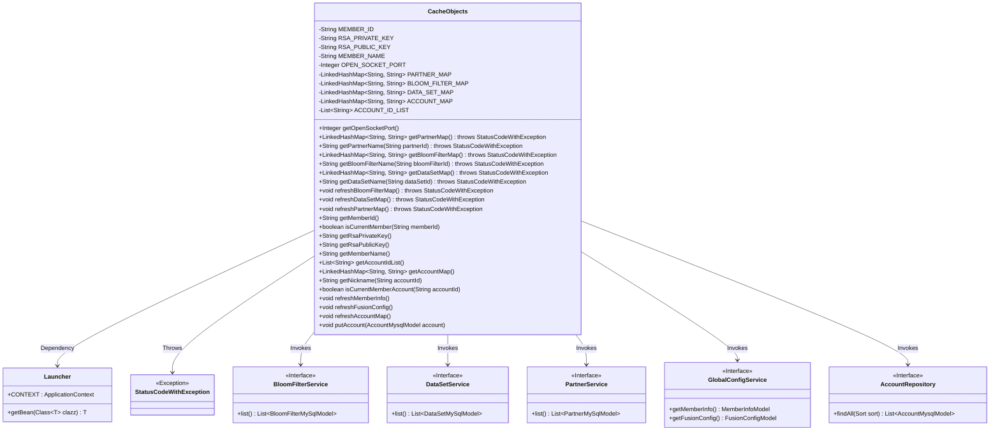
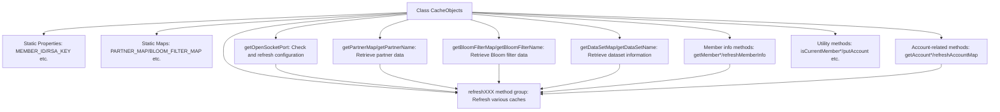

# Basic Information

|      |      |
|------|------|
| Name | CacheObjects |
| Language | .java |
| Code Path | WeFe/fusion/fusion-service/src/main/java/com/welab/wefe/data/fusion/service/service/CacheObjects.java |
| Package Name | com.welab.wefe.data.fusion.service.service |
| Dependencies | ['com.welab.wefe.common.exception.StatusCodeWithException', 'com.welab.wefe.common.web.Launcher', 'com.welab.wefe.data.fusion.service.database.entity.AccountMysqlModel', 'com.welab.wefe.data.fusion.service.database.entity.BloomFilterMySqlModel', 'com.welab.wefe.data.fusion.service.database.entity.DataSetMySqlModel', 'com.welab.wefe.data.fusion.service.database.entity.PartnerMySqlModel', 'com.welab.wefe.data.fusion.service.database.repository.AccountRepository', 'com.welab.wefe.data.fusion.service.dto.entity.globalconfig.FusionConfigModel', 'com.welab.wefe.data.fusion.service.dto.entity.globalconfig.MemberInfoModel', 'com.welab.wefe.data.fusion.service.service.bloomfilter.BloomFilterService', 'com.welab.wefe.data.fusion.service.service.dataset.DataSetService', 'com.welab.wefe.data.fusion.service.service.globalconfig.GlobalConfigService', 'org.springframework.data.domain.Sort', 'java.util.ArrayList', 'java.util.LinkedHashMap', 'java.util.List'] |
| Brief Description | The `CacheObjects` class manages static cached data, including member information, keys, ports, and multiple mapping tables (partners, Bloom filters, datasets, accounts). It provides methods to retrieve and refresh this data to ensure it remains up-to-date. Additionally, it supports determining member and account affiliations. |

# Description

The `CacheObjects` class is a utility class designed for caching various types of static data, including member information, RSA keys, port numbers, and multiple mapping tables (partners, Bloom filters, datasets, accounts). This class employs a lazy-loading mechanism to initialize data upon first access and provides refresh methods to reload data from the database. Key functionalities include retrieving member IDs, keys, and port numbers; querying names from mapping tables; determining account ownership; and synchronizing cache updates. All static data is fetched from the database via corresponding Service or Repository layers, with synchronized methods ensuring thread safety.

# Class Summary

| Name   | Type  | Description |
|-------|------|-------------|
| CacheObjects | class | The CacheObjects class manages static cached data, including member information, RSA keys, port numbers, and multiple mapping tables (partners, Bloom filters, datasets, accounts). It provides methods for retrieving and refreshing the cache to ensure data consistency. |

## Class CacheObjects

|      |      |
|------|------|
| Access Modifier | public |
| Type | class |
| Name | CacheObjects |
| Description | The CacheObjects class manages static cached data, including member information, RSA keys, port numbers, and multiple mapping tables (partners, Bloom filters, datasets, accounts). It provides methods for retrieving and refreshing the cache to ensure data consistency. |

### UML Class Diagram

The diagram illustrates the CacheObjects class as a core cache manager, which stores various configurations and mapping data through static variables and provides thread-safe access and refresh methods. It depends on Launcher to obtain the Spring context and invokes multiple service interfaces (such as BloomFilterService, DataSetService, etc.) to update cached data, while potentially throwing StatusCodeWithException. The class diagram clearly reflects the lazy-loading pattern and refresh mechanism of cached data.

### Internal Method Call Graph

This flowchart illustrates the complete structure of the CacheObjects class, which centers around static cache properties and two key operations: 1) Various getter methods trigger corresponding refresh operations when data is empty; 2) All refresh methods obtain service beans through Launcher to update caches. The class employs lazy-loading to manage multiple cache data types (member info, partners, Bloom filters, etc.), ensures thread safety via synchronized methods, and provides utility functions like account management and member validation.

### Field List

| Name  | Type  | Description |
|-------|-------|------|
| PARTNER_MAP = new LinkedHashMap<>() | LinkedHashMap<String, String> | Define a static private LinkedHashMap variable PARTNER_MAP with both key and value types as String. |
| BLOOM_FILTER_MAP = new LinkedHashMap<>() | LinkedHashMap<String, String> | Define a private static LinkedHashMap variable BLOOM_FILTER_MAP with both keys and values of String type. |
| ACCOUNT_MAP = new LinkedHashMap<>() | LinkedHashMap<String, String> | The private static constant ACCOUNT_MAP, of type ordered hash map, with both keys and values being strings. |
| OPEN_SOCKET_PORT | Integer | Private static integer variable used to store the open socket port number. |
| MEMBER_ID | String | private static String memberId |
| RSA_PRIVATE_KEY | String | private static String variable RSA_PRIVATE_KEY. |
| ACCOUNT_ID_LIST = new ArrayList<>() | List<String> | Declare a private static final List<String> variable ACCOUNT_ID_LIST, initialized as an empty ArrayList. |
| RSA_PUBLIC_KEY | String | private static String variable RSA public key |
| DATA_SET_MAP = new LinkedHashMap<>() | LinkedHashMap<String, String> | The static LinkedHashMap variable DATA_SET_MAP has key-value pairs of String type. |
| MEMBER_NAME | String | Declare a private static string variable MEMBER_NAME. |

### Method List

| Name  | Type  | Description |
|-------|-------|------|
| getMemberId | String | The static method getMemberId returns MEMBER_ID, and if it is empty, it calls refreshMemberInfo to refresh before returning. |
| getOpenSocketPort | Integer | Get the open Socket port number. If not initialized, refresh the configuration and return. |
| getAccountMap | LinkedHashMap<String, String> | The static method getAccountMap returns a LinkedHashMap, and if ACCOUNT_MAP is empty, it calls refreshAccountMap to refresh before returning. |
| getRsaPublicKey | String | Static method to obtain the RSA public key; if it is empty, refresh the member information and return. |
| getMemberName | String | The static method getMemberName returns the member name MEMBER_NAME, or calls refreshMemberInfo to refresh and return if it is empty. |
| getPartnerName | String | The static method `getPartnerName` retrieves the partner name by `partnerId`. If not found, it refreshes the cache and attempts again, ultimately returning the name or throwing an exception. |
| refreshBloomFilterMap | void | Refreshing the Bloom Filter Mapping Table: Clear existing data and load all Bloom filter IDs and names from the database into the in-memory mapping. |
| getBloomFilterName | String | Static methods retrieve the Bloom filter name by ID; if it does not exist, the cache is refreshed before attempting retrieval again. |
| getAccountIdList | List<String> | The static method `getAccountIdList` returns a list of account IDs. If the list is empty, it calls `refreshAccountMap` to refresh it and ultimately returns the list. |
| getDataSetMap | LinkedHashMap<String, String> | This is a Java method that returns a LinkedHashMap named DATA_SET_MAP. If DATA_SET_MAP is empty, it first calls the refreshBloomFilterMap method to update the data. The method may throw a StatusCodeWithException. |
| getDataSetName | String | Static method retrieves dataset name by ID; if not found, refreshes cache and retries. Throws exception if still unavailable. |
| refreshPartnerMap | void | This method refreshes the partner mapping table by clearing existing data, loading all partner information from the database, and storing member IDs and names into the mapping table. |
| refreshDataSetMap | void | This method refreshes the dataset mapping table, clears the existing data, loads all datasets from the database, and stores their IDs and names into the mapping table. |
| getPartnerMap | LinkedHashMap<String, String> | The static method getPartnerMap returns a LinkedHashMap. If it is empty, it calls refreshPartnerMap to refresh, and may throw a StatusCodeWithException. |
| getNickname | String | The static synchronized method getNickname retrieves the nickname based on accountId: if accountId is null, it returns null; otherwise, it searches from AccountMap and returns the default member name if not found. |
| isCurrentMemberAccount | boolean | The static synchronized method checks whether the current account ID is in the account list. |
| refreshMemberInfo | void | The static synchronized method `refreshMemberInfo` retrieves member information from the `GlobalConfigService`. If the information exists, it updates global variables such as the member ID, RSA public/private keys, and member name. |
| refreshFusionConfig | void | The static synchronized method `refreshFusionConfig` retrieves the configuration from `GlobalConfigService` and updates `OPEN_SOCKET_PORT` if it exists. |
| refreshAccountMap | void | The static synchronized method `refreshAccountMap` clears and reloads account data into `ACCOUNT_MAP` and `ACCOUNT_ID_LIST`, sorted by nickname. |
| putAccount | void | This is a Java synchronization method used to store account information into a global map and list. After checking that the account is not null, the method saves the account ID and nickname into ACCOUNT_MAP and adds the ID to ACCOUNT_ID_LIST. |
| getRsaPrivateKey | String | Methods to obtain the RSA private key. If the private key is empty, refresh the member information and return. |
| getBloomFilterMap | LinkedHashMap<String, String> | Get the Bloom filter mapping table, and refresh it before returning if empty. |
| isCurrentMember | boolean | Check whether the current member ID matches the input ID, and return a boolean value. |

