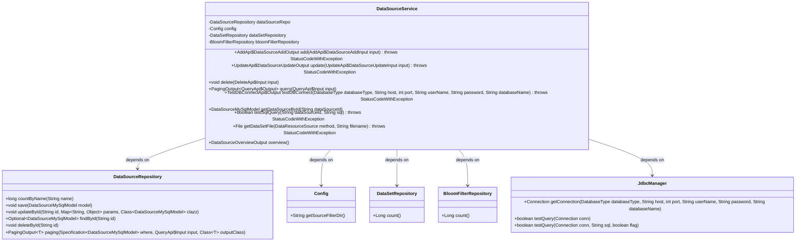

# Basic Information

|      |      |
|------|------|
| Name | DataSourceService |
| Language | .java |
| Code Path | WeFe/fusion/fusion-service/src/main/java/com/welab/wefe/data/fusion/service/service/DataSourceService.java |
| Package Name | com.welab.wefe.data.fusion.service.service |
| Dependencies | ['com.welab.wefe.common.StatusCode', 'com.welab.wefe.common.data.mysql.Where', 'com.welab.wefe.common.exception.StatusCodeWithException', 'com.welab.wefe.common.jdbc.base.DatabaseType', 'com.welab.wefe.common.web.util.CurrentAccountUtil', 'com.welab.wefe.common.web.util.ModelMapper', 'com.welab.wefe.data.fusion.service.api.datasource', 'com.welab.wefe.data.fusion.service.config.Config', 'com.welab.wefe.data.fusion.service.database.entity.DataSourceMySqlModel', 'com.welab.wefe.data.fusion.service.database.repository.BloomFilterRepository', 'com.welab.wefe.data.fusion.service.database.repository.DataSetRepository', 'com.welab.wefe.data.fusion.service.database.repository.DataSourceRepository', 'com.welab.wefe.data.fusion.service.dto.base.PagingOutput', 'com.welab.wefe.data.fusion.service.dto.entity.DataSourceOverviewOutput', 'com.welab.wefe.data.fusion.service.enums.DataResourceSource', 'com.welab.wefe.data.fusion.service.manager.JdbcManager', 'org.springframework.beans.factory.annotation.Autowired', 'org.springframework.data.jpa.domain.Specification', 'org.springframework.stereotype.Service', 'java.io.File', 'java.sql.Connection', 'java.util.Date', 'java.util.HashMap', 'java.util.Map'] |
| Brief Description | The DataSourceService provides data source management functionalities, including addition, deletion, modification, and query operations, connection testing, SQL query validation, and file retrieval. It supports database connection testing to ensure data source validity and counts the number of datasets and Bloom filters. |

# Description

DataSourceService is a Spring service class that provides data source management functionalities. Its main features include: validating name uniqueness and database connection when adding a data source, saving data source information; testing the connection and updating information during data source updates; deleting data sources; paginated querying of data sources; testing database connections and SQL queries; retrieving uploaded files; and counting datasets and Bloom filters. It handles database connections via JdbcManager and performs data persistence operations using Repository.

# Class Summary

| Name   | Type  | Description |
|-------|------|-------------|
| DataSourceService | class | The DataSourceService provides data source management functionalities, including adding, updating, deleting, and querying data sources, testing database connections, validating SQL queries, as well as retrieving dataset files and statistical overviews. |

## Class DataSourceService

|      |      |
|------|------|
| Access Modifier | @Service;public |
| Type | class |
| Name | DataSourceService |
| Description | The DataSourceService provides data source management functionalities, including adding, updating, deleting, and querying data sources, testing database connections, validating SQL queries, as well as retrieving dataset files and statistical overviews. |

### UML Class Diagram

Class Diagram Description: DataSourceService is a service class responsible for CRUD operations on data sources, database connection testing, SQL query testing, etc. It depends on DataSourceRepository for data source persistence operations, Config for configuration information, DataSetRepository and BloomFilterRepository for statistical data, and JdbcManager for managing database connections. The diagram illustrates the relationships between these classes and their main methods.

### Internal Method Call Graph

```mermaid
graph TD
    A["Class DataSourceService"]
    B["Property: DataSourceRepository dataSourceRepo"]
    C["Property: Config config"]
    D["Property: DataSetRepository dataSetRepository"]
    E["Property: BloomFilterRepository bloomFilterRepository"]
    F["Method: add(DataSourceAddInput) → DataSourceAddOutput"]
    G["Method: update(DataSourceUpdateInput) → DataSourceUpdateOutput"]
    H["Method: delete(DeleteApi.Input)"]
    I["Method: query(QueryApi.Input) → PagingOutput"]
    J["Method: testDBConnect() → TestDBConnectApi.Output"]
    K["Method: getDataSourceById(String) → DataSourceMySqlModel"]
    L["Method: testSqlQuery(String, String) → boolean"]
    M["Method: getDataSetFile(DataResourceSource, String) → File"]
    N["Method: overview() → DataSourceOverviewOutput"]

    A --> B
    A --> C
    A --> D
    A --> E
    A --> F
    A --> G
    A --> H
    A --> I
    A --> J
    A --> K
    A --> L
    A --> M
    A --> N

    F -->|"1. Check name uniqueness"| F1["dataSourceRepo.countByName()"]
    F -->|"2. Test connection"| J
    F -->|"3. Map model"| F2["ModelMapper.map()"]
    F -->|"4. Set audit fields"| F3["CurrentAccountUtil.get().getId()"]
    F -->|"5. Save data"| F4["dataSourceRepo.save()"]

    G -->|"1. Test connection"| J
    G -->|"2. Build parameters"| G1["new HashMap()"]
    G -->|"3. Update data"| G2["dataSourceRepo.updateById()"]
    G -->|"4. Map output"| G3["ModelMapper.map()"]

    H -->|"1. Query data"| H1["dataSourceRepo.findById()"]
    H -->|"2. Delete data"| H2["dataSourceRepo.deleteById()"]

    I -->|"1. Build query conditions"| I1["Where.create().equal().build()"]
    I -->|"2. Paginated query"| I2["dataSourceRepo.paging()"]

    J -->|"1. Get connection"| J1["JdbcManager.getConnection()"]
    J -->|"2. Test query"| J2["JdbcManager.testQuery()"]

    L -->|"1. Get data source"| K
    L -->|"2. Get connection"| J1
    L -->|"3. Test SQL"| L1["JdbcManager.testQuery(sql)"]

    M -->|"1. Handle different sources"| M1["switch(method)"]
    M -->|"2. Validate file"| M2["file.exists()"]

    N -->|"1. Count datasets"| N1["dataSetRepository.count()"]
    N -->|"2. Count bloom filters"| N2["bloomFilterRepository.count()"]
```

Flowchart description: This flowchart illustrates the complete structure of the DataSourceService class, including 4 dependency-injected properties and 8 core methods. Key processes involve connection testing and persistence operations during data source addition (add) and update (update), existence checks before deletion (delete), condition building for paginated queries (query), and detailed steps for database connection testing (testDBConnect). All methods clearly indicate internal call relationships and execution sequences through arrows, demonstrating the complete chain of data validation, business processing, and persistence operations.

### Field List

| Name  | Type  | Description |
|-------|-------|------|
| dataSetRepository | DataSetRepository | Using @Autowired to automatically inject an instance of DataSetRepository. |
| config | Config | Use @Autowired to automatically inject the Config configuration object. |
| dataSourceRepo | DataSourceRepository | Automatically inject data source repository instances. |
| bloomFilterRepository | BloomFilterRepository | Automatically inject Bloom filter repository instances. |

### Method List

| Name  | Type  | Description |
|-------|-------|------|
| query | PagingOutput<QueryApi.Output> | The Java method `query` retrieves paginated results based on the input parameters `name` and `id`. It constructs query conditions using `Specification` and invokes the pagination method of `dataSourceRepo`. |
| testDBConnect | TestDBConnectApi.Output | Methods for testing database connections involve establishing a connection via the JDBC manager and executing a query for verification. A successful attempt returns results, while a failure throws an exception. |
| delete | void | This method searches for and deletes the corresponding record from the data source repository based on the input ID, and returns directly if the record does not exist. |
| update | UpdateApi.DataSourceUpdateOutput | Method for updating data source: After testing the connection, map the input parameters to the model and update the database, then return the updated ID. |
| add | AddApi.DataSourceAddOutput | The method `add` is used to add a data source: it checks name uniqueness, tests the database connection, sets creation information and saves it, then returns the new data source ID. If the name is duplicated, an exception is thrown. |
| getDataSourceById | DataSourceMySqlModel | Retrieve the data source object from the MySQL data source repository based on the ID, or return null if it does not exist. |
| testSqlQuery | boolean | Check the data source and test the SQL query, then return the results. If the data source does not exist, throw an exception. |
| getDataSetFile | File | The method retrieves files based on the data source type: uploaded files are searched in the configuration directory, while local files directly use the path. An exception is thrown if the file does not exist. |
| overview | DataSourceOverviewOutput | Method overview counts the dataset and the number of Bloom filters, returning a DataSourceOverviewOutput object containing both. |

