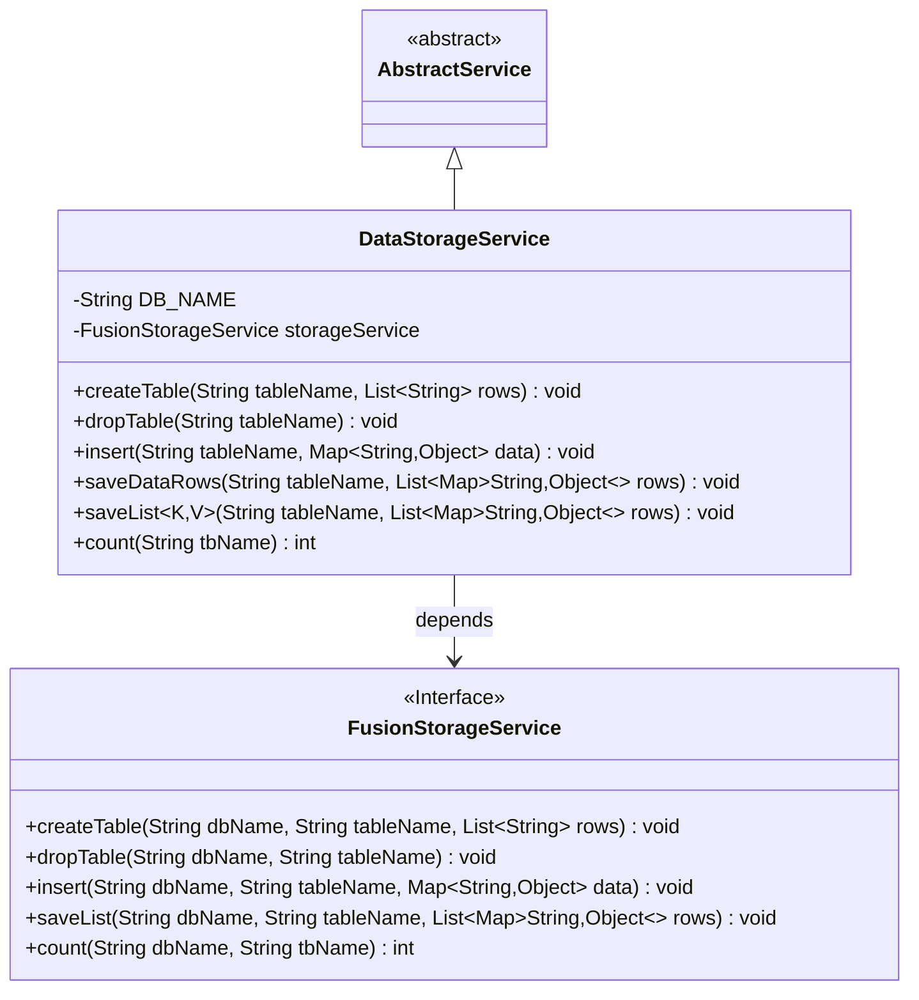
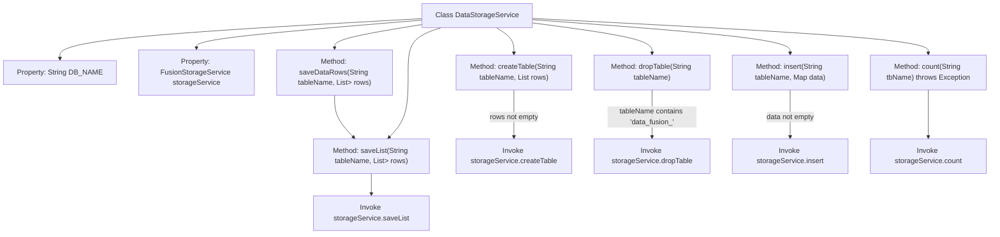

# Basic Information

|      |      |
|------|------|
| Name | DataStorageService |
| Language | .java |
| Code Path | WeFe/fusion/fusion-service/src/main/java/com/welab/wefe/data/fusion/service/service/DataStorageService.java |
| Package Name | com.welab.wefe.data.fusion.service.service |
| Dependencies | ['org.springframework.beans.factory.annotation.Autowired', 'org.springframework.beans.factory.annotation.Value', 'org.springframework.stereotype.Service', 'java.util.List', 'java.util.Map'] |
| Brief Description | The DataStorageService class provides database table operation functionalities, including creating tables, deleting tables, inserting data, batch saving, and data counting, relying on FusionStorageService to implement specific operations. |

# Description

The DataStorageService is a service class that inherits from AbstractService, designed for database table operations. It injects the MySQL database name via @Value and automatically configures the FusionStorageService. Its primary functionalities include: creating tables (requiring a non-empty column list), dropping tables (limited to those with the "data_fusion_" prefix), inserting single data entries (with null checks), batch-saving data rows (by invoking the internal saveList method), and retrieving table record counts. All operations are delegated to the storageService for execution, with the database name and table name parameters uniformly passed.

# Class Summary

| Name   | Type  | Description |
|-------|------|-------------|
| DataStorageService | class | The DataStorageService provides database table operations, including creating tables, deleting tables, inserting data, batch saving, and counting, relying on the FusionStorageService to implement specific logic. |

## Class DataStorageService

|      |      |
|------|------|
| Access Modifier | @Service;public |
| Type | class |
| Name | DataStorageService |
| Description | The DataStorageService provides database table operations, including creating tables, deleting tables, inserting data, batch saving, and counting, relying on the FusionStorageService to implement specific logic. |

### UML Class Diagram

This class diagram illustrates that DataStorageService inherits from AbstractService and depends on the FusionStorageService interface to implement database operations. DataStorageService contains core methods such as creating tables, dropping tables, inserting data, and batch-saving data, which are executed through the injected FusionStorageService instance. As an interface, FusionStorageService defines standard methods for database operations, achieving abstraction of storage services.

### Internal Method Call Graph

This code implements the DataStorageService class, primarily used for database table operations. It extends AbstractService and delegates actual storage operations to FusionStorageService. Key functionalities include table creation, deletion, data insertion, batch saving, and counting. Each method incorporates precondition checks such as non-null parameter validation or table name format verification, invoking corresponding methods of the underlying storageService upon successful validation. The class injects database name via @Value and storage service via @Autowired, demonstrating Spring's dependency injection features.

### Field List

| Name  | Type  | Description |
|-------|-------|------|
| DB_NAME | String | The code snippet injects the configuration property `db.mysql.database` into the private variable `DB_NAME` via the `@Value` annotation. |
| storageService | FusionStorageService | Automatically inject the FusionStorageService instance. |

### Method List

| Name  | Type  | Description |
|-------|-------|------|
| dropTable | void | The method checks if the table name contains "data_fusion_". If not, it returns directly; otherwise, it invokes the storage service to delete the specified table in the database. |
| createTable | void | The method `createTable` takes a table name and a list of row data. If the list is empty, it returns directly; otherwise, it calls `storageService` to create the table. |
| insert | void | Java Method: Insert data into the specified table, with parameters being the table name and a data Map. Returns directly if the data is empty, otherwise invokes the storage service for the insertion operation. |
| saveDataRows | void | This method is used to save data rows, receiving the table name and a list of data rows, and calling the saveList method for storage. |
| saveList | void | The Java method `saveList` saves a list of Maps into the specified database table, implemented by calling `storageService.saveList`. |
| count | int | The method `count` calculates the number of records in the specified table by invoking the `count` method of `storageService`. It requires passing the database name and table name as parameters and may throw exceptions. |

