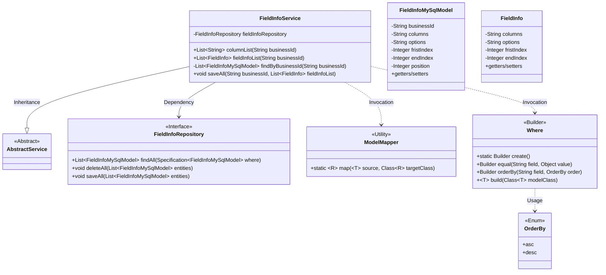
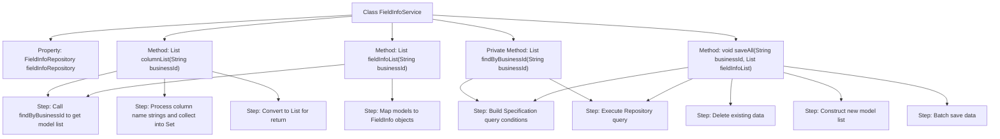

# Basic Information

|      |      |
|------|------|
| Name | FieldInfoService |
| Language | .java |
| Code Path | WeFe/fusion/fusion-service/src/main/java/com/welab/wefe/data/fusion/service/service/FieldInfoService.java |
| Package Name | com.welab.wefe.data.fusion.service.service |
| Dependencies | ['com.welab.wefe.common.data.mysql.Where', 'com.welab.wefe.common.data.mysql.enums.OrderBy', 'com.welab.wefe.common.web.util.ModelMapper', 'com.welab.wefe.data.fusion.service.database.entity.FieldInfoMySqlModel', 'com.welab.wefe.data.fusion.service.database.repository.FieldInfoRepository', 'com.welab.wefe.data.fusion.service.utils.primarykey.FieldInfo', 'org.springframework.beans.factory.annotation.Autowired', 'org.springframework.data.jpa.domain.Specification', 'org.springframework.stereotype.Service', 'java.util', 'java.util.stream.Collectors'] |
| Brief Description | The FieldInfoService class provides field information management functionalities, including querying field lists and field information lists by businessId, as well as batch saving field information. It operates the database through FieldInfoRepository, supporting conditional queries and sorting. |

# Description

The FieldInfoService is a service class that inherits from AbstractService and contains operations related to field information. It interacts with the database through FieldInfoRepository. Its main functionalities include: the columnList method retrieves a list of column names based on businessId; the fieldInfoList method obtains a list of field information and performs model conversion; the private findByBusinessId method queries by businessId and sorts by position; the saveAll method first deletes existing data and then saves a new list of field information, including attributes such as businessId, columns, options, and index positions.

# Class Summary

| Name   | Type  | Description |
|-------|------|-------------|
| FieldInfoService | class | The FieldInfoService class provides field information management functionalities, including querying field lists, field information lists, and batch saving field information. It operates the database through FieldInfoRepository, supporting queries and sorting by businessId. |

## Class FieldInfoService

|      |      |
|------|------|
| Access Modifier | @Service;public |
| Type | class |
| Name | FieldInfoService |
| Description | The FieldInfoService class provides field information management functionalities, including querying field lists, field information lists, and batch saving field information. It operates the database through FieldInfoRepository, supporting queries and sorting by businessId. |

### UML Class Diagram

This class diagram illustrates the core structure of FieldInfoService and its relationships. As a business service class inheriting from AbstractService, it operates on FieldInfoMySqlModel data through FieldInfoRepository and utilizes ModelMapper for model conversion. The Where builder class is used to create dynamic query conditions, while the OrderBy enum defines sorting methods. Key functionalities include: retrieving column name lists (columnList), obtaining field information lists (fieldInfoList), and batch-saving field data (saveAll). The classes collaborate through dependency, inheritance, and invocation relationships to form a complete business processing workflow.

### Internal Method Call Graph

This flowchart illustrates the core structure and method invocation relationships of the FieldInfoService class. The class interacts with the database through FieldInfoRepository, providing three core functionalities: retrieving column name lists (columnList), obtaining field information lists (fieldInfoList), and batch data saving (saveAll). The private method findByBusinessId is reused by the first two public methods for querying data by business ID. The saveAll method implements an update logic of delete-then-save, encompassing complete model conversion and batch operation processes. All database operations are executed by building Specification conditions.

### Field List

| Name  | Type  | Description |
|-------|-------|------|
| fieldInfoRepository | FieldInfoRepository | Automatically injects a FieldInfoRepository instance. |

### Method List

| Name  | Type  | Description |
|-------|-------|------|
| saveAll | void | The method `saveAll` deletes old data based on `businessId`, converts the `fieldInfoList` into a list of `FieldInfoMySqlModel`, and then saves it. The processing includes setting field values such as `columns`, `options`, indexes, and positions. |
| findByBusinessId | List<FieldInfoMySqlModel> | This method queries the FieldInfoMySqlModel list based on the businessId, sorts the results in ascending order by position, and returns the query results. |
| fieldInfoList | List<FieldInfo> | This method queries the database based on the businessId, converts the result into a list of FieldInfo, and returns it. |
| columnList | List<String> | This method queries field information based on the businessId, extracts all column names, removes duplicates, and returns a list. |

