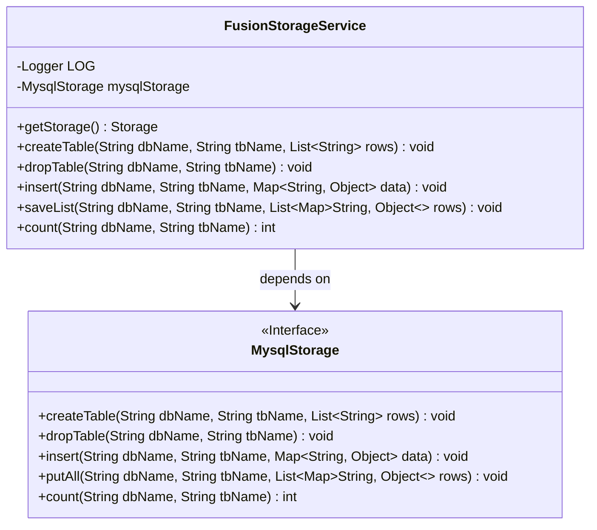
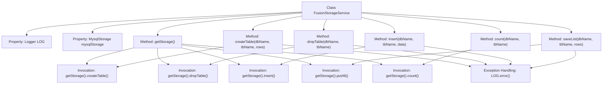

# Basic Information

|      |      |
|------|------|
| Name | FusionStorageService |
| Language | .java |
| Code Path | WeFe/fusion/fusion-service/src/main/java/com/welab/wefe/data/fusion/service/service/FusionStorageService.java |
| Package Name | com.welab.wefe.data.fusion.service.service |
| Dependencies | ['com.welab.wefe.data.fusion.service.repo.Storage', 'com.welab.wefe.data.fusion.service.repo.impl.MysqlStorage', 'org.slf4j.Logger', 'org.slf4j.LoggerFactory', 'org.springframework.beans.factory.annotation.Autowired', 'org.springframework.stereotype.Service', 'java.util.List', 'java.util.Map'] |
| Brief Description | FusionStorageService is a Spring service class that implements database table creation, deletion, data insertion, batch saving, and counting functionalities through MysqlStorage, while capturing exceptions and logging them. |

# Description

FusionStorageService is a Spring service class that provides database operation functionalities through an auto-injected MysqlStorage instance. Key methods include obtaining storage instances, creating tables, dropping tables, inserting single records, batch-saving data, and counting records. All operations are delegated to MysqlStorage via getStorage(), with exceptions caught and logged. The class incorporates a comprehensive exception handling mechanism, utilizing the LOG object to record error messages.

# Class Summary

| Name   | Type  | Description |
|-------|------|-------------|
| FusionStorageService | class | FusionStorageService is a Spring service class that operates databases through MysqlStorage, providing functionalities such as creating tables, deleting tables, inserting data, batch saving, and counting, while logging exceptions. |

## Class FusionStorageService

|      |      |
|------|------|
| Access Modifier | @Service;public |
| Type | class |
| Name | FusionStorageService |
| Description | FusionStorageService is a Spring service class that operates databases through MysqlStorage, providing functionalities such as creating tables, deleting tables, inserting data, batch saving, and counting, while logging exceptions. |

### UML Class Diagram

This code demonstrates a Spring service class `FusionStorageService` that implements database operations through the dependency-injected `MysqlStorage` interface. The class diagram clearly shows the relationship between the service class and the storage interface, along with their respective method signatures. The service class encapsulates database operations such as table creation, deletion, data insertion, and counting. All methods uniformly obtain a storage instance via `getStorage()` and delegate calls while catching exceptions and logging them. The interface defines standard database operation methods, embodying the Dependency Inversion Principle.

### Internal Method Call Graph

This code illustrates a Spring service class FusionStorageService that encapsulates various database operations for MysqlStorage. The flowchart clearly presents the class structure, method invocation relationships, and exception handling flow. All database operations are delegated to the mysqlStorage instance via the getStorage() method, with unified exception logging. Core functionalities include table management (create/drop), data operations (insert/batch insert), and count queries, with each operation following the standard "invoke storage layer → catch exception" workflow.

### Field List

| Name  | Type  | Description |
|-------|-------|------|
| mysqlStorage | MysqlStorage | The code automatically injects a MysqlStorage instance via @Autowired. |
| LOG = LoggerFactory.getLogger(FusionStorageService.class) | Logger | The class FusionStorageService defines a static immutable logger instance named LOG. |

### Method List

| Name  | Type  | Description |
|-------|-------|------|
| createTable | void | The method `createTable` is used to create a table, which takes parameters including the database name, table name, and a list of row data. It invokes the storage interface to execute the creation operation, catches exceptions, and logs error messages. |
| getStorage | Storage | Get the storage object and return a mysqlStorage instance. |
| dropTable | void | This method is used to delete a table in the specified database, catch exceptions, and log error messages. |
| insert | void | The method `insert` accepts a database name, table name, and data mapping, invokes the storage interface to insert data, and logs error messages in case of exceptions. |
| saveList | void | The method `saveList` stores data rows into the specified database table, catches exceptions, and logs them. |
| count | int | This method counts the number of records in the specified database and table by invoking a stored procedure interface, which may throw exceptions. |

