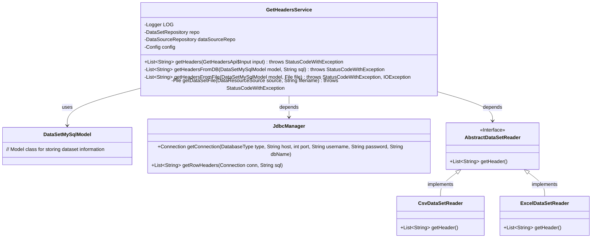
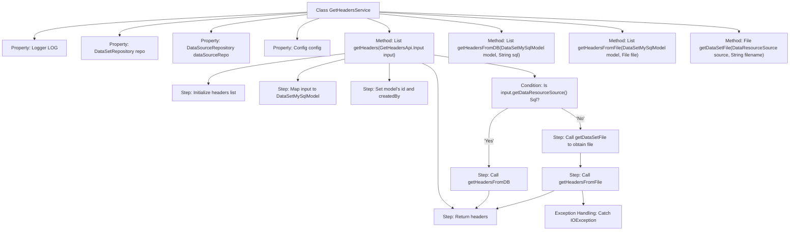
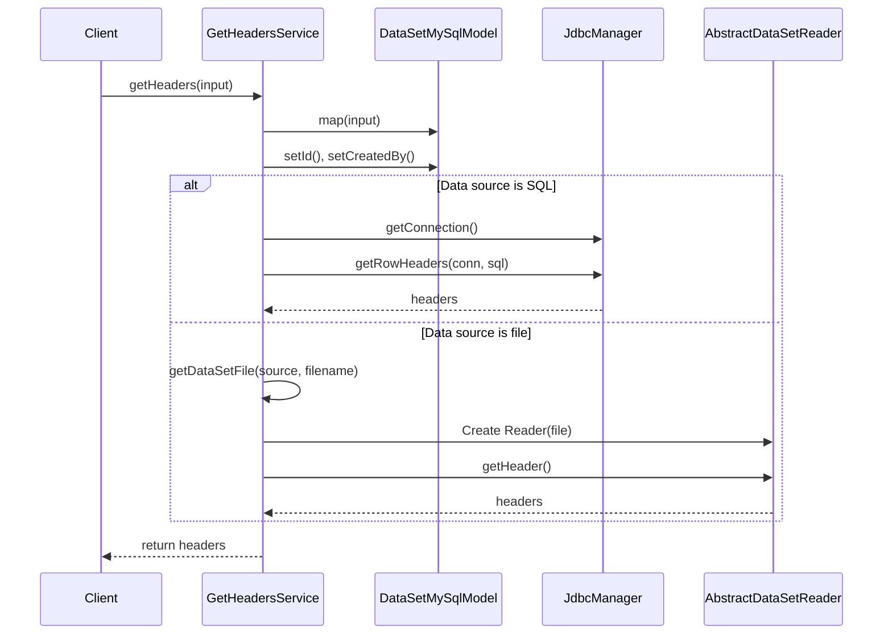

# Basic Information

|      |      |
|------|------|
| Name | GetHeadersService |
| Language | .java |
| Code Path | WeFe/fusion/fusion-service/src/main/java/com/welab/wefe/data/fusion/service/service/GetHeadersService.java |
| Package Name | com.welab.wefe.data.fusion.service.service |
| Dependencies | ['com.welab.wefe.common.StatusCode', 'com.welab.wefe.common.exception.StatusCodeWithException', 'com.welab.wefe.common.jdbc.base.DatabaseType', 'com.welab.wefe.common.web.util.CurrentAccountUtil', 'com.welab.wefe.common.web.util.ModelMapper', 'com.welab.wefe.data.fusion.service.api.dataset.GetHeadersApi', 'com.welab.wefe.data.fusion.service.config.Config', 'com.welab.wefe.data.fusion.service.database.entity.DataSetMySqlModel', 'com.welab.wefe.data.fusion.service.database.repository.DataSetRepository', 'com.welab.wefe.data.fusion.service.database.repository.DataSourceRepository', 'com.welab.wefe.data.fusion.service.enums.DataResourceSource', 'com.welab.wefe.data.fusion.service.manager.JdbcManager', 'com.welab.wefe.data.fusion.service.utils.AbstractDataSetReader', 'com.welab.wefe.data.fusion.service.utils.CsvDataSetReader', 'com.welab.wefe.data.fusion.service.utils.ExcelDataSetReader', 'org.slf4j.Logger', 'org.slf4j.LoggerFactory', 'org.springframework.beans.factory.annotation.Autowired', 'org.springframework.stereotype.Service', 'java.io.File', 'java.io.IOException', 'java.sql.Connection', 'java.util.ArrayList', 'java.util.List'] |
| Brief Description | The GetHeadersService class retrieves data table headers based on the input source (database or file). For databases, it obtains them through SQL queries; for files, it reads the headers according to the file type (CSV or Excel). It handles exceptions and logs them. |

# Description

GetHeadersService is a Spring service class designed to retrieve dataset headers from a database or file. It injects dependencies including DataSetRepository, DataSourceRepository, and Config via Autowired. The getHeaders method determines the data source type (SQL or file) from input parameters and invokes corresponding methods to fetch headers. For SQL data sources, it connects to the database through JdbcManager and executes SQL to obtain headers. For file data sources, it uses appropriate readers (CSV or Excel) based on file type to extract headers. File path processing supports both uploaded and local files, throwing exceptions if files are missing. The process logs operations and handles potential IO exceptions.

# Class Summary

| Name   | Type  | Description |
|-------|------|-------------|
| GetHeadersService | class | The GetHeadersService class provides functionality for retrieving dataset headers, supporting reading from database SQL or files (CSV/Excel). It includes database connection, file processing, and exception handling logic. |

## Class GetHeadersService

|      |      |
|------|------|
| Access Modifier | @Service;public |
| Type | class |
| Name | GetHeadersService |
| Description | The GetHeadersService class provides functionality for retrieving dataset headers, supporting reading from database SQL or files (CSV/Excel). It includes database connection, file processing, and exception handling logic. |

### UML Class Diagram

This code describes a service class `GetHeadersService` designed to retrieve dataset column headers from databases or files. Core functionalities include: obtaining table headers through SQL database queries or parsing CSV/Excel files. The class diagram illustrates key components and their relationships: the service class relies on `JdbcManager` for database connections, employs an abstract factory pattern to select different file readers (CSV or Excel), and uniformly uses `DataSetMySqlModel` as the data carrier. Exception handling permeates the entire process, covering file I/O errors and parameter validation exceptions.

### Internal Method Call Graph

This code represents a Spring service class primarily responsible for retrieving dataset column headers based on input parameters. The flowchart illustrates the class structure and main method invocation relationships, while the sequence diagram details two retrieval paths: querying from database SQL or reading from files. The core logic branches based on the data source type (DataResourceSource), invoking either getHeadersFromDB or getHeadersFromFile methods, ultimately returning the headers list. Exception handling ensures specific status code exceptions are thrown during file reading errors.

### Field List

| Name  | Type  | Description |
|-------|-------|------|
| dataSourceRepo | DataSourceRepository | Using @Autowired to automatically inject the DataSourceRepository instance dataSourceRepo. |
| config | Config | Automatically inject Config configuration instance. |
| LOG = LoggerFactory.getLogger(this.getClass()) | Logger | A private static log object defined in the class, used to record log information for the current class. |
| repo | DataSetRepository | Automatically inject the DataSetRepository instance into the repo variable. |

### Method List

| Name  | Type  | Description |
|-------|-------|------|
| getHeaders | List<String> | The method retrieves the header list based on the input. If the data source is SQL, it queries the database; otherwise, it reads from a file. It handles exceptions and returns the result. |
| getHeadersFromDB | List<String> | Retrieve dataset headers from the database: Connect to the Hive database, execute SQL queries, and return column header information. |
| getHeadersFromFile | List<String> | The method reads dataset headers from a file. Based on the file type (CSV or Excel), it selects the corresponding reader and returns a list of headers. The process is logged and may throw exceptions. |
| getDataSetFile | File | This method retrieves the file object based on the data source type and throws an exception if the file does not exist. It supports three sources: uploaded files, local files, and SQL. |

