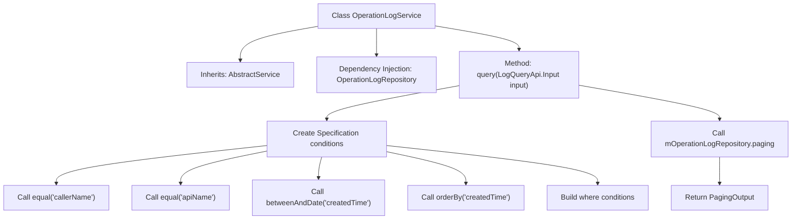

# Basic Information

|      |      |
|------|------|
| Name | OperationLogService |
| Language | .java |
| Code Path | WeFe/fusion/fusion-service/src/main/java/com/welab/wefe/data/fusion/service/service/OperationLogService.java |
| Package Name | com.welab.wefe.data.fusion.service.service |
| Dependencies | ['com.welab.wefe.common.data.mysql.Where', 'com.welab.wefe.common.data.mysql.enums.OrderBy', 'com.welab.wefe.common.exception.StatusCodeWithException', 'com.welab.wefe.data.fusion.service.api.operation.LogQueryApi', 'com.welab.wefe.data.fusion.service.database.entity.OperationLogMysqlModel', 'com.welab.wefe.data.fusion.service.database.repository.OperationLogRepository', 'com.welab.wefe.data.fusion.service.dto.base.PagingOutput', 'com.welab.wefe.data.fusion.service.dto.entity.OperationLogOutputModel', 'org.springframework.beans.factory.annotation.Autowired', 'org.springframework.data.jpa.domain.Specification', 'org.springframework.stereotype.Service'] |
| Brief Description | The OperationLogService provides paginated query functionality for operation logs, supporting filtering by caller, API name, and time range, with results sorted in descending order by creation time. |

# Description

The OperationLogService is a service class that inherits from AbstractService and is used for operation log queries. It injects OperationLogRepository via Autowired to access the database. The provided query method accepts a LogQueryApi.Input parameter, constructs a query specification that includes conditions for callerName, apiName, and a createdTime range, and sorts the results by createdTime in descending order. It ultimately returns paginated OperationLogOutputModel results. The method may throw a StatusCodeWithException.

# Class Summary

| Name   | Type  | Description |
|-------|------|-------------|
| OperationLogService | class | Operation log service class, which queries log records by conditions and returns paginated results. It implements data access through repository interfaces, supporting filtering by caller, API name, and time range, with results sorted in descending order by creation time. |


## Class OperationLogService

|      |      |
|------|------|
| Access Modifier | @Service;public |
| Type | class |
| Name | OperationLogService |
| Description | Operation log service class, which queries log records by conditions and returns paginated results. It implements data access through repository interfaces, supporting filtering by caller, API name, and time range, with results sorted in descending order by creation time. |


### UML Class Diagram

```mermaid
classDiagram
    class OperationLogService {
        -OperationLogRepository mOperationLogRepository
        +PagingOutput~OperationLogOutputModel~ query(LogQueryApi$Input input) StatusCodeWithException
    }
    
    class AbstractService {
        <<abstract>>
    }
    
    class OperationLogRepository {
        +PagingOutput~T~ paging(Specification~OperationLogMysqlModel~ where, LogQueryApi$Input input, Class~T~ clazz)
    }
    
    class LogQueryApi {
        class Input {
            +String callerName
            +String apiName
            +Date startTime
            +Date endTime
        }
    }
    
    class OperationLogMysqlModel {
    }
    
    class OperationLogOutputModel {
    }
    
    class Where {
        +create() WhereBuilder
    }
    
    class WhereBuilder {
        +equal(String field, Object value) WhereBuilder
        +betweenAndDate(String field, Date start, Date end) WhereBuilder
        +orderBy(String field, OrderBy order) WhereBuilder
        +build(Class~T~ clazz) Specification~T~
    }
    
    class OrderBy {
        <<enumeration>>
        asc
        desc
    }
    
    OperationLogService --|> AbstractService : Inheritance
    OperationLogService --> OperationLogRepository : Dependency
    OperationLogService --> LogQueryApi$Input : Dependency
    OperationLogRepository --> OperationLogMysqlModel : Operates
    OperationLogRepository --> OperationLogOutputModel : Returns
    WhereBuilder --> OrderBy : Uses
    WhereBuilder --> Specification : Generates
    Where --> WhereBuilder : Creates
```

This code demonstrates an operation log service class OperationLogService, which inherits from AbstractService and performs database operations through OperationLogRepository. The core functionality is the query method, which accepts LogQueryApi.Input parameters, uses the Where builder to create query conditions, and ultimately returns paginated operation log data. The class diagram clearly illustrates the dependencies between components, including key aspects such as input parameter processing, query condition construction, database operations, and result output.


### Internal Method Call Graph



This flowchart illustrates the structure of the OperationLogService class and the execution flow of its query method. The class inherits from AbstractService and utilizes OperationLogRepository through dependency injection. The query method first constructs a Specification object containing multiple conditions (including equality comparison, date range query, and sorting), then invokes the Repository's paging query method, ultimately returning paginated results. The entire process demonstrates a complete data access flow from condition construction to database query, conforming to the typical Spring Data JPA query pattern.

### Field List

| Name  | Type  | Description |
|-------|-------|------|
| mOperationLogRepository | OperationLogRepository | Automatically inject the operation log repository instance. |

### Method List

| Name  | Type  | Description |
|-------|-------|------|
| query | PagingOutput<OperationLogOutputModel> | This method queries operation logs based on input conditions, supporting filtering by caller, interface name, and time range, and returns paginated results in descending order of creation time. |


