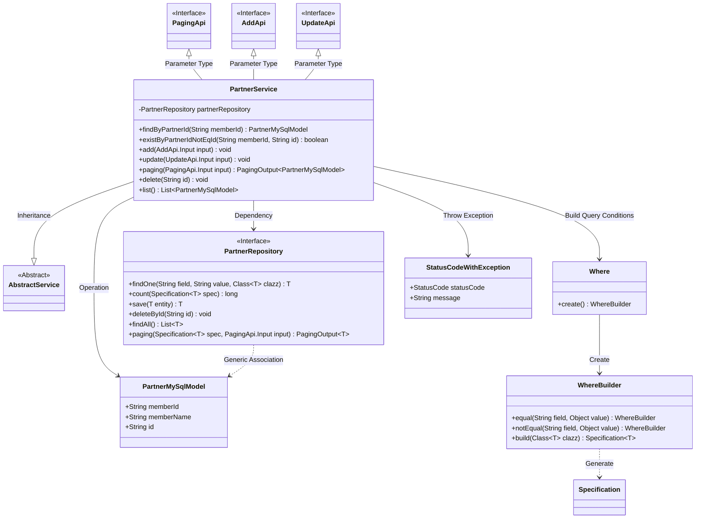

# Basic Information

|      |      |
|------|------|
| Name | PartnerService |
| Language | .java |
| Code Path | WeFe/fusion/fusion-service/src/main/java/com/welab/wefe/data/fusion/service/service/PartnerService.java |
| Package Name | com.welab.wefe.data.fusion.service.service |
| Dependencies | ['com.welab.wefe.common.StatusCode', 'com.welab.wefe.common.data.mysql.Where', 'com.welab.wefe.common.exception.StatusCodeWithException', 'com.welab.wefe.data.fusion.service.api.partner.AddApi', 'com.welab.wefe.data.fusion.service.api.partner.PagingApi', 'com.welab.wefe.data.fusion.service.api.partner.UpdateApi', 'com.welab.wefe.data.fusion.service.database.entity.PartnerMySqlModel', 'com.welab.wefe.data.fusion.service.database.repository.PartnerRepository', 'com.welab.wefe.data.fusion.service.dto.base.PagingOutput', 'org.springframework.beans.BeanUtils', 'org.springframework.beans.factory.annotation.Autowired', 'org.springframework.data.jpa.domain.Specification', 'org.springframework.stereotype.Service', 'java.util.List'] |
| Brief Description | The PartnerService class provides partner management functionalities, including querying, adding, updating, deleting, and paginated queries. It checks for the existence of partners via memberId to ensure data uniqueness. Database operations are performed using the Repository, supporting conditional queries and pagination. |

# Description

PartnerService is a service class that inherits from AbstractService and provides partner data management functionalities. Key methods include: querying partners by memberId, checking if a memberId exists (excluding a specified ID), adding a new partner (with duplicate validation), updating a partner (with existence and duplicate validation), paginated querying, deleting partners, and retrieving a list of all partners. It utilizes PartnerRepository for database operations and performs data validation and exception handling during these operations.

# Class Summary

| Name   | Type  | Description |
|-------|------|-------------|
| PartnerService | class | The PartnerService class provides partner management functionalities, including querying, adding, updating, deleting, and paginated queries. It checks for the existence of partners via memberId to ensure data uniqueness. Database operations are performed using the Repository, supporting conditional queries and pagination. |

## Class PartnerService

|      |      |
|------|------|
| Access Modifier | @Service;public |
| Type | class |
| Name | PartnerService |
| Description | The PartnerService class provides partner management functionalities, including querying, adding, updating, deleting, and paginated queries. It checks for the existence of partners via memberId to ensure data uniqueness. Database operations are performed using the Repository, supporting conditional queries and pagination. |

### UML Class Diagram

This class diagram illustrates the core structure and relationships of PartnerService. PartnerService inherits from AbstractService and performs data persistence operations through PartnerRepository, primarily handling CRUD operations for the PartnerMySqlModel entity. The service class uses the Where builder to create dynamic query conditions and processes business exceptions via StatusCodeWithException. The diagram clearly demonstrates the collaboration between the service layer, persistence layer, entity classes, and utility classes, reflecting a typical service layer implementation pattern in the Spring framework.

### Internal Method Call Graph

```mermaid
graph TD
    A["PartnerService"]
    B["Property: PartnerRepository partnerRepository"]
    C["Method: findByPartnerId(String memberId)"]
    D["Method: existByPartnerIdNotEqId(String memberId, String id)"]
    E["Method: add(AddApi.Input input)"]
    F["Method: update(UpdateApi.Input input)"]
    G["Method: paging(PagingApi.Input input)"]
    H["Method: delete(String id)"]
    I["Method: list()"]

    A --> B
    A --> C
    A --> D
    A --> E
    A --> F
    A --> G
    A --> H
    A --> I

    C --> C1["partnerRepository.findOne"]
    D --> D1["Where.create.equal.notEqual.build"]
    D --> D2["partnerRepository.count"]
    E --> E1["findByPartnerId existence check"]
    E --> E2["BeanUtils.copyProperties"]
    E --> E3["partnerRepository.save"]
    F --> F1["partnerRepository.findOne existence check"]
    F --> F2["existByPartnerIdNotEqId conflict validation"]
    F --> F3["BeanUtils.copyProperties"]
    F --> F4["partnerRepository.save"]
    G --> G1["Where.create.equal.build"]
    G --> G2["partnerRepository.paging"]
    H --> H1["partnerRepository.deleteById"]
    I --> I1["partnerRepository.findAll"]
```

This flowchart illustrates the complete structure of the PartnerService class, featuring 7 core methods and 1 auto-injected Repository property. The primary business logic revolves around CRUD operations for partner data. The add and update methods incorporate comprehensive validation processes (existence checks, property copying, persistence operations), while the paging method enables multi-condition paginated queries. The delete and list methods provide basic data operations. All database interactions are implemented through partnerRepository, with key operations like save/findOne/count clearly labeled. Exception handling flows are embedded in the add and update methods, throwing business exceptions via status codes.

### Field List

| Name  | Type  | Description |
|-------|-------|------|
| partnerRepository | PartnerRepository | Automatically inject the PartnerRepository instance. |

### Method List

| Name  | Type  | Description |
|-------|-------|------|
| update | void | Method for updating partner information: Check ID validity, verify member ID uniqueness, copy attributes and save. Throw an exception if invalid or duplicate. |
| existByPartnerIdNotEqId | boolean | Check if there exists a Partner record under the specified memberId where the id is not equal to the given value. |
| add | void | The method checks whether the partner exists, throws an exception if it does; otherwise, it saves the new partner data. |
| findByPartnerId | PartnerMySqlModel | Query the partner MySQL model based on member ID and return matching results. |
| paging | PagingOutput<PartnerMySqlModel> | Pagination query method, filters partner data based on member ID and name, and returns paginated results. |
| delete | void | Delete the partner record with the specified ID. |
| list | List<PartnerMySqlModel> | This method returns a list of MySQL models for all partners by invoking the findAll method of the partnerRepository. |

