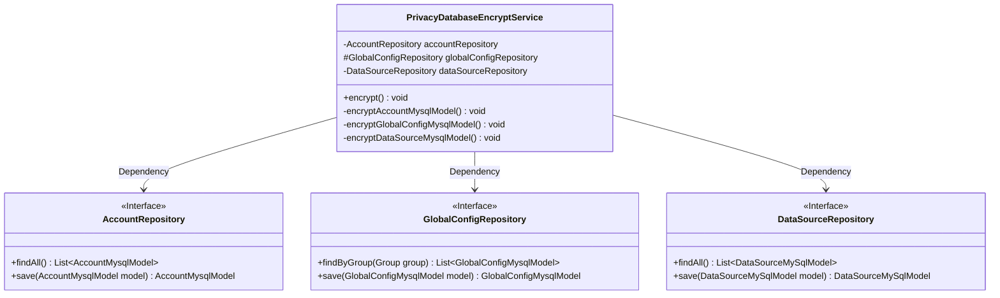
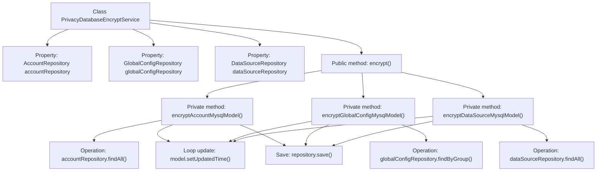

# Basic Information

|      |      |
|------|------|
| Name | PrivacyDatabaseEncryptService |
| Language | .java |
| Code Path | WeFe/fusion/fusion-service/src/main/java/com/welab/wefe/data/fusion/service/service/PrivacyDatabaseEncryptService.java |
| Package Name | com.welab.wefe.data.fusion.service.service |
| Dependencies | ['com.welab.wefe.data.fusion.service.database.entity.AccountMysqlModel', 'com.welab.wefe.data.fusion.service.database.entity.DataSourceMySqlModel', 'com.welab.wefe.data.fusion.service.database.entity.GlobalConfigMysqlModel', 'com.welab.wefe.data.fusion.service.database.repository.AccountRepository', 'com.welab.wefe.data.fusion.service.database.repository.DataSourceRepository', 'com.welab.wefe.data.fusion.service.database.repository.GlobalConfigRepository', 'com.welab.wefe.data.fusion.service.service.globalconfig.BaseGlobalConfigService', 'org.springframework.beans.factory.annotation.Autowired', 'org.springframework.stereotype.Service', 'org.springframework.transaction.annotation.Transactional', 'org.springframework.util.CollectionUtils', 'java.util.Date', 'java.util.List'] |
| Brief Description | The `PrivacyDatabaseEncryptService` class is used to encrypt private data in databases, containing three encryption methods: account, global configuration, and data source, all of which update the modification time and save the changes. |

# Description

The `PrivacyDatabaseEncryptService` is a Spring service class responsible for encrypting private data in the database. This class operates on data by auto-wiring three repository interfaces: `AccountRepository`, `GlobalConfigRepository`, and `DataSourceRepository`. The main method `encrypt()` uses the `@Transactional` annotation to ensure atomicity, sequentially calling three private methods to process account, global configuration, and data source models respectively. Each method first queries the corresponding model list, and if non-empty, iterates through the list to update the `updatedTime` field of each model before saving it back to the database. Notably, the global configuration method additionally filters records where the `GROUP` is `MEMBER_INFO`.

# Class Summary

| Name   | Type  | Description |
|-------|------|-------------|
| PrivacyDatabaseEncryptService | class | The PrivacyDatabaseEncryptService is a service class designed for encrypting private data in databases. It employs three private methods to encrypt account information, global configurations, and data source models respectively, updates their modification timestamps, and persists them to corresponding repositories. All operations are executed within a single transaction, with rollback upon encountering errors. |

## Class PrivacyDatabaseEncryptService

|      |      |
|------|------|
| Access Modifier | @Service;public |
| Type | class |
| Name | PrivacyDatabaseEncryptService |
| Description | The PrivacyDatabaseEncryptService is a service class designed for encrypting private data in databases. It employs three private methods to encrypt account information, global configurations, and data source models respectively, updates their modification timestamps, and persists them to corresponding repositories. All operations are executed within a single transaction, with rollback upon encountering errors. |

### UML Class Diagram

This code demonstrates a Spring service class `PrivacyDatabaseEncryptService` that handles different types of data encryption tasks through three private methods. The class depends on three JPA repository interfaces (`AccountRepository`, `GlobalConfigRepository`, and `DataSourceRepository`) to fetch and persist data. Each encryption method iterates through the corresponding model list, updates its timestamp, and saves it. The class diagram clearly illustrates the dependency relationships between the service class and repository interfaces, as well as the method signatures of each interface.

### Internal Method Call Graph

This flowchart illustrates the core structure and execution flow of the PrivacyDatabaseEncryptService class. The class handles encryption operations for different data models (account, global configuration, and data source) through three private methods. Each method first retrieves a data list from the corresponding repository, then iterates through the list to update each model's timestamp field before saving. The public method encrypt() serves as the entry point to uniformly invoke these three private methods. The entire process executes under transaction management, with any exception triggering rollback. The flowchart clearly presents the hierarchical logic from property injection to method calls, and then to specific database operations.

### Field List

| Name  | Type  | Description |
|-------|-------|------|
| accountRepository | AccountRepository | Using @Autowired to automatically inject an instance of AccountRepository. |
| dataSourceRepository | DataSourceRepository | Using @Autowired to automatically inject an instance of DataSourceRepository. |
| globalConfigRepository | GlobalConfigRepository | Automatically inject global configuration repository instances. |

### Method List

| Name  | Type  | Description |
|-------|-------|------|
| encryptAccountMysqlModel | void | Encrypted account MySQL model data: Traverse all account records, update the time to the current date, and save. |
| encrypt | void | The method `encrypt` annotated with `@Transactional` contains three encryption operations and will roll back in case of exceptions. |
| encryptGlobalConfigMysqlModel | void | Encrypt the global configuration data of the MEMBER_INFO group, update the timestamp to the current time, and save it. |
| encryptDataSourceMysqlModel | void | This method is used to encrypt the MySQL data source model, iterating through all models and updating the time to the current date, then saving it to the database. |

