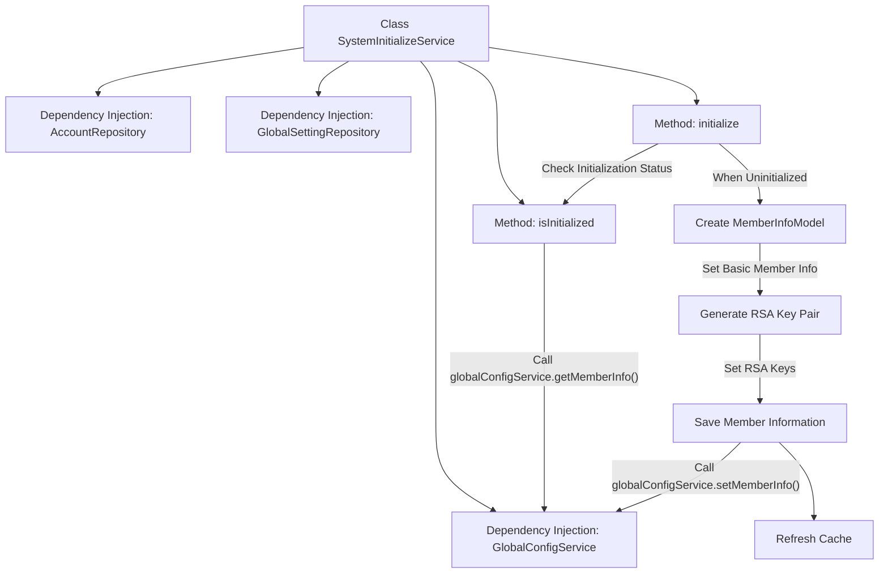
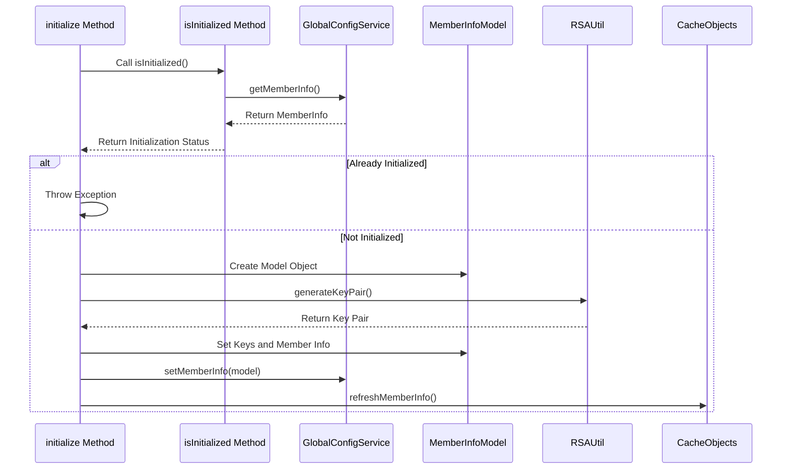

# Basic Information

|      |      |
|------|------|
| Name | SystemInitializeService |
| Language | .java |
| Code Path | WeFe/fusion/fusion-service/src/main/java/com/welab/wefe/data/fusion/service/service/SystemInitializeService.java |
| Package Name | com.welab.wefe.data.fusion.service.service |
| Dependencies | ['com.welab.wefe.common.StatusCode', 'com.welab.wefe.common.exception.StatusCodeWithException', 'com.welab.wefe.common.util.RSAUtil', 'com.welab.wefe.data.fusion.service.api.system.InitializeApi', 'com.welab.wefe.data.fusion.service.database.repository.AccountRepository', 'com.welab.wefe.data.fusion.service.database.repository.GlobalSettingRepository', 'com.welab.wefe.data.fusion.service.dto.entity.globalconfig.MemberInfoModel', 'com.welab.wefe.data.fusion.service.service.globalconfig.GlobalConfigService', 'org.springframework.beans.factory.annotation.Autowired', 'org.springframework.stereotype.Service', 'org.springframework.transaction.annotation.Transactional', 'java.util.UUID'] |
| Brief Description | The SystemInitializeService is used for system initialization, checking whether it has been initialized and setting member information via the initialize method, including generating RSA key pairs. Repeated initialization will throw an exception. |

# Description

SystemInitializeService is a system initialization service class that includes three dependency injection components: AccountRepository, GlobalSettingRepository, and GlobalConfigService. It provides the `isInitialized` method to check whether the system has been initialized by retrieving member information via `globalConfigService`. The `initialize` method is used to initialize the system, employing transaction management to ensure atomicity of operations. First, it checks if the system has already been initialized—if so, it throws an exception. It then creates a `MemberInfoModel` object, sets member details such as ID, name, email, and phone number, and generates and stores an RSA key pair. Finally, it saves the member information via `globalConfigService` and refreshes the cache. Comments indicate that the original approach using `globalSettingRepository` has been commented out.

# Class Summary

| Name   | Type  | Description |
|-------|------|-------------|
| SystemInitializeService | class | The SystemInitializeService class is used for system initialization, including the isInitialized method to check if initialization has been completed and the initialize method to perform initialization. During initialization, it generates an RSA key pair and saves member information to prevent duplicate operations. |


## Class SystemInitializeService

|      |      |
|------|------|
| Access Modifier | @Service;public |
| Type | class |
| Name | SystemInitializeService |
| Description | The SystemInitializeService class is used for system initialization, including the isInitialized method to check if initialization has been completed and the initialize method to perform initialization. During initialization, it generates an RSA key pair and saves member information to prevent duplicate operations. |


### UML Class Diagram

```mermaid
classDiagram
    class SystemInitializeService {
        -AccountRepository accountRepository
        -GlobalSettingRepository globalSettingRepository
        -GlobalConfigService globalConfigService
        +isInitialized() boolean
        +initialize(InitializeApi$Input input) void
    }

    class AccountRepository {
        <<Interface>>
    }

    class GlobalSettingRepository {
        <<Interface>>
    }

    class GlobalConfigService {
        <<Interface>>
        +getMemberInfo() MemberInfoModel
        +setMemberInfo(MemberInfoModel model) void
    }

    class InitializeApi$Input {
        +String memberName
        +String memberEmail
        +String memberMobile
    }

    class MemberInfoModel {
        +String memberId
        +String memberName
        +String memberEmail
        +String memberMobile
        +String rsaPrivateKey
        +String rsaPublicKey
    }

    class RSAUtil {
        <<Utility>>
        +generateKeyPair() RsaKeyPair
    }

    class RsaKeyPair {
        +String privateKey
        +String publicKey
    }

    class StatusCodeWithException {
        +StatusCode statusCode
        +String message
    }

    class CacheObjects {
        <<Utility>>
        +refreshMemberInfo() void
    }

    SystemInitializeService --> AccountRepository : depends
    SystemInitializeService --> GlobalSettingRepository : depends
    SystemInitializeService --> GlobalConfigService : depends
    SystemInitializeService --> InitializeApi$Input : uses
    SystemInitializeService --> MemberInfoModel : creates
    SystemInitializeService --> RSAUtil : invokes
    SystemInitializeService --> StatusCodeWithException : throws
    GlobalConfigService --> MemberInfoModel : operates
    RSAUtil --> RsaKeyPair : generates
    SystemInitializeService --> CacheObjects : invokes
```

This code illustrates a system initialization service, whose core functionalities include checking if the system is initialized (via querying global configurations) and performing initialization operations (creating member information and generating RSA key pairs). The class diagram clearly depicts the service's dependencies with multiple repositories, services, and utility classes, as well as the structure of data transfer objects. The initialization process involves key operations such as key generation, data storage, and cache refreshing, with transaction management ensuring atomicity.


### Internal Method Call Graph





This flowchart describes the initialization process of the SystemInitializeService class, which primarily includes two core methods: isInitialized() checks whether the system has completed initialization, while initialize() performs the actual system initialization. The initialization process involves creating a member information model, generating an RSA key pair, saving configuration information to GlobalConfigService, and refreshing the cache. The sequence diagram details the calling order and interaction logic between methods, particularly the pre-initialization status check and exception handling flow. The entire design employs transactional operations to ensure data consistency and manages component collaboration through dependency injection.

### Field List

| Name  | Type  | Description |
|-------|-------|------|
| accountRepository | AccountRepository | Automatically inject the AccountRepository instance. |
| globalSettingRepository | GlobalSettingRepository | Using @Autowired to automatically inject an instance of GlobalSettingRepository. |
| globalConfigService | GlobalConfigService | Using @Autowired to automatically inject an instance of GlobalConfigService. |

### Method List

| Name  | Type  | Description |
|-------|-------|------|
| isInitialized | boolean | Check whether the member information in the global configuration service has been initialized, returning a boolean value. |
| initialize | void | The method `initialize` employs transaction processing to check whether the system has been initialized. If not, it creates member information and generates an RSA key pair, then updates the global configuration and cache. If the system has already been initialized, it throws an exception. |


