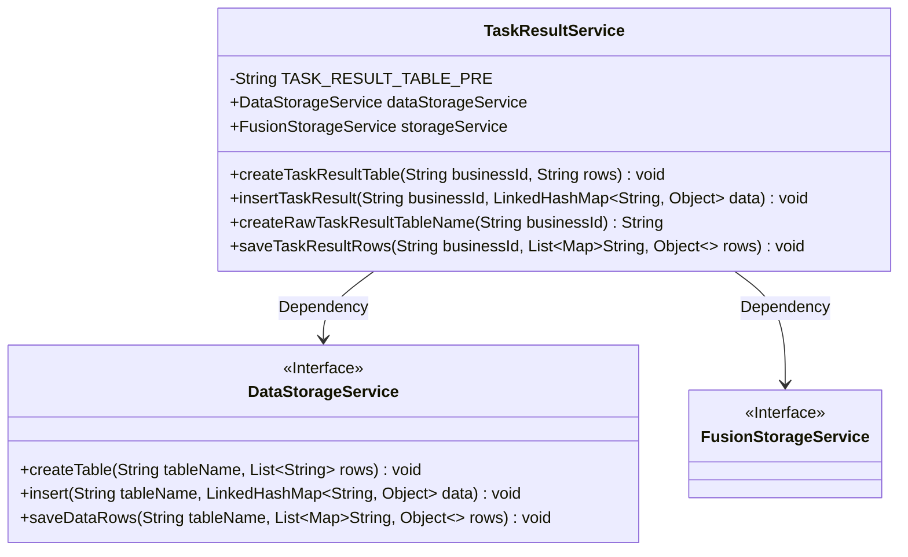
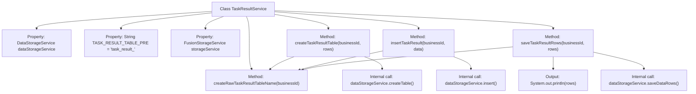

# Basic Information

|      |      |
|------|------|
| Name | TaskResultService |
| Language | .java |
| Code Path | WeFe/fusion/fusion-service/src/main/java/com/welab/wefe/data/fusion/service/service/TaskResultService.java |
| Package Name | com.welab.wefe.data.fusion.service.service |
| Dependencies | ['org.springframework.beans.factory.annotation.Autowired', 'org.springframework.stereotype.Service', 'java.util.Arrays', 'java.util.LinkedHashMap', 'java.util.List', 'java.util.Map'] |
| Brief Description | The TaskResultService class provides operations for the task result table, including table creation, data insertion, batch saving, and table name generation, relying on DataStorageService to implement storage logic. |

# Description

TaskResultService is a Spring service class designed to manage operations related to the task result table. It relies on DataStorageService and FusionStorageService for data storage. Key functionalities include: creating business ID-associated tables prefixed with "task_result_" via the createTaskResultTable method; inserting single data entries using the insertTaskResult method; and batch-saving multiple rows of data through the saveTaskResultRows method. The table name generation logic is encapsulated in the createRawTaskResultTableName method, consistently following a naming convention of prefix plus business ID.

# Class Summary

| Name   | Type  | Description |
|-------|------|-------------|
| TaskResultService | class | The TaskResultService class provides operations for the task result table, including table creation, data insertion, batch saving, and table name generation, relying on DataStorageService for storage operations. |

## Class TaskResultService

|      |      |
|------|------|
| Access Modifier | @Service;public |
| Type | class |
| Name | TaskResultService |
| Description | The TaskResultService class provides operations for the task result table, including table creation, data insertion, batch saving, and table name generation, relying on DataStorageService for storage operations. |

### UML Class Diagram

This code demonstrates a task result service class (TaskResultService) that utilizes data storage service (DataStorageService) and fusion storage service (FusionStorageService) through dependency injection. Its primary functionalities include creating task result tables, inserting single data entries, batch-saving data rows, and generating raw table names. The class diagram clearly illustrates the relationships between these three classes, with TaskResultService serving as the core business class that relies on two interface services to perform data storage operations. All methods revolve around the business ID (businessId) for operations, constructing table names by adding a fixed prefix (TASK_RESULT_TABLE_PRE), thereby implementing structured storage functionality for task result data.

### Internal Method Call Graph

This code represents the TaskResultService class, primarily used for managing the creation of task result tables, data insertion, and batch saving operations. It leverages DataStorageService for underlying table operations, including functionalities like generating table names, creating tables, inserting single data entries, and batch saving data. The core logic dynamically generates table names based on businessId and delegates specific storage operations to dataStorageService, with table names following the format "task_result_" + businessId. The code structure is clear, with single responsibilities, adhering to service layer design principles.

### Field List

| Name  | Type  | Description |
|-------|-------|------|
| storageService | FusionStorageService | Automatically inject the FusionStorageService instance. |
| dataStorageService | DataStorageService | Use @Autowired to automatically inject an instance of DataStorageService. |
| TASK_RESULT_TABLE_PRE = "task_result_" | String | Define the string constant TASK_RESULT_TABLE_PRE with the value "task_result_", to be used as a table name prefix. |

### Method List

| Name  | Type  | Description |
|-------|-------|------|
| createTaskResultTable | void | Create a task result table by method, generate the table name based on the business ID, and use the data storage service to create a table containing the specified rows. |
| insertTaskResult | void | The method `insertTaskResult` receives a business ID and data, generates a table name, and then stores the data. |
| createRawTaskResultTableName | String | Generate the method for task result table names by prefixing with the business ID. |
| saveTaskResultRows | void | This method saves the task result data, prints the data rows, and invokes the storage service to store the data in the table corresponding to the specified business ID. |

