# Basic Information

|      |      |
|------|------|
| Name | TaskService |
| Language | .java |
| Code Path | WeFe/fusion/fusion-service/src/main/java/com/welab/wefe/data/fusion/service/service/TaskService.java |
| Package Name | com.welab.wefe.data.fusion.service.service |
| Dependencies | ['com.alibaba.fastjson.JSONObject', 'com.welab.wefe.common.StatusCode', 'com.welab.wefe.common.data.mysql.Where', 'com.welab.wefe.common.exception.StatusCodeWithException', 'com.welab.wefe.common.util.StringUtil', 'com.welab.wefe.common.web.util.ModelMapper', 'com.welab.wefe.data.fusion.service.actuator.rsapsi.PsiServerActuator', 'com.welab.wefe.data.fusion.service.api.task', 'com.welab.wefe.data.fusion.service.database.entity.BloomFilterMySqlModel', 'com.welab.wefe.data.fusion.service.database.entity.DataSetMySqlModel', 'com.welab.wefe.data.fusion.service.database.entity.PartnerMySqlModel', 'com.welab.wefe.data.fusion.service.database.entity.TaskMySqlModel', 'com.welab.wefe.data.fusion.service.database.repository.DataSetRepository', 'com.welab.wefe.data.fusion.service.database.repository.PartnerRepository', 'com.welab.wefe.data.fusion.service.database.repository.TaskRepository', 'com.welab.wefe.data.fusion.service.dto.base.PagingOutput', 'com.welab.wefe.data.fusion.service.dto.entity.PartnerOutputModel', 'com.welab.wefe.data.fusion.service.dto.entity.TaskOutput', 'com.welab.wefe.data.fusion.service.dto.entity.TaskOverviewOutput', 'com.welab.wefe.data.fusion.service.dto.entity.bloomfilter.BloomfilterOutputModel', 'com.welab.wefe.data.fusion.service.dto.entity.dataset.DataSetOutputModel', 'com.welab.wefe.data.fusion.service.enums', 'com.welab.wefe.data.fusion.service.manager.ActuatorManager', 'com.welab.wefe.data.fusion.service.service.bloomfilter.BloomFilterService', 'com.welab.wefe.data.fusion.service.task.AbstractTask', 'com.welab.wefe.data.fusion.service.task.PsiServerTask', 'com.welab.wefe.data.fusion.service.utils.primarykey.FieldInfo', 'com.welab.wefe.data.fusion.service.utils.primarykey.PrimaryKeyUtils', 'org.apache.commons.collections4.CollectionUtils', 'org.apache.commons.lang3.StringUtils', 'org.springframework.beans.factory.annotation.Autowired', 'org.springframework.data.jpa.domain.Specification', 'org.springframework.stereotype.Service', 'org.springframework.transaction.annotation.Transactional', 'java.math.BigInteger', 'java.util.Arrays', 'java.util.Date', 'java.util.List', 'java.util.UUID', 'java.util.concurrent', 'java.util.stream.Collectors', 'com.welab.wefe.common.StatusCode.DATA_NOT_FOUND', 'com.welab.wefe.common.StatusCode.PARAMETER_VALUE_INVALID'] |
| Brief Description | The TaskService class provides task management functionalities, including task search, update, addition, and processing, supporting RSA-PSI algorithm and Bloom filter operations, involving task status management, data resource handling, and third-party service interactions. |

# Description

TaskService is a service class that inherits from AbstractService and is primarily responsible for task management functionalities. It performs data operations and business processing through multiple Repositories (such as TaskRepository, DataSetRepository, etc.) and Services (such as PartnerService, ThirdPartyService, etc.). Key functionalities include: querying tasks by ID or business ID, updating task status and statistical information, adding and updating tasks, processing task requests (e.g., RSA-PSI algorithm processing), receiving alignment requests from partners, paginated querying of task lists, retrieving task details, deleting tasks, and obtaining task overview statistics. The class also involves transaction management (@Transactional) and exception handling (StatusCodeWithException).

# Class Summary

| Name   | Type  | Description |
|-------|------|-------------|
| TaskService | class | The TaskService class provides task management functionalities, including task addition, deletion, modification, and querying, status updates, PSI algorithm processing, and data alignment operations, supporting both RSA_PSI algorithm and Bloom filters. |

## Class TaskService

|      |      |
|------|------|
| Access Modifier | @Service;public |
| Type | class |
| Name | TaskService |
| Description | The TaskService class provides task management functionalities, including task addition, deletion, modification, and querying, status updates, PSI algorithm processing, and data alignment operations, supporting both RSA_PSI algorithm and Bloom filters. |

### UML Class Diagram

```mermaid
classDiagram
    class AbstractService {
        <<Abstract>>
    }

    class TaskService {
        -TaskRepository taskRepository
        -DataSetRepository dataSetRepository
        -PartnerRepository partnerRepository
        -PartnerService partnerService
        -ThirdPartyService thirdPartyService
        -BloomFilterService bloomFilterService
        -TaskResultService taskResultService
        -FieldInfoService fieldInfoService
        +find(String taskId) TaskMySqlModel
        +findByBusinessId(String businessId) TaskMySqlModel
        +updateByBusinessId(String businessId, TaskStatus status, Integer fusionCount, Integer processedCount, long spend) void
        +add(AddApi.Input input) void
        +update(UpdateApi.Input input) void
        +handle(HandleApi.Input input) void
        +psi(HandleApi.Input input, TaskMySqlModel task, PartnerMySqlModel partner) void
        +psiClient(HandleApi.Input input, TaskMySqlModel task, PartnerMySqlModel partner) void
        +psiServer(HandleApi.Input input, TaskMySqlModel task, PartnerMySqlModel partner) void
        +alignByPartner(ReceiveApi.Input input) void
        +paging(PagingApi.Input input) PagingOutput~TaskOutput~
        +detail(String taskId) TaskOutput
        +setName(TaskOutput model) void
        +setDataResouceList(TaskOutput model) void
        +setPartnerList(TaskOutput model) void
        +delete(String id) void
        +overview() TaskOverviewOutput
    }

    class TaskRepository {
        <<Interface>>
        +findOne(String field, String value, Class~T~ clazz) T
        +save(TaskMySqlModel model) void
        +paging(Specification~TaskMySqlModel~ where, PagingApi.Input input) PagingOutput~TaskMySqlModel~
        +deleteById(String id) void
        +count() Long
        +count(String field, Object value, Class~T~ clazz) Long
    }

    class DataSetRepository {
        <<Interface>>
        +findOne(String field, String value, Class~T~ clazz) T
    }

    class PartnerRepository {
        <<Interface>>
    }

    class PartnerService {
        <<Interface>>
        +findByPartnerId(String partnerId) PartnerMySqlModel
    }

    class ThirdPartyService {
        <<Interface>>
        +alignApply(TaskMySqlModel task) void
        +callback(String baseUrl, String businessId, CallbackType type, Object... args) JSONObject
    }

    class BloomFilterService {
        <<Interface>>
        +findById(String id) BloomFilterMySqlModel
    }

    class TaskResultService {
        <<Interface>>
    }

    class FieldInfoService {
        <<Interface>>
        +saveAll(String businessId, List~FieldInfo~ fieldInfoList) void
        +fieldInfoList(String businessId) List~FieldInfo~
    }

    AbstractService <|-- TaskService
    TaskService --> TaskRepository : Dependency
    TaskService --> DataSetRepository : Dependency
    TaskService --> PartnerRepository : Dependency
    TaskService --> PartnerService : Dependency
    TaskService --> ThirdPartyService : Dependency
    TaskService --> BloomFilterService : Dependency
    TaskService --> TaskResultService : Dependency
    TaskService --> FieldInfoService : Dependency
```

This diagram illustrates TaskService as the core service class, inheriting from AbstractService and interacting with multiple Repository and Service components through dependency injection. Key functionalities include task CRUD operations, PSI algorithm processing, paginated queries, and status management. The class diagram clearly reflects the typical structure of a Spring service layer, where TaskService acts as a coordinator to complete distributed task processing flows—particularly the server/client implementations of PSI (Private Set Intersection) algorithm—through eight dependent components.

### Internal Method Call Graph

```mermaid
graph TD
    A["Class TaskService"]
    B["Property: TaskRepository taskRepository"]
    C["Property: DataSetRepository dataSetRepository"]
    D["Property: PartnerRepository partnerRepository"]
    E["Property: PartnerService partnerService"]
    F["Property: ThirdPartyService thirdPartyService"]
    G["Property: BloomFilterService bloomFilterService"]
    H["Property: TaskResultService taskResultService"]
    I["Property: FieldInfoService fieldInfoService"]
    J["Method: find(String taskId)"]
    K["Method: findByBusinessId(String businessId)"]
    L["Method: updateByBusinessId(...)"]
    M["Method: add(AddApi.Input input)"]
    N["Method: update(UpdateApi.Input input)"]
    O["Method: handle(HandleApi.Input input)"]
    P["Method: psi(HandleApi.Input...)"]
    Q["Method: psiClient(...)"]
    R["Method: psiServer(...)"]
    S["Method: alignByPartner(...)"]
    T["Method: paging(...)"]
    U["Method: detail(String taskId)"]
    V["Method: setName(TaskOutput model)"]
    W["Method: setDataResouceList(...)"]
    X["Method: setPartnerList(...)"]
    Y["Method: delete(String id)"]
    Z["Method: overview()"]

    A --> B
    A --> C
    A --> D
    A --> E
    A --> F
    A --> G
    A --> H
    A --> I
    A --> J
    A --> K
    A --> L
    A --> M
    A --> N
    A --> O
    O --> P
    P --> Q
    P --> R
    A --> S
    A --> T
    A --> U
    U --> V
    U --> W
    U --> X
    A --> Y
    A --> Z
```

This flowchart illustrates the complete structure of the TaskService class, comprising 9 dependency-injected properties and 15 core methods. Key business processes such as task handling (handle) are dispatched via the psi method to either psiClient or psiServer implementations. Update operations (updateByBusinessId) involve status validation and data persistence, while adding new tasks (add) encompasses multi-table operations and third-party service calls. The class methods exhibit clear hierarchical relationships, primarily categorized into CRUD operations, business processing flows, and auxiliary methods, reflecting the core logic of the task management system.

### Field List

| Name  | Type  | Description |
|-------|-------|------|
| partnerRepository | PartnerRepository | Using @Autowired to automatically inject an instance of PartnerRepository. |
| dataSetRepository | DataSetRepository | Using @Autowired to automatically inject an instance of DataSetRepository. |
| bloomFilterService | BloomFilterService | Automatically inject the Bloom filter service instance. |
| taskResultService | TaskResultService | Using @Autowired to automatically inject an instance of TaskResultService. |
| partnerService | PartnerService | Using @Autowired to automatically inject an instance of PartnerService. |
| taskRepository | TaskRepository | Use @Autowired to automatically inject an instance of TaskRepository. |
| thirdPartyService | ThirdPartyService | Automatically inject third-party service instances. |
| fieldInfoService | FieldInfoService | Automatically inject the FieldInfoService service instance. |

### Method List

| Name  | Type  | Description |
|-------|-------|------|
| detail | TaskOutput | This method queries the database by task ID and maps the result to a TaskOutput object. If the data does not exist, an exception is thrown; otherwise, it sets the name, data resources, and partner list before returning the result. |
| alignByPartner | void | The transactional method `alignByPartner` processes the input parameters, validates the PSI execution role and data volume, then creates and stores the task model. It rolls back in case of exceptions and throws a status code exception for parameter errors. |
| psiServer | void | The method `psiServer` handles PSI tasks: checks if the business ID exists, validates the Bloom filter data, starts a new thread to execute the task after configuring the task parameters, updates the status, and notifies the client. Throws a status code error in case of exceptions. |
| psiClient | void | The psiClient method handles PSI tasks: validates data resource IDs, searches for datasets, saves field information, updates task status and attributes, and finally calls back third-party services. |
| add | void | Transactional method `add` handles task creation: generates a business ID, saves field information, and sets task attributes. Based on the algorithm and resource type, it assigns the PSI execution role, verifies dataset existence, saves the task, and triggers a third-party alignment request. |
| update | void | The transactional method updates task data, checking the task's existence before updating fields such as name and resource ID. If the algorithm is RSA_PSI and the resource type is a Bloom filter, the role is set to server and saved. Otherwise, it checks the dataset's existence; if the algorithm is RSA_PSI, the role is set to client, and the row count is updated before saving. Rolls back on exceptions. |
| paging | PagingOutput<TaskOutput> | Paginate task data, filter by business ID, status, and role, map the results, set names, and return paginated output. |
| updateByBusinessId | void | Update the task status, fusion count, processing count, and time consumption based on the business ID. If the task does not exist, an exception will be thrown. |
| findByBusinessId | TaskMySqlModel | Query the task by business ID and return a TaskMySqlModel object. If it fails, a StatusCodeWithException will be thrown. |
| psi | void | The method `psi` invokes different PSI processing logic based on the `task` role: the `server` role calls `psiServer`, the `client` role calls `psiClient`, and no action is taken in other cases. |
| handle | void | The method `handle` processes the input, checks the task status and existence, validates partner information, and performs corresponding operations based on the algorithm type (e.g., RSA_PSI), rolling back in case of exceptions. |
| setName | void | The method `setName` sets the name for the `TaskOutput` model: it retrieves the partner name using `partnerMemberId` and assigns the corresponding data resource name based on the `dataResourceType` (BloomFilter or others). |
| setPartnerList | void | The method `setPartnerList` queries partner information based on the partner IDs in the task model, maps it to the output model, and sets it to the partner list in the task model. |
| delete | void | Transaction method deletes tasks, rolls back on exceptions, and requires checking task status. |
| overview | TaskOverviewOutput | The method counts the total number of tasks, initiators, providers, pending tasks, and running tasks, then returns the aggregated results. |
| find | TaskMySqlModel | Retrieve the MySQL task model with the specified ID, or throw an exception if it fails. |
| setDataResouceList | void | This method sets the corresponding resource list based on the data type of the task output. If it is a Bloom filter type, it queries and maps to the Bloom filter output model; if it is a dataset type, it queries the dataset and sets the hash function. Finally, the results are stored in the corresponding lists of the model. |

