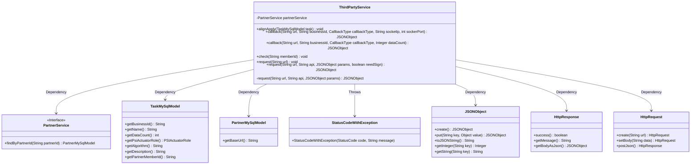
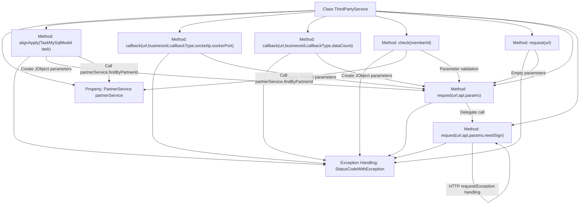

# Basic Information

|      |      |
|------|------|
| Name | ThirdPartyService |
| Language | .java |
| Code Path | WeFe/fusion/fusion-service/src/main/java/com/welab/wefe/data/fusion/service/service/ThirdPartyService.java |
| Package Name | com.welab.wefe.data.fusion.service.service |
| Dependencies | ['com.alibaba.fastjson.JSONObject', 'com.welab.wefe.common.StatusCode', 'com.welab.wefe.common.exception.StatusCodeWithException', 'com.welab.wefe.common.http.HttpRequest', 'com.welab.wefe.common.http.HttpResponse', 'com.welab.wefe.common.util.JObject', 'com.welab.wefe.common.util.RSAUtil', 'com.welab.wefe.data.fusion.service.database.entity.PartnerMySqlModel', 'com.welab.wefe.data.fusion.service.database.entity.TaskMySqlModel', 'com.welab.wefe.data.fusion.service.enums.CallbackType', 'com.welab.wefe.data.fusion.service.enums.PSIActuatorRole', 'org.springframework.beans.factory.annotation.Autowired', 'org.springframework.stereotype.Service', 'java.util.TreeMap'] |
| Brief Description | ThirdPartyService provides third-party service interaction capabilities, including task alignment requests, callback handling, and remote checks. It ensures request security through RSA signatures and handles abnormal status codes. |

# Description

The ThirdPartyService is a class designed to handle interactions with third-party services, with core functionalities including task alignment requests, callback processing, and remote verification. The `alignApply` method constructs and sends requests to partners based on task parameters, throwing an exception if partner information is unavailable. It offers two `callback` methods to process callback requests with either socket details or data volume. The `check` method verifies the existence of partner members. The central `request` method manages HTTP requests, supports RSA signature validation to ensure data sequence integrity, and processes response status codes and error messages. All methods may throw a `StatusCodeWithException` to communicate error states.

# Class Summary

| Name   | Type  | Description |
|-------|------|-------------|
| ThirdPartyService | class | ThirdPartyService provides functionality for interacting with third parties, including task alignment requests, callback handling, and remote checks, supporting parameter signing and error handling. |

## Class ThirdPartyService

|      |      |
|------|------|
| Access Modifier | @Service;public |
| Type | class |
| Name | ThirdPartyService |
| Description | ThirdPartyService provides functionality for interacting with third parties, including task alignment requests, callback handling, and remote checks, supporting parameter signing and error handling. |

### UML Class Diagram

This code illustrates a third-party service class `ThirdPartyService` that interacts with partner systems through the `PartnerService` interface, featuring core functionalities including task alignment requests, callback notifications, and remote checks. The class diagram clearly depicts key classes and their relationships: `ThirdPartyService` depends on multiple model classes and service interfaces, utilizes `HttpRequest` for network calls, processes `JSONObject` data formats, and handles exceptions via `StatusCodeWithException`. Critical steps such as signature validation, parameter assembly, and response processing are embedded in the workflow, demonstrating a comprehensive external system interaction logic.

### Internal Method Call Graph

This flowchart illustrates the core structure and invocation relationships of the ThirdPartyService class. The class primarily handles interactions with third-party services, containing key methods such as request alignment (alignApply), callback processing (callback), and remote checks (check), all ultimately implemented through the request method for HTTP communication. The flow particularly emphasizes the exception handling mechanism (StatusCodeWithException) and critical business logic including parameter construction, RSA signature verification, and HTTP communication. All public methods eventually invoke the private request method to complete actual requests, which implements core functionalities such as parameter processing, signature verification, and response parsing.

### Field List

| Name  | Type  | Description |
|-------|-------|------|
| partnerService | PartnerService | Automatically inject the PartnerService instance. |

### Method List

| Name  | Type  | Description |
|-------|-------|------|
| check | void | Check the validity of the member ID; if it does not exist, throw an exception; if it exists, request its base URL. |
| callback | JSONObject | Java Method: Callback a third-party service via URL, passing parameters such as business ID, callback type, and data volume, and return a JSON response. |
| alignApply | void | The method `alignApply` takes a `TaskMySqlModel` parameter, constructs a JSON object containing fields such as business ID and name, verifies the partner information, and then sends a task request to the partner URL. If the partner does not exist, it throws an exception. |
| callback | JSONObject | The method `callback` invokes a third-party interface via a URL, passing parameters such as business ID, callback type, IP, and port, and returns a JSON result. Exceptions may be thrown. |
| request | void | This method initiates a request via a given URL, calls a third-party remote inspection interface without parameter passing, and may throw status code exceptions. |
| request | JSONObject | Private method: Sends a JSON request via URL and API with parameters as params, handles exceptions by default, and returns a JSONObject. |
| request | JSONObject | This method sends JSON requests via URL and API, supporting RSA signatures. It prevents tampering through parameter ordering, throws exceptions on signature failures or response errors, and returns JSON results upon success. |

