# Basic Information

|      |      |
|------|------|
| Name | service |
| Language | .java |
| Code Path | WeFe/fusion/fusion-service/src/main/java/com/welab/wefe/data/fusion/service/service |
| Package Name | docs.fusion.fusion-service.src.main.java.com.welab.wefe.data.fusion.service.service |
| Brief Description | The Bloom Filter Management Module is responsible for creation, updates, queries, and monitoring, supporting multithreading and encrypted verification. The Global Configuration Module manages member information and email settings, supporting group operations. The Dataset Module handles creation, status tracking, and batch processing. The Task Service manages task status, statistics, and request processing. The System Initialization Service checks and initializes system configurations. The Partner Service manages partner data. The Storage Service provides database operation functionalities. The Single Sign-On Service handles account initialization and updates. The Abstract Service offers logging capabilities. The Data Storage Service manages table operations. The Field Information Service processes column names and attributes. The Task Result Service manages result tables. The Callback Service handles task callbacks. The Cache Utility Class manages static data. The Privacy Data Encryption Service handles database encryption. The Data Source Service manages data source connections and validation. The Header Service retrieves dataset headers. The Third-Party Service handles interactions with partners. The Operation Log Service queries log records. |

# Description

## Overview  
The core responsibility of this module is to build the core service layer of the data fusion platform, providing four key capabilities: Bloom filter management, global configuration management, dataset lifecycle management, and task scheduling. The interface specifications follow a layered design, encompassing CRUD operations (e.g., `increment` for count updates), status monitoring (e.g., `GetBloomFilterStateService`), and batch processing (similar to an event bus pattern). Key data structures include Bloom filter instances, MailServerModel (SMTP parameters), dataset dynamic table names (DATA_SET_TABLE_PRE+ID), and task models. External dependencies involve MySQL (via JPA/Hibernate), RSA encryption, the Spring framework, and filesystem IO, such as handling SQL data source connections through JdbcManager.  

## Primary Business Scenarios  
The typical application pattern is a privacy-preserving computation workflow: 1) System initialization (SystemInitializeService generates RSA keys) → 2) Data preparation (DataSetAddService loads CSV/SQL data) → 3) Secure computation (TaskService processes RSA-PSI algorithms) → 4) Result callback (CallbackService synchronizes status). The interaction model combines the producer-consumer pattern (e.g., batch processing of 10,000 rows) and the configuration center pattern (GlobalConfigService manages multi-tenant parameters). Functional completeness is reflected in cryptographic validation (no more than 5 field combinations), thread-safe operations (e.g., CacheObjects cache synchronization), and exception handling (e.g., StatusCodeWithException). API types span management (PartnerService CRUD), monitoring (OperationLogService log queries), and integration (ThirdPartyService cross-node communication).

### Package Internal Structure View

```mermaid
graph TD
    service --> bloomfilter
    service --> globalconfig
    service --> dataset
    service --> TaskService.java
    service --> SystemInitializeService.java
    service --> PartnerService.java
    service --> FusionStorageService.java
    service --> AccountService.java
    service --> AbstractService.java
    service --> DataStorageService.java
    service --> FieldInfoService.java
    service --> TaskResultService.java
    service --> CallbackService.java
    service --> CacheObjects.java
    service --> PrivacyDatabaseEncryptService.java
    service --> DataSourceService.java
    service --> GetHeadersService.java
    service --> ThirdPartyService.java
    service --> OperationLogService.java
    bloomfilter --> BloomFilterAddServiceDataRowConsumer.java
    bloomfilter --> BloomFilterService.java
    bloomfilter --> BloomFilterAddService.java
    bloomfilter --> GetBloomFilterStateService.java
    globalconfig --> GlobalConfigService.java
    globalconfig --> MailServerModel.java
    globalconfig --> BaseGlobalConfigService.java
    dataset --> DataSetAddService.java
    dataset --> GetDataSetStateService.java
    dataset --> DataSetAddServiceDataRowConsumer.java
    dataset --> DataSetService.java
    dataset --> DataSetStorageHelper.java
```

This flowchart illustrates the hierarchical structure of Java service classes in the fusion-service module of the WeFe project. The root node "service" contains three subdirectories (bloomfilter, globalconfig, dataset) and multiple direct service class files. Each subdirectory further includes its respective service implementation classes. For example, the bloomfilter directory contains Bloom Filter-related services, the globalconfig directory includes global configuration services, and the dataset directory comprises dataset services. The overall structure clearly reflects the organization of service classes.

# File List

| Name   | Type  | Description |
|-------|------|-------------|
| [TaskService.java](TaskService.md) | file | The TaskService class provides task management functionalities, including task lookup, update, addition, and processing. It supports RSA-PSI algorithm and Bloom filter operations, involving task status management, data resource handling, and third-party service interactions. |
| [SystemInitializeService.java](SystemInitializeService.md) | file | The SystemInitializeService is used for system initialization, checking whether it has been initialized and setting member information via the initialize method, including generating RSA key pairs. Repeated initialization will throw an exception. |
| [PartnerService.java](PartnerService.md) | file | The PartnerService class provides partner management functionalities, including querying, adding, updating, deleting, and paginated queries. It checks the existence of a partner via memberId to ensure data uniqueness. Database operations are performed using the Repository, supporting conditional queries and pagination. |
| [FusionStorageService.java](FusionStorageService.md) | file | FusionStorageService is a Spring service class that implements database table creation, deletion, data insertion, batch saving, and counting functionalities through MysqlStorage, while capturing exceptions and logging them. |
| [AccountService.java](AccountService.md) | file | The AccountService handles SSO login, checks system initialization, queries or creates accounts, updates information, and returns login results. |
| [AbstractService.java](AbstractService.md) | file | Abstract service classes provide logging functionality, including a logger object and exception logging methods. |
| [DataStorageService.java](DataStorageService.md) | file | The DataStorageService class provides database table operation functionalities, including table creation, table deletion, data insertion, batch saving, and data counting, relying on FusionStorageService to implement specific operations. |
| [FieldInfoService.java](FieldInfoService.md) | file | The FieldInfoService class provides field information management functionalities, including querying field lists and field information lists by businessId, as well as batch saving field information. It operates the database through FieldInfoRepository, supporting conditional queries and sorting. |
| [TaskResultService.java](TaskResultService.md) | file | The TaskResultService class provides operations for the task result table, including table creation, data insertion, batch saving, and table name generation, relying on DataStorageService to implement storage logic. |
| [CallbackService.java](CallbackService.md) | file | The CallbackService processes callback requests and performs different operations based on their types: running starts client tasks, init updates task status, success concludes tasks, and stop terminates tasks. It involves collaboration with TaskService, TaskRepository, and PartnerService. |
| [CacheObjects.java](CacheObjects.md) | file | The CacheObjects class manages static cached data, including member information, keys, ports, and multiple mapping tables (partners, Bloom filters, datasets, accounts). It provides methods for retrieving and refreshing this data to ensure it remains up-to-date. Additionally, it supports determining member and account affiliations. |
| [PrivacyDatabaseEncryptService.java](PrivacyDatabaseEncryptService.md) | file | The `PrivacyDatabaseEncryptService` class is used to encrypt private data in databases, containing three encryption methods: account, global configuration, and data source. All methods update the modification time and save the changes. |
| [DataSourceService.java](DataSourceService.md) | file | The DataSourceService provides data source management functionalities, including addition, deletion, modification, and query operations, connection testing, SQL query validation, and file retrieval. It supports database connection testing to ensure data source validity and counts the number of datasets and Bloom filters. |
| [GetHeadersService.java](GetHeadersService.md) | file | The `GetHeadersService` class retrieves data table headers based on the input source (database or file). For databases, it obtains headers via SQL queries; for files, it reads headers according to the file type (CSV or Excel). It handles exceptions and logs them. |
| [ThirdPartyService.java](ThirdPartyService.md) | file | ThirdPartyService provides third-party service interaction capabilities, including task alignment requests, callback processing, and remote checks. It ensures request security through RSA signatures and handles abnormal status codes. |
| [OperationLogService.java](OperationLogService.md) | file | The OperationLogService provides paginated query functionality for operation logs, supporting filtering by caller, API name, and time range, with results sorted in descending order by creation time. |
| [dataset](dataset/_module.md) | package | The DataSetAddService handles dataset addition, validates parameters, and stores data. The GetDataSetStateService updates dataset status and progress. The DataSetAddServiceDataRowConsumer processes data rows in batches. The DataSetService manages dataset operations. The DataSetStorageHelper handles dataset storage and statistics. |
| [globalconfig](globalconfig/_module.md) | package | The GlobalConfigService inherits from BaseGlobalConfigService, providing configuration management functionalities such as updating configurations, RSA keys, member information, etc. The MailServerModel encapsulates email server configuration details. The BaseGlobalConfigService manages group configurations, supporting CRUD operations and serialization. |
| [bloomfilter](bloomfilter/_module.md) | package | The BloomFilterAddServiceDataRowConsumer processes data to generate Bloom filters, supporting multi-threading and batch operations. The BloomFilterService provides CRUD and data preview functionalities, operating on MySQL databases. The BloomFilterAddService implements filter addition, data reading, and checking capabilities. The GetBloomFilterStateService manages filter state updates and queries. |

