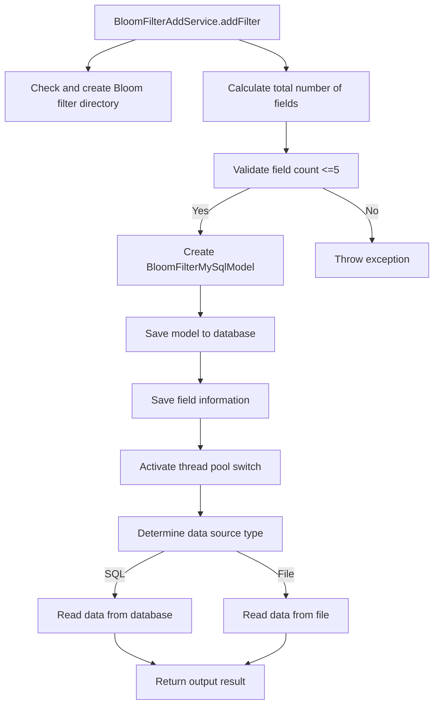
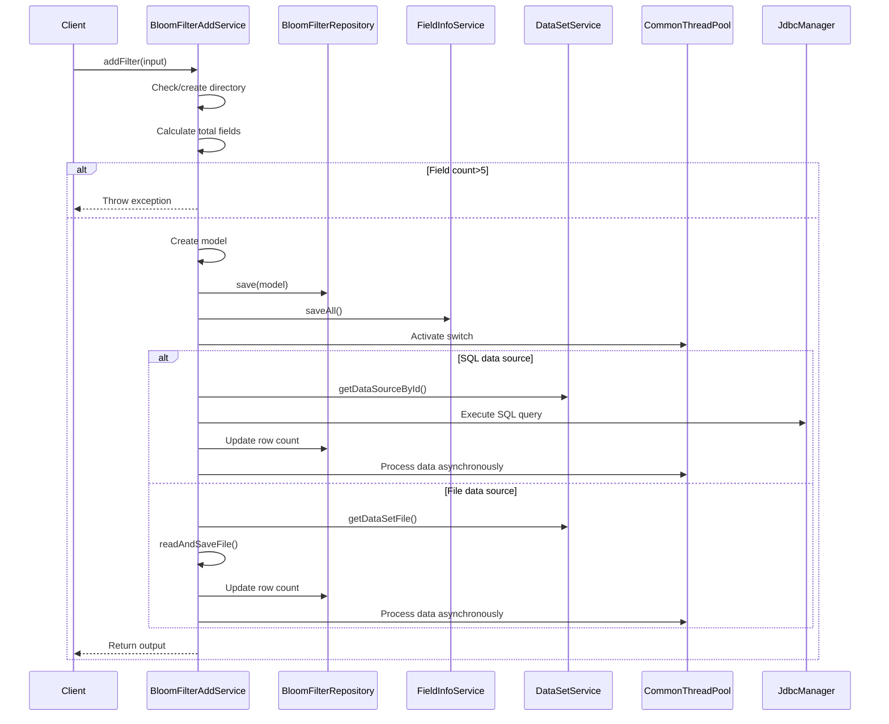

# Basic Information

|      |      |
|------|------|
| Name | BloomFilterAddService |
| Language | .java |
| Code Path | WeFe/fusion/fusion-service/src/main/java/com/welab/wefe/data/fusion/service/service/bloomfilter/BloomFilterAddService.java |
| Package Name | com.welab.wefe.data.fusion.service.service.bloomfilter |
| Dependencies | ['com.welab.wefe.common.CommonThreadPool', 'com.welab.wefe.common.StatusCode', 'com.welab.wefe.common.exception.StatusCodeWithException', 'com.welab.wefe.common.util.JObject', 'com.welab.wefe.common.util.StringUtil', 'com.welab.wefe.common.web.Launcher', 'com.welab.wefe.common.web.util.CurrentAccountUtil', 'com.welab.wefe.data.fusion.service.api.bloomfilter.AddApi', 'com.welab.wefe.data.fusion.service.config.Config', 'com.welab.wefe.data.fusion.service.database.entity.BloomFilterMySqlModel', 'com.welab.wefe.data.fusion.service.database.entity.DataSourceMySqlModel', 'com.welab.wefe.data.fusion.service.database.repository.BloomFilterRepository', 'com.welab.wefe.data.fusion.service.enums.DataResourceSource', 'com.welab.wefe.data.fusion.service.enums.Progress', 'com.welab.wefe.data.fusion.service.manager.JdbcManager', 'com.welab.wefe.data.fusion.service.service.AbstractService', 'com.welab.wefe.data.fusion.service.service.FieldInfoService', 'com.welab.wefe.data.fusion.service.service.dataset.DataSetService', 'com.welab.wefe.data.fusion.service.utils.AbstractDataSetReader', 'com.welab.wefe.data.fusion.service.utils.CsvDataSetReader', 'com.welab.wefe.data.fusion.service.utils.ExcelDataSetReader', 'com.welab.wefe.data.fusion.service.utils.bf.BloomFilters', 'com.welab.wefe.data.fusion.service.utils.primarykey.FieldInfo', 'com.welab.wefe.data.fusion.service.utils.primarykey.PrimaryKeyUtils', 'com.welab.wefe.fusion.core.utils.CryptoUtils', 'com.welab.wefe.fusion.core.utils.PSIUtils', 'org.apache.commons.lang3.StringUtils', 'org.springframework.beans.factory.annotation.Autowired', 'org.springframework.stereotype.Service', 'org.springframework.transaction.annotation.Transactional', 'java.io.File', 'java.io.FileReader', 'java.io.IOException', 'java.io.LineNumberReader', 'java.math.BigInteger', 'java.nio.file.Paths', 'java.security.SecureRandom', 'java.sql.Connection', 'java.util.ArrayList', 'java.util.Date', 'java.util.List'] |
| Brief Description | The BloomFilterAddService class provides Bloom filter addition functionality, supporting data reading from databases or files, validating encryption combination complexity, saving model information, and handling data sources. It includes data parsing, thread pool operations, and encryption validation logic. |

# Description

The code implements a Bloom filter service with key functionalities including adding filters, reading data from files or databases and saving to MySQL, and checking whether data exists in the filter. The service first validates input parameters to ensure no more than five fields are encrypted in combination. It then processes data based on the source (SQL or file), reads the data, and generates the Bloom filter. The check feature verifies data matches using blind factors and encryption techniques. The entire process involves directory creation, data parsing, multi-threaded processing, and exception handling.

# Class Summary

| Name   | Type  | Description |
|-------|------|-------------|
| BloomFilterAddService | class | The BloomFilterAddService class provides Bloom filter addition functionality, supporting data reading from databases or files, handling field combination constraints, saving model information, and incorporating data validation logic. |


## Class BloomFilterAddService

|      |      |
|------|------|
| Access Modifier | @Service;public |
| Type | class |
| Name | BloomFilterAddService |
| Description | The BloomFilterAddService class provides Bloom filter addition functionality, supporting data reading from databases or files, handling field combination constraints, saving model information, and incorporating data validation logic. |


### UML Class Diagram

```mermaid
classDiagram
    class BloomFilterAddService {
        -BloomFilterRepository bloomFilterRepository
        -DataSetService dataSetService
        -Config config
        -FieldInfoService fieldInfoService
        +addFilter(AddApi~Input~ input) AddApi~BloomfilterAddOutput~
        -readAndSaveFile(BloomFilterMySqlModel model, File file, List~String~ idFeatureFields) int
        +readAndSaveFromDB(BloomFilterMySqlModel model, List~String~ headers) int
        +CheckFilter(String id, BigInteger N, BigInteger e, BigInteger d, List~Object~ CheckData, BloomFilters~BigInteger~ bf) boolean
    }

    class AbstractService {
        <<Abstract>>
    }

    class BloomFilterRepository {
        <<Interface>>
        +save(BloomFilterMySqlModel model)
        +updateById(String id, String field, Object value, Class~T~ clazz)
    }

    class DataSetService {
        <<Interface>>
        +getDataSetFile(DataResourceSource source, String filename) File
        +getDataSourceById(String id) DataSourceMySqlModel
    }

    class FieldInfoService {
        <<Interface>>
        +saveAll(String modelId, List~FieldInfo~ fieldInfos)
        +fieldInfoList(String id) List~FieldInfo~
    }

    class Config {
        -String bloomFilterDir
        +String getBloomFilterDir()
    }

    class BloomFilterMySqlModel {
        -String id
        -String description
        -DataResourceSource dataResourceSource
        -String name
        -String rows
        -int usedCount
        -int rowCount
        -Date updatedTime
        -String statement
        -String sourcePath
        -String dataSourceId
        -String hashFunction
        -String src
        -int processCount
        // getters/setters
    }

    class AddApi {
        class Input {
            -List~FieldInfo~ fieldInfoList
            -String description
            -DataResourceSource dataResourceSource
            -String name
            -List~String~ rows
            -String sql
            -String filename
            -String dataSourceId
            // getters/setters
        }
        class BloomfilterAddOutput {
            -String dataSourceId
            +setDataSourceId(String id)
        }
    }

    class FieldInfo {
        -List~String~ columnList
        // getters/setters
    }

    class DataResourceSource {
        <<Enumeration>>
        Sql
        File
    }

    class BloomFilterAddServiceDataRowConsumer {
        -BloomFilterMySqlModel model
        -File file
        // Consumer logic implementation
    }

    AbstractService <|-- BloomFilterAddService
    BloomFilterAddService --> BloomFilterRepository : Dependency
    BloomFilterAddService --> DataSetService : Dependency
    BloomFilterAddService --> FieldInfoService : Dependency
    BloomFilterAddService --> Config : Dependency
    BloomFilterAddService --> AddApi : Uses I/O
    BloomFilterAddService --> BloomFilterMySqlModel : Operates
    BloomFilterAddService --> FieldInfo : Processes field info
    BloomFilterAddService --> BloomFilterAddServiceDataRowConsumer : Creates/uses
    DataSetService --> DataSourceMySqlModel : Queries
    AddApi .. Input
    AddApi .. BloomfilterAddOutput
```

Class diagram description: This diagram illustrates the core structure of BloomFilterAddService, which inherits from AbstractService and depends on multiple service interfaces (BloomFilterRepository, DataSetService, FieldInfoService) and a configuration class (Config). Its primary functions include processing Bloom filter addition requests via the addFilter method, invoking readAndSaveFromDB or readAndSaveFile methods based on data sources (SQL or file), and utilizing BloomFilterAddServiceDataRowConsumer for data consumption. It also includes the CheckFilter method for verifying data matches, involving cryptographic operations and Bloom filter queries.


### Internal Method Call Graph





This flowchart illustrates the processing flow of the core method addFilter in BloomFilterAddService, including key steps such as directory checking, parameter validation, model creation, data source determination, and asynchronous processing. The sequence diagram details the interaction process from client invocation to internal service components, covering critical interaction nodes like exception handling, database operations, and thread pool scheduling. The entire process strictly follows transactional operations to ensure data consistency while supporting both SQL and file data source processing methods.

### Field List

| Name  | Type  | Description |
|-------|-------|------|
| bloomFilterRepository | BloomFilterRepository | Using @Autowired to automatically inject an instance of BloomFilterRepository. |
| fieldInfoService | FieldInfoService | Automatically inject the FieldInfoService service instance. |
| config | Config | Automatically inject Config configuration instance. |
| dataSetService | DataSetService | Automatically inject the DataSetService instance. |

### Method List

| Name  | Type  | Description |
|-------|-------|------|
| addFilter | AddApi.BloomfilterAddOutput | This method is used to add a Bloom filter. After verifying parameter validity, it creates and saves the model, generates the filter by reading data from either a database or file based on the data source type, and finally returns the data source ID. The transaction is rolled back in case of exceptions. |
| readAndSaveFile | int | The method reads file data and saves it, supporting CSV and Excel formats, updates the database after counting the rows, creates directories and processes data rows, and finally returns the total row count. |
| readAndSaveFromDB | int | The method reads data from the database and saves it, checks the validity of the data source, counts the number of rows, updates the processing status, creates directories, and asynchronously processes the data before returning the row count. |
| CheckFilter | boolean | This method checks whether the data exists in the Bloom filter. The steps are as follows: 1. Retrieve field information; 2. Generate blind factors; 3. Process the primary key and encrypt it; 4. Sign the query data; 5. Verify the matching result. It returns true if the match is successful, otherwise false. |


