# Basic Information

|      |      |
|------|------|
| Name | BloomFilterAddServiceDataRowConsumer |
| Language | .java |
| Code Path | WeFe/fusion/fusion-service/src/main/java/com/welab/wefe/data/fusion/service/service/bloomfilter/BloomFilterAddServiceDataRowConsumer.java |
| Package Name | com.welab.wefe.data.fusion.service.service.bloomfilter |
| Dependencies | ['java.io.File', 'java.io.FileOutputStream', 'java.io.IOException', 'java.math.BigInteger', 'java.util.List', 'java.util.Map', 'java.util.concurrent.CopyOnWriteArrayList', 'java.util.concurrent.ExecutorService', 'java.util.concurrent.Executors', 'java.util.concurrent.TimeUnit', 'java.util.concurrent.atomic.AtomicInteger', 'java.util.function.Consumer', 'org.bouncycastle.crypto.AsymmetricCipherKeyPair', 'org.bouncycastle.crypto.params.RSAKeyParameters', 'org.bouncycastle.crypto.params.RSAPrivateCrtKeyParameters', 'org.slf4j.Logger', 'org.slf4j.LoggerFactory', 'org.springframework.beans.factory.annotation.Autowired', 'com.welab.wefe.common.BatchConsumer', 'com.welab.wefe.common.util.JObject', 'com.welab.wefe.common.web.Launcher', 'com.welab.wefe.data.fusion.service.database.entity.BloomFilterMySqlModel', 'com.welab.wefe.data.fusion.service.database.repository.BloomFilterRepository', 'com.welab.wefe.data.fusion.service.enums.Progress', 'com.welab.wefe.data.fusion.service.service.FieldInfoService', 'com.welab.wefe.data.fusion.service.utils.bf.BloomFilters', 'com.welab.wefe.data.fusion.service.utils.primarykey.FieldInfo', 'com.welab.wefe.data.fusion.service.utils.primarykey.PrimaryKeyUtils', 'com.welab.wefe.fusion.core.utils.CryptoUtils', 'com.welab.wefe.fusion.core.utils.PSIUtils'] |
| Brief Description | The `BloomFilterAddServiceDataRowConsumer` class implements the `Consumer` interface and is designed for batch processing data to generate a Bloom filter. It includes functionalities such as RSA key pair handling, Bloom filter operations, multi-threaded processing, and progress tracking. It supports batch data consumption, accelerates processing via a thread pool, and ultimately writes the results to a file. |

# Description

BloomFilterAddServiceDataRowConsumer is a class that implements the Consumer interface, primarily designed for processing data and generating Bloom filters. It includes several key attributes such as a Bloom filter instance, RSA key parameters, progress tracking, and batch processing utilities. The class provides two methods for generating Bloom filters: a multithreaded optimized version and a single-threaded version. By consuming data in batches, it adds processed data to the Bloom filter while supporting progress updates and result saving. It also incorporates functionality for data validation and thread-safe operations.

# Class Summary

| Name   | Type  | Description |
|-------|------|-------------|
| BloomFilterAddServiceDataRowConsumer | class | The `BloomFilterAddServiceDataRowConsumer` class implements the `Consumer` interface and is designed for batch processing data to generate a Bloom filter. It incorporates RSA key pairs, Bloom filter operations, multithreading processing, and progress tracking functionality. It supports batch data consumption, accelerates processing via a thread pool, and ultimately writes the results to a file. |


## Class BloomFilterAddServiceDataRowConsumer

|      |      |
|------|------|
| Access Modifier | public |
| Type | class |
| Name | BloomFilterAddServiceDataRowConsumer |
| Description | The `BloomFilterAddServiceDataRowConsumer` class implements the `Consumer` interface and is designed for batch processing data to generate a Bloom filter. It incorporates RSA key pairs, Bloom filter operations, multithreading processing, and progress tracking functionality. It supports batch data consumption, accelerates processing via a thread pool, and ultimately writes the results to a file. |


### UML Class Diagram

```mermaid
classDiagram
    class BloomFilterAddServiceDataRowConsumer {
        -Logger LOG
        -BloomFilterRepository bloomFilterRepository
        -String src
        -AsymmetricCipherKeyPair keyPair
        -BloomFilters~BigInteger~ bf
        -RSAKeyParameters pk
        -BigInteger e
        -BigInteger N
        -RSAPrivateCrtKeyParameters sk
        -BigInteger d
        -List~FieldInfo~ fieldInfoList
        -Integer processCount
        -AtomicInteger checkCount
        -Progress process
        -List~Object~ CheckData
        -BloomFilterMySqlModel model
        -BatchConsumer~Map~String,Object~~ batchConsumer
        +BloomFilters~BigInteger~ getBf()
        +void setBf(BloomFilters~BigInteger~ bf)
        +BigInteger getE()
        +void setE(BigInteger e)
        +BigInteger getN()
        +void setN(BigInteger n)
        +BigInteger getD()
        +void setD(BigInteger d)
        +Integer getProcessCount()
        +void setProcessCount(Integer processCount)
        +Progress getProcess()
        +void setProcess(Progress process)
        +List~Object~ getCheckData()
        +BloomFilterMySqlModel getModel()
        +BloomFilterAddServiceDataRowConsumer(BloomFilterMySqlModel model, File file)
        +void accept(Map~String,Object~ data)
        +void generateFilter(BloomFilterMySqlModel model, List~Map~String,Object~~ rows)
        +void generateFilterSlown(BloomFilterMySqlModel model, List~Map~String,Object~~ rows)
        +void waitForFinishAndClose()
        +AtomicInteger getCheckCount()
        +void setCheckCount(AtomicInteger checkCount)
        +void setCheckData(List~Object~ checkData)
        +synchronized void addToBf(BigInteger z)
    }

    class BloomFilterRepository {
        <<Interface>>
        +save(BloomFilterMySqlModel model)
        +updateById(String id, String field, Object value, Class~T~ clazz)
        +findOne(String field, Object value, Class~T~ clazz)
    }

    class BloomFilters~T~ {
        <<Interface>>
        +add(T element)
        +writeTo(OutputStream out)
        +size()
    }

    class BatchConsumer~T~ {
        +BatchConsumer(int batchSize, int maxWaitTime, Consumer~List~T~~ processor)
        +add(T item)
        +waitForFinishAndClose()
    }

    class BloomFilterMySqlModel {
        +String id
        +String src
        +Progress process
        +Integer processCount
        +Integer rowCount
        +String d
        +String n
        +String e
        +getProcessCount()
        +getRowCount()
        +getId()
        +getSrc()
        +setD(String d)
        +setN(String n)
        +setE(String e)
        +setSrc(String src)
        +setProcess(Progress process)
    }

    class FieldInfo {
        // Field information class
    }

    class Progress {
        <<Enumeration>>
        Ready
        Running
        Success
    }

    BloomFilterAddServiceDataRowConsumer --> BloomFilterRepository : Dependency
    BloomFilterAddServiceDataRowConsumer --> BloomFilters~BigInteger~ : Uses
    BloomFilterAddServiceDataRowConsumer --> BatchConsumer~Map~String,Object~~ : Composition
    BloomFilterAddServiceDataRowConsumer --> BloomFilterMySqlModel : Association
    BloomFilterAddServiceDataRowConsumer --> FieldInfo : Association
    BloomFilterAddServiceDataRowConsumer --> Progress : Uses
```

This class diagram illustrates the core structure of BloomFilterAddServiceDataRowConsumer, which is a Bloom filter data processing service implementing the Consumer interface. Its primary functionalities include: batch processing data via thread pools, handling data with RSA encryption algorithms, maintaining processing states (Progress enumeration), and persisting data through BloomFilterRepository. The class contains multiple encryption-related parameters (BigInteger e/N/d) and concurrency control components (AtomicInteger checkCount), achieving efficient batch consumption via BatchConsumer. It maintains a strong association with BloomFilterMySqlModel for storing processing progress and parameter configurations.


### Internal Method Call Graph

```mermaid
graph TD
    A["Class BloomFilterAddServiceDataRowConsumer"]
    B["Attribute: Logger LOG"]
    C["Attribute: BloomFilterRepository bloomFilterRepository"]
    D["Attribute: String src"]
    E["Attribute: AsymmetricCipherKeyPair keyPair"]
    F["Attribute: BloomFilters<BigInteger> bf"]
    G["Attribute: RSAKeyParameters pk"]
    H["Attribute: BigInteger e/N/d"]
    I["Attribute: RSAPrivateCrtKeyParameters sk"]
    J["Attribute: List<FieldInfo> fieldInfoList"]
    K["Attribute: Integer processCount"]
    L["Attribute: AtomicInteger checkCount"]
    M["Attribute: Progress process"]
    N["Attribute: List<Object> CheckData"]
    O["Attribute: BloomFilterMySqlModel model"]
    P["Attribute: BatchConsumer<Map> batchConsumer"]
    Q["Constructor: BloomFilterAddServiceDataRowConsumer"]
    R["Method: generateFilter"]
    S["Method: generateFilterSlown"]
    T["Method: waitForFinishAndClose"]
    U["Method: addToBf"]
    V["Method: Multiple getter/setter"]

    A --> B
    A --> C
    A --> D
    A --> E
    A --> F
    A --> G
    A --> H
    A --> I
    A --> J
    A --> K
    A --> L
    A --> M
    A --> N
    A --> O
    A --> P
    A --> Q
    Q --> R
    Q --> S
    A --> T
    A --> U
    A --> V
    R -->|"Thread pool processing"| U
    S -->|"Single-thread processing"| F
```



This flowchart illustrates the complete structure of the BloomFilterAddServiceDataRowConsumer class, featuring 18 core attributes and 5 key methods. The constructor initializes Bloom filter parameters and launches a batch consumer. The generateFilter method employs thread pools for parallel data encryption and filter addition operations, while generateFilterSlown provides a single-threaded processing path. waitForFinishAndClose ensures completion of the consumption queue. The class utilizes various cryptographic parameters (RSA key pairs) and concurrency control mechanisms (AtomicInteger/CopyOnWriteArrayList), achieving efficient batch processing through BatchConsumer, ultimately persisting Bloom filter data to the file system.

### Field List

| Name  | Type  | Description |
|-------|-------|------|
| processCount = 0 | Integer | Define a private integer variable processCount with an initial value of 0. |
| N | BigInteger | Declare a private big integer variable N. |
| e | BigInteger | Private large integer variable e. |
| bloomFilterRepository | BloomFilterRepository | Automatically inject the Bloom filter repository instance. |
| d | BigInteger | The private large integer variable d. |
| keyPair | AsymmetricCipherKeyPair | Asymmetric Encryption Key Pair |
| LOG = LoggerFactory.getLogger(this.getClass()) | Logger | Define the logger instance LOG for the current class, used to output log information. |
| CheckData = new CopyOnWriteArrayList<>() | List<Object> | Define a thread-safe dynamic array CheckData, implemented using CopyOnWriteArrayList. |
| bf | BloomFilters<BigInteger> | Private Bloom Filter for storing large integer types. |
| process | Progress | Private progress object `process` |
| src | String | Declaration of private string variable src. |
| checkCount = new AtomicInteger(0) | AtomicInteger | Define a thread-safe integer variable named checkCount, initialized to 0, for counting operations in a multi-threaded environment. |
| sk | RSAPrivateCrtKeyParameters | Private key parameter: Variable `sk` of type `RSAPrivateCrtKeyParameters`. |
| pk | RSAKeyParameters | Private key RSA parameters |
| fieldInfoList | List<FieldInfo> | Field information list, storing a collection of FieldInfo objects. |
| batchConsumer | BatchConsumer<Map<String, Object>> | Private batch consumer, processing data of type Map<String, Object>. |
| model | BloomFilterMySqlModel | The private member variable `model`, of type `BloomFilterMySqlModel`. |

### Method List

| Name  | Type  | Description |
|-------|-------|------|
| generateFilterSlown | void | Method generates a Bloom filter, processes data rows, and computes hash values to store in the filter. Upon completion, it updates the database status and saves the filter to a file. Records time consumption and logs. |
| generateFilter | void | Method generates a Bloom filter, processes data using a 120-thread pool, calculates hashes and adds them to the filter, records processing time and quantity, updates the status upon completion, and saves it to a file. |
| getD | BigInteger | Java method: Returns the value of the private BigInteger variable d. |
| setN | void | Set the value of N to the input large integer n. |
| getBf | BloomFilters<BigInteger> | Get the Bloom filter object `bf` of type `BigInteger`. |
| setProcess | void | Methods for setting the progress object, assigning the incoming `process` to the `process` property of the current object. |
| setProcessCount | void | Defined a public method for setting the value of the integer-type processCount property. |
| accept | void | Rewrite the accept method to add the incoming Map data to the batchConsumer. |
| setE | void | Method for setting the public exponent e, with the parameter being of type BigInteger. |
| getN | BigInteger | The Java method returns an N value of type BigInteger. |
| getProcess | Progress | Methods to obtain the process object, returning the process variable. |
| getProcessCount | Integer | Methods to obtain the number of processes, returns an integer value processCount. |
| getModel | BloomFilterMySqlModel | Methods to obtain the BloomFilterMySqlModel object. |
| setBf | void | The method setBf is used to set the member variable bf of type BloomFilters<BigInteger>. |
| getCheckData | List<Object> | Methods for obtaining the list of inspection data, returning a list of CheckData objects. |
| setCheckData | void | This is a Java method used to set the CheckData property, which accepts a List parameter of type Object. |
| waitForFinishAndClose | void | The method `waitForFinishAndClose` invokes the same method of `batchConsumer`, waiting for completion and then closing. |
| setD | void | Set the value of private variable d, with the parameter type being BigInteger. |
| getCheckCount | AtomicInteger | Get the atomic integer value of the check count. |
| setCheckCount | void | This is a Java method used to set the checkCount property of a class, with the parameter type being AtomicInteger. |
| getE | BigInteger | The method returns a variable e of type BigInteger. |
| addToBf | void | Synchronization method `addToBf`, which adds the BigInteger type parameter `z` to the member variable `bf`. |


