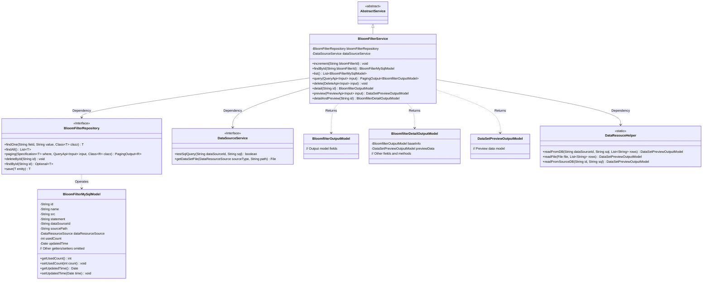

# Basic Information

|      |      |
|------|------|
| Name | BloomFilterService |
| Language | .java |
| Code Path | WeFe/fusion/fusion-service/src/main/java/com/welab/wefe/data/fusion/service/service/bloomfilter/BloomFilterService.java |
| Package Name | com.welab.wefe.data.fusion.service.service.bloomfilter |
| Dependencies | ['com.welab.wefe.common.StatusCode', 'com.welab.wefe.common.data.mysql.Where', 'com.welab.wefe.common.exception.StatusCodeWithException', 'com.welab.wefe.common.util.StringUtil', 'com.welab.wefe.common.web.util.ModelMapper', 'com.welab.wefe.data.fusion.service.api.bloomfilter.DeleteApi', 'com.welab.wefe.data.fusion.service.api.bloomfilter.PreviewApi', 'com.welab.wefe.data.fusion.service.api.bloomfilter.QueryApi', 'com.welab.wefe.data.fusion.service.database.entity.BloomFilterMySqlModel', 'com.welab.wefe.data.fusion.service.database.repository.BloomFilterRepository', 'com.welab.wefe.data.fusion.service.dto.base.PagingOutput', 'com.welab.wefe.data.fusion.service.dto.entity.bloomfilter.BloomfilterDetailOutputModel', 'com.welab.wefe.data.fusion.service.dto.entity.bloomfilter.BloomfilterOutputModel', 'com.welab.wefe.data.fusion.service.dto.entity.dataset.DataSetPreviewOutputModel', 'com.welab.wefe.data.fusion.service.enums.DataResourceSource', 'com.welab.wefe.data.fusion.service.service.AbstractService', 'com.welab.wefe.data.fusion.service.service.DataSourceService', 'com.welab.wefe.data.fusion.service.utils.dataresouce.DataResouceHelper', 'org.springframework.beans.factory.annotation.Autowired', 'org.springframework.data.jpa.domain.Specification', 'org.springframework.stereotype.Service', 'java.io.File', 'java.io.FileNotFoundException', 'java.io.IOException', 'java.nio.file.Paths', 'java.util.Arrays', 'java.util.Date', 'java.util.List'] |
| Brief Description | The BloomFilterService provides Bloom filter management functionalities, including addition, deletion, query, modification, paginated queries, detail previews, and data source processing. It supports both SQL and file data sources, incorporating usage count updates and exception handling. |

# Description

The BloomFilterService class is a service-layer component that inherits from AbstractService, primarily providing CRUD operations and data preview functionality for Bloom filters. It interacts with MySQL databases through BloomFilterRepository and relies on DataSourceService for data source processing. Core features include: updating filter usage counts via the increment method; querying data through findById and list methods; supporting paginated conditional queries with the query method; deleting filters and associated files via the delete method; retrieving details with the detail method; previewing data source content (supporting SQL queries and file reading) with the preview method; and combining detail and preview functionality with the detailAndPreview method. Exception handling covers scenarios such as non-existent data and file I/O errors, with key operations logged.

# Class Summary

| Name   | Type  | Description |
|-------|------|-------------|
| BloomFilterService | class | The BloomFilterService provides Bloom filter management functionalities, including addition, deletion, modification, query, preview, and detail retrieval, supporting operations with both database and file data sources. |

## Class BloomFilterService

|      |      |
|------|------|
| Access Modifier | @Service;public |
| Type | class |
| Name | BloomFilterService |
| Description | The BloomFilterService provides Bloom filter management functionalities, including addition, deletion, modification, query, preview, and detail retrieval, supporting operations with both database and file data sources. |

### UML Class Diagram

This class diagram illustrates the core structure of the Bloom Filter Service (BloomFilterService), which inherits from the abstract service class (AbstractService) and relies on the Data Source Service (DataSourceService) and Bloom Filter Repository (BloomFilterRepository) to perform data operations. The service class manipulates the BloomFilterMySqlModel entity class and returns output models such as BloomfilterOutputModel and BloomfilterDetailOutputModel, implementing business functionalities like CRUD operations and preview for bloom filters. The DataResouceHelper, as a static utility class, provides auxiliary methods for reading data from databases and files. The overall design reflects a layered architecture with clear responsibilities for each module, achieving loose coupling through interfaces and abstract classes.

### Internal Method Call Graph

```mermaid
graph TD
    A["Class BloomFilterService"]
    B["Property: BloomFilterRepository bloomFilterRepository"]
    C["Property: DataSourceService dataSourceService"]
    D["Method: increment(String bloomFilterId)"]
    E["Method: findById(String bloomFilterId)"]
    F["Method: list()"]
    G["Method: query(QueryApi.Input input)"]
    H["Method: delete(DeleteApi.Input input)"]
    I["Method: detail(String id)"]
    J["Method: preview(PreviewApi.Input input)"]
    K["Method: detailAndPreview(String id)"]

    A --> B
    A --> C
    A --> D
    A --> E
    A --> F
    A --> G
    A --> H
    A --> I
    A --> J
    A --> K

    D --> E1["bloomFilterRepository.findOne"]
    D --> E2["model.setUsedCount"]
    D --> E3["model.setUpdatedTime"]
    D --> E4["bloomFilterRepository.save"]

    E --> F1["bloomFilterRepository.findOne"]

    F --> G1["bloomFilterRepository.findAll"]

    G --> H1["Where.create"]
    G --> H2["bloomFilterRepository.paging"]

    H --> I1["bloomFilterRepository.findById"]
    H --> I2["bloomFilterRepository.deleteById"]
    H --> I3["file.delete"]

    I --> J1["bloomFilterRepository.findById"]
    I --> J2["ModelMapper.map"]

    J --> K1["findById"]
    J --> K2["dataSourceService.testSqlQuery"]
    J --> K3["DataResouceHelper.readFromDB"]
    J --> K4["dataSourceService.getDataSetFile"]
    J --> K5["DataResouceHelper.readFile"]

    K --> L1["detail"]
    K --> L2["ModelMapper.map"]
    K --> L3["preview"]
```

This flowchart illustrates the structure and method invocation relationships of the BloomFilterService class. The class contains two auto-wired properties and eight core methods, covering CRUD operations and preview functionality for Bloom filters. Key operations include database interactions through bloomFilterRepository, data source handling via dataSourceService, and data reading implemented through DataResouceHelper. The methods exhibit multi-layer invocation relationships, such as detailAndPreview calling both detail and preview methods, while the preview method may further invoke findById and DataResouceHelper's reading methods. The overall flow demonstrates a complete data processing pipeline from database operations to file handling.

### Field List

| Name  | Type  | Description |
|-------|-------|------|
| dataSourceService | DataSourceService | Using @Autowired to automatically inject a DataSourceService instance. |
| bloomFilterRepository | BloomFilterRepository | Automatically inject the Bloom filter repository instance. |

### Method List

| Name  | Type  | Description |
|-------|-------|------|
| increment | void | This method queries the Bloom filter model by ID, increments its usage count, updates the modification time, and finally saves the changes. |
| list | List<BloomFilterMySqlModel> | This method returns a list containing all BloomFilterMySqlModel objects, with data sourced from the findAll query of bloomFilterRepository. |
| findById | BloomFilterMySqlModel | Query the Bloom filter model by ID, and return the corresponding model by looking it up via the repository method using the ID. |
| detailAndPreview | BloomfilterDetailOutputModel | This method retrieves Bloom filter details by ID, maps them to an output model, then invokes a preview interface to obtain dataset previews, ultimately merging and returning the detail model with preview data. |
| preview | DataSetPreviewOutputModel | Method for previewing data: Reads data based on the input source (database or file) and returns preview results, handling exceptions such as file not found or read errors. |
| query | PagingOutput<BloomfilterOutputModel> | This method constructs query conditions through input parameters, filters data by exact ID matching and fuzzy name matching, and returns paginated query results. |
| delete | void | This method deletes the database record and associated files based on the input ID. If the record does not exist, it returns directly; if it exists, the record is deleted, and the associated file path is checked. If the file exists, it is deleted, and a success message is printed. |
| detail | BloomfilterOutputModel | The method queries the Bloom filter data by ID, throws an exception if it does not exist, and maps it to the output model and returns if it exists. Logs are recorded during the process. |

