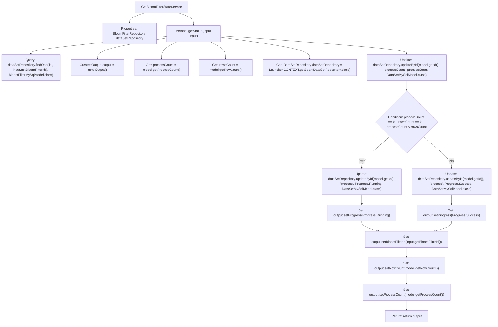

# Basic Information

|      |      |
|------|------|
| Name | GetBloomFilterStateService |
| Language | .java |
| Code Path | WeFe/fusion/fusion-service/src/main/java/com/welab/wefe/data/fusion/service/service/bloomfilter/GetBloomFilterStateService.java |
| Package Name | com.welab.wefe.data.fusion.service.service.bloomfilter |
| Dependencies | ['com.welab.wefe.common.exception.StatusCodeWithException', 'com.welab.wefe.common.web.Launcher', 'com.welab.wefe.data.fusion.service.api.bloomfilter.GetBloomFilterStateApi', 'com.welab.wefe.data.fusion.service.api.bloomfilter.GetBloomFilterStateApi.Output', 'com.welab.wefe.data.fusion.service.database.entity.BloomFilterMySqlModel', 'com.welab.wefe.data.fusion.service.database.entity.DataSetMySqlModel', 'com.welab.wefe.data.fusion.service.database.repository.DataSetRepository', 'com.welab.wefe.data.fusion.service.database.repository.BloomFilterRepository', 'com.welab.wefe.data.fusion.service.enums.Progress', 'com.welab.wefe.data.fusion.service.service.AbstractService', 'org.springframework.beans.factory.annotation.Autowired', 'org.springframework.stereotype.Service', 'java.io.IOException'] |
| Brief Description | Service class for retrieving Bloom filter status, which updates the status based on processing progress and returns the output result. Marks as successful if processing is complete, otherwise marks as in progress. |

# Description

This service class is used to retrieve and update the status of a Bloom filter. It queries the Bloom filter model with the specified ID through the injected BloomFilterRepository, checking its processed count and row count. If the processed count is zero, the row count is zero, or the processed count is less than the row count, the status is set to "Running"; if the processed count is greater than or equal to the row count, it is set to "Success". Finally, it returns an output object containing the Bloom filter ID, row count, processed count, and current status. During the process, the processed count and status fields in the database are updated in real time.

# Class Summary

| Name   | Type  | Description |
|-------|------|-------------|
| GetBloomFilterStateService | class | Service class for retrieving Bloom filter status, which queries database records by ID, compares the processed count with the row count to update progress status, and returns an output object containing ID, row count, and processed count. |


## Class GetBloomFilterStateService

|      |      |
|------|------|
| Access Modifier | @Service;public |
| Type | class |
| Name | GetBloomFilterStateService |
| Description | Service class for retrieving Bloom filter status, which queries database records by ID, compares the processed count with the row count to update progress status, and returns an output object containing ID, row count, and processed count. |


### UML Class Diagram

```mermaid
classDiagram
    class AbstractService {
        <<abstract>>
    }

    class GetBloomFilterStateService {
        -BloomFilterRepository dataSetRepository
        +Output getStatue(GetBloomFilterStateApi$Input input) throws StatusCodeWithException, IOException
    }

    class BloomFilterRepository {
        <<Interface>>
        +findOne(String fieldName, Object value, Class~T~ clazz) BloomFilterMySqlModel
    }

    class DataSetRepository {
        <<Interface>>
        +updateById(String id, String fieldName, Object value, Class~T~ clazz) void
    }

    class GetBloomFilterStateApi$Input {
        +String getBloomFilterId() String
    }

    class Output {
        -String bloomFilterId
        -int rowCount
        -int processCount
        -Progress progress
        +setBloomFilterId(String bloomFilterId) void
        +setRowCount(int rowCount) void
        +setProcessCount(int processCount) void
        +setProgress(Progress progress) void
    }

    class BloomFilterMySqlModel {
        -String id
        -int processCount
        -int rowCount
        +getId() String
        +getProcessCount() int
        +getRowCount() int
    }

    class DataSetMySqlModel {
        <<Model>>
    }

    enum Progress {
        <<enum>>
        Running
        Success
    }

    AbstractService <|-- GetBloomFilterStateService
    GetBloomFilterStateService --> BloomFilterRepository : Dependency
    GetBloomFilterStateService --> DataSetRepository : Dependency
    GetBloomFilterStateService --> GetBloomFilterStateApi$Input : Uses
    GetBloomFilterStateService --> Output : Returns
    BloomFilterRepository --> BloomFilterMySqlModel : Queries
    DataSetRepository --> DataSetMySqlModel : Updates
```

This code demonstrates a service class `GetBloomFilterStateService` that inherits from `AbstractService`. It queries the Bloom filter state via `BloomFilterRepository` and updates the processing progress using `DataSetRepository`. Based on the comparison between the process count and row count, it sets different progress states (Running or Success) in the output object. The class diagram clearly illustrates the dependency relationships between components and the data flow paths.


### Internal Method Call Graph



This flowchart describes the core logic flow of the GetBloomFilterStateService class. The service first queries the database using BloomFilterId to retrieve model data, then updates the processing status (Running or Success) based on the comparison between processCount and rowsCount, and finally assembles the output result. The entire process includes key steps such as database querying, conditional judgment, status updating, and data encapsulation, demonstrating the complete processing chain from input parameters to output results, reflecting the business logic of Bloom filter state management.

### Field List

| Name  | Type  | Description |
|-------|-------|------|
| dataSetRepository | BloomFilterRepository | Automatically inject protected Bloom filter data warehouse instances. |

### Method List

| Name  | Type  | Description |
|-------|-------|------|
| getStatue | Output | This method queries the Bloom filter status based on the input ID, compares the processed count and row count to update the progress status as either running or successful, and returns an output object containing the ID, row count, and processed count. |


