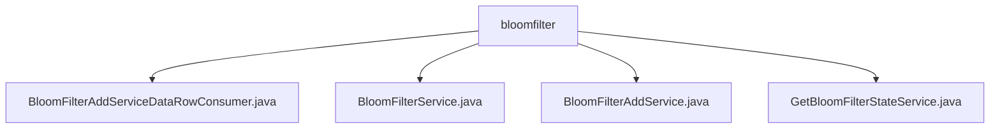

# Basic Information

|      |      |
|------|------|
| Name | bloomfilter |
| Language | .java |
| Code Path | WeFe/fusion/fusion-service/src/main/java/com/welab/wefe/data/fusion/service/service/bloomfilter |
| Package Name | docs.fusion.fusion-service.src.main.java.com.welab.wefe.data.fusion.service.service.bloomfilter |
| Brief Description | The BloomFilterAddServiceDataRowConsumer processes data to generate Bloom filters, supporting multi-threading and batch operations. The BloomFilterService provides CRUD and data preview functionalities, operating on MySQL databases. The BloomFilterAddService implements filter addition, data reading, and checking capabilities. The GetBloomFilterStateService manages filter state updates and queries. |

# Description

## Overview  
The core responsibility of this module is to implement full lifecycle management of Bloom filters, including creation, update, query, and status monitoring, with support for multithreaded data loading and encrypted validation. The interface specifications cover CRUD operations, data preview, and status checks, such as updating usage counts via `increment` or viewing data source content via `preview`. Key data structures include Bloom filter instances, RSA key parameters, and progress tracking objects. External dependencies include MySQL databases (via BloomFilterRepository), data source services (DataSourceService), and filesystem I/O operations. For example, multithreaded optimized versions are used during batch data consumption to enhance performance.  

## Primary Business Scenarios  
A typical application pattern is privacy-preserving queries in data fusion scenarios: First, data is loaded from SQL or files via `BloomFilterAddService` to generate a filter; then, `BloomFilterService` is used for paginated queries or deletion operations; finally, `GetBloomFilterStateService` monitors processing progress. The interaction model resembles an event bus—for instance, `BloomFilterAddServiceDataRowConsumer` triggers progress updates during batch data consumption. Functional completeness is reflected in support for encrypted field validation (up to 5 combinations), exception handling (e.g., file I/O errors), and thread-safe operations. API types include status check APIs (returning IDs/row counts/status) and data preview APIs (supporting SQL syntax parsing).

### Package Internal Structure View

This flowchart illustrates the file structure relationships under the `bloomfilter` directory in the WeFe project. The `bloomfilter` node serves as the parent, directly containing four service class files: `BloomFilterAddServiceDataRowConsumer`, `BloomFilterService`, `BloomFilterAddService`, and `GetBloomFilterStateService`. These files are implementation classes related to the Bloom filter functionality, located under a specific package path in the `fusion-service` module, reflecting the implementation structure of the Bloom filter feature within this module.

# File List

| Name   | Type  | Description |
|-------|------|-------------|
| [BloomFilterAddServiceDataRowConsumer.java](BloomFilterAddServiceDataRowConsumer.md) | file | The BloomFilterAddServiceDataRowConsumer class implements the Consumer interface and is designed for batch processing data to generate a Bloom filter. It incorporates RSA key pairs, Bloom filter operations, multi-threaded processing, and progress tracking functionalities. It supports batch data consumption, accelerates processing via a thread pool, and ultimately writes the results to a file. |
| [BloomFilterService.java](BloomFilterService.md) | file | BloomFilterService provides Bloom filter management functionalities, including addition, deletion, query, modification, paginated queries, detail preview, and data source processing. It supports both SQL and file data sources, incorporating usage count updates and exception handling. |
| [BloomFilterAddService.java](BloomFilterAddService.md) | file | The BloomFilterAddService class provides Bloom filter addition functionality, supporting data reading from databases or files, validating encryption combination complexity, saving model information, and handling data sources. It includes data parsing, thread pool operations, and encryption validation logic. |
| [GetBloomFilterStateService.java](GetBloomFilterStateService.md) | file | Service class for retrieving Bloom filter status, updating the status based on processing progress and returning output results. Marks as successful if processing is complete, otherwise marks as in progress. |

