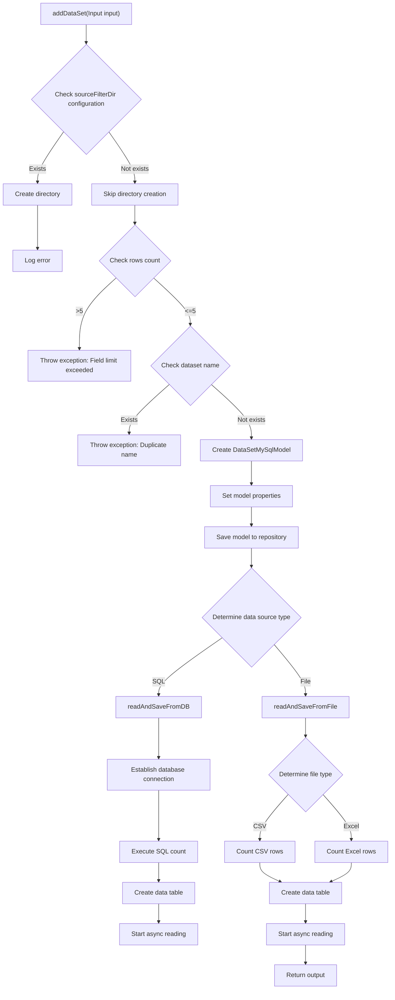
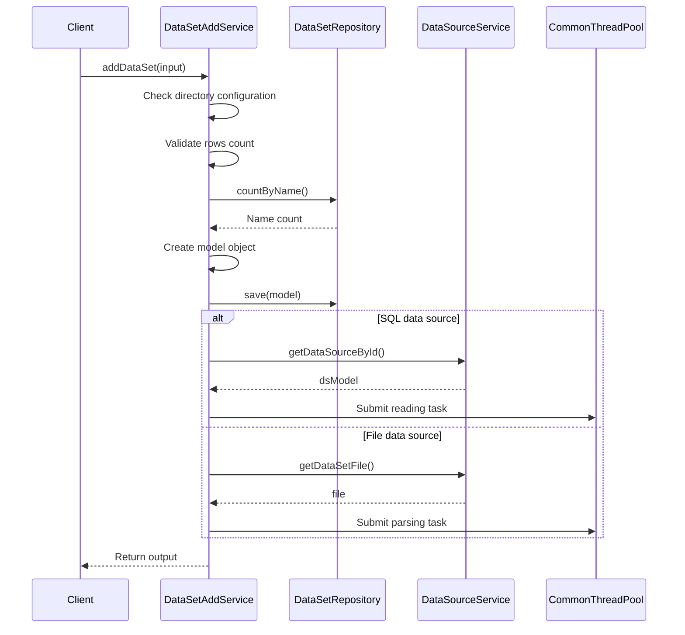

# Basic Information

|      |      |
|------|------|
| Name | DataSetAddService |
| Language | .java |
| Code Path | WeFe/fusion/fusion-service/src/main/java/com/welab/wefe/data/fusion/service/service/dataset/DataSetAddService.java |
| Package Name | com.welab.wefe.data.fusion.service.service.dataset |
| Dependencies | ['java.io.File', 'java.io.FileReader', 'java.io.IOException', 'java.io.LineNumberReader', 'java.nio.file.Paths', 'java.sql.Connection', 'java.util.Date', 'java.util.List', 'org.apache.commons.lang3.StringUtils', 'org.springframework.beans.factory.annotation.Autowired', 'org.springframework.stereotype.Service', 'com.welab.wefe.common.CommonThreadPool', 'com.welab.wefe.common.StatusCode', 'com.welab.wefe.common.exception.StatusCodeWithException', 'com.welab.wefe.common.util.StringUtil', 'com.welab.wefe.common.web.Launcher', 'com.welab.wefe.common.web.util.CurrentAccountUtil', 'com.welab.wefe.data.fusion.service.api.dataset.AddApi', 'com.welab.wefe.data.fusion.service.config.Config', 'com.welab.wefe.data.fusion.service.database.entity.DataSetMySqlModel', 'com.welab.wefe.data.fusion.service.database.entity.DataSourceMySqlModel', 'com.welab.wefe.data.fusion.service.database.repository.DataSetRepository', 'com.welab.wefe.data.fusion.service.enums.DataResourceSource', 'com.welab.wefe.data.fusion.service.enums.Progress', 'com.welab.wefe.data.fusion.service.manager.JdbcManager', 'com.welab.wefe.data.fusion.service.service.AbstractService', 'com.welab.wefe.data.fusion.service.service.DataSourceService', 'com.welab.wefe.data.fusion.service.utils.AbstractDataSetReader', 'com.welab.wefe.data.fusion.service.utils.CsvDataSetReader', 'com.welab.wefe.data.fusion.service.utils.ExcelDataSetReader'] |
| Brief Description | Dataset addition service class, which includes functionality for reading data from files or databases and storing it, supporting deduplication and field count validation. |

# Description

DataSetAddService is a service class designed for adding datasets. It first checks if the configuration directory exists and creates it if necessary, then validates input parameters, including field count limits and dataset name uniqueness. Next, it creates and saves the dataset model to the database, processing the data source differently based on its type (SQL or file). For file sources, it parses CSV or Excel files and stores the data; for SQL sources, it executes queries and stores the results. During processing, it updates the dataset status and row count, ultimately returning the dataset ID and data source ID. The entire process includes error handling and logging.

# Class Summary

| Name   | Type  | Description |
|-------|------|-------------|
| DataSetAddService | class | Dataset addition service class, which includes functions for reading data from files or databases and storing it, supports field restrictions, name duplication checks, and deduplication processing. |

## Class DataSetAddService

|      |      |
|------|------|
| Access Modifier | @Service;public |
| Type | class |
| Name | DataSetAddService |
| Description | Dataset addition service class, which includes functions for reading data from files or databases and storing it, supports field restrictions, name duplication checks, and deduplication processing. |

### UML Class Diagram

```mermaid
classDiagram
    class DataSetAddService {
        -DataSetRepository dataSetRepository
        -DataSourceService dataSourceService
        -Config config
        +AddApi.DataSetAddOutput addDataSet(AddApi.Input input) throws Exception
        -int readAndSaveFromFile(DataSetMySqlModel model, File file, List~String~ rows, boolean deduplication) throws IOException, StatusCodeWithException
        -int readAndSaveFromDB(DataSetMySqlModel model, String dataSourceId, List~String~ headers, String sql, boolean deduplication) throws Exception
    }

    class DataSetRepository {
        +long countByName(String name)
        +save(DataSetMySqlModel model)
        +updateById(String id, String field, Object value, Class~T~ clazz)
    }

    class DataSourceService {
        +File getDataSetFile(DataResourceSource source, String filename) throws IOException
        +DataSourceMySqlModel getDataSourceById(String dataSourceId)
    }

    class Config {
        +String getSourceFilterDir()
    }

    class DataSetMySqlModel {
        +String id
        +String name
        +String description
        +String dataResourceSource
        +String rows
        +int usedCount
        +int rowCount
        +Date updatedTime
        +String statement
        +String sourcePath
        +String dataSourceId
        +boolean storaged
        // Other setter/getter methods
    }

    class DataSourceMySqlModel {
        +String databaseType
        +String host
        +String port
        +String userName
        +String password
        +String databaseName
        // Other fields and methods
    }

    class AbstractDataSetReader {
        <<Interface>>
        +List~String~ getHeader()
        +long getRowCount(int sheetIndex)
        +void readAllWithSelectRow(DataSetAddServiceDataRowConsumer consumer, List~String~ rows, int sheetIndex) throws StatusCodeWithException, IOException
    }

    class CsvDataSetReader {
        +CsvDataSetReader(File file)
    }

    class ExcelDataSetReader {
        +ExcelDataSetReader(File file)
    }

    class JdbcManager {
        +Connection getConnection(String dbType, String host, String port, String user, String pwd, String dbName)
        +long count(Connection conn, String sql)
        +void readWithSelectRow(Connection conn, String sql, DataSetAddServiceDataRowConsumer consumer, List~String~ headers)
    }

    class DataSetAddServiceDataRowConsumer {
        +DataSetAddServiceDataRowConsumer(DataSetMySqlModel model, boolean deduplication, File file, List~String~ rows)
        +DataSetAddServiceDataRowConsumer(DataSetMySqlModel model, boolean deduplication, int rowsCount, List~String~ headers)
    }

    class DataSetStorageHelper {
        +static void createDataSetTable(String id, List~String~ headers)
    }

    DataSetAddService --> DataSetRepository : Dependency
    DataSetAddService --> DataSourceService : Dependency
    DataSetAddService --> Config : Dependency
    DataSetAddService --> DataSetMySqlModel : Create/Use
    DataSetAddService --> DataSourceMySqlModel : Use
    DataSetAddService --> AbstractDataSetReader : Use
    DataSetAddService --> JdbcManager : Use
    DataSetAddService --> DataSetAddServiceDataRowConsumer : Create/Use
    DataSetAddService --> DataSetStorageHelper : Use
    CsvDataSetReader ..|> AbstractDataSetReader : Implements
    ExcelDataSetReader ..|> AbstractDataSetReader : Implements
```

This code describes a dataset addition service (DataSetAddService) responsible for handling dataset addition operations, including reading data from databases or files and storing it in MySQL. The service relies on components such as the dataset repository (DataSetRepository), data source service (DataSourceService), and configuration (Config). The core method addDataSet() determines the data source (SQL or file) based on input parameters and calls the corresponding reading methods (readAndSaveFromDB or readAndSaveFromFile). These methods use different readers (implementations of AbstractDataSetReader) or the JDBC manager (JdbcManager) to fetch data and process data rows through a consumer pattern (DataSetAddServiceDataRowConsumer). The entire process involves collaboration among multiple components, including data validation, directory creation, data reading, storage, and status updates.

### Internal Method Call Graph

This flowchart illustrates the core processing logic of DataSetAddService, comprising three key phases: data validation, model creation, and asynchronous data processing. It first performs input parameter validation (directory check, field quantity limits, and name duplication check), then creates and saves the data model object, and finally initiates different asynchronous processing flows based on the data source type (SQL or file). The sequence diagram details the interaction process between client calls and internal service components, highlighting the temporal relationships of data validation, storage, and asynchronous processing. The entire process demonstrates a dual guarantee mechanism for both data integrity and processing efficiency.

### Field List

| Name  | Type  | Description |
|-------|-------|------|
| dataSourceService | DataSourceService | Automatically inject the DataSourceService instance. |
| config | Config | Automatically inject Config configuration instance. |
| dataSetRepository | DataSetRepository | Automatically inject the DataSetRepository instance. |

### Method List

| Name  | Type  | Description |
|-------|-------|------|
| readAndSaveFromFile | int | The method reads data from files and saves it to the database, processes CSV or Excel formats, counts the number of rows, and updates the model status, using a thread pool for asynchronous data reading. |
| addDataSet | AddApi.DataSetAddOutput | The method `addDataSet` is used to add a dataset, checking directory existence, field quantity limits, and name duplication, saving the model, and reading data from a database or file based on the data source type, finally returning the output result. |
| readAndSaveFromDB | int | Read data from the database and save it, check the validity of the data source, count the number of rows, update the dataset status, create a storage table, read and process data asynchronously, and finally return the total number of rows. |

