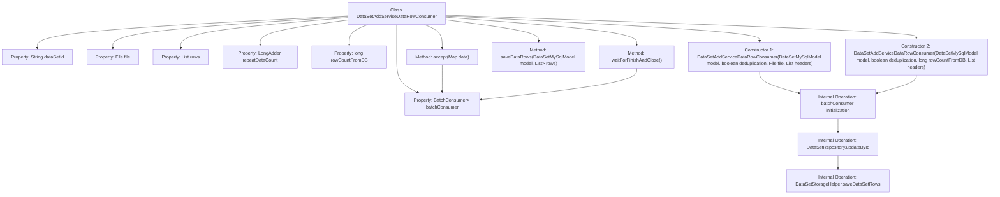

# Basic Information

|      |      |
|------|------|
| Name | DataSetAddServiceDataRowConsumer |
| Language | .java |
| Code Path | WeFe/fusion/fusion-service/src/main/java/com/welab/wefe/data/fusion/service/service/dataset/DataSetAddServiceDataRowConsumer.java |
| Package Name | com.welab.wefe.data.fusion.service.service.dataset |
| Dependencies | ['com.welab.wefe.common.BatchConsumer', 'com.welab.wefe.common.web.Launcher', 'com.welab.wefe.data.fusion.service.database.entity.DataSetMySqlModel', 'com.welab.wefe.data.fusion.service.database.repository.DataSetRepository', 'com.welab.wefe.data.fusion.service.enums.Progress', 'java.io.File', 'java.util.List', 'java.util.Map', 'java.util.concurrent.atomic.LongAdder', 'java.util.function.Consumer'] |
| Brief Description | The dataset row consumer class supports batch processing and deduplication, can read data from files or databases, accelerates writes through batch processing, and provides completion waiting and shutdown functionalities. |

# Description

This is a consumer class `DataSetAddServiceDataRowConsumer` designed for batch processing dataset rows. It implements the `Consumer` interface, with its primary functionality being the efficient saving of data rows to a dataset through batch processing. The class contains two constructors, supporting data reading from files and databases respectively. Core members include the dataset ID, file object, data row list, batch consumer `BatchConsumer`, duplicate data counter `repeatDataCount`, and database row count `rowCountFromDB`. The class provides the `saveDataRows` method for saving data rows and the `waitForFinishAndClose` method for awaiting consumption completion. The batch processing mechanism optimizes write performance by setting a maximum batch size (10,000) and updates the dataset status to "Running" during processing.

# Class Summary

| Name   | Type  | Description |
|-------|------|-------------|
| DataSetAddServiceDataRowConsumer | class | The `DataSetAddServiceDataRowConsumer` class is designed for batch processing of dataset row data, supporting both file and database sources. It accelerates write operations through batch processing and includes features such as deduplication counting and progress updates. |


## Class DataSetAddServiceDataRowConsumer

|      |      |
|------|------|
| Access Modifier | public |
| Type | class |
| Name | DataSetAddServiceDataRowConsumer |
| Description | The `DataSetAddServiceDataRowConsumer` class is designed for batch processing of dataset row data, supporting both file and database sources. It accelerates write operations through batch processing and includes features such as deduplication counting and progress updates. |


### UML Class Diagram

```mermaid
classDiagram
    class DataSetAddServiceDataRowConsumer {
        -String dataSetId
        -File file
        -List~String~ rows
        -BatchConsumer~Map~String,Object~~ batchConsumer
        -LongAdder repeatDataCount
        -long rowCountFromDB
        +DataSetAddServiceDataRowConsumer(DataSetMySqlModel model, boolean deduplication, File file, List~String~ headers)
        +DataSetAddServiceDataRowConsumer(DataSetMySqlModel model, boolean deduplication, long rowCountFromDB, List~String~ headers)
        +saveDataRows(DataSetMySqlModel model, List~Map~String,Object~~ rows) void
        +accept(Map~String,Object~ data) void
        +waitForFinishAndClose() void
    }

    class BatchConsumer~T~ {
        <<Interface>>
        +setMaxBatchSize(int size) void
        +add(T item) void
        +waitForFinishAndClose() void
    }

    class DataSetMySqlModel {
        +String id
    }

    class DataSetRepository {
        +updateById(String id, String field, Progress progress, Class~T~ clazz) void
    }

    class DataSetStorageHelper {
        +saveDataSetRows(DataSetMySqlModel model, List~Map~String,Object~~ rows) void
    }

    DataSetAddServiceDataRowConsumer --> BatchConsumer~Map~String,Object~~ : uses
    DataSetAddServiceDataRowConsumer --> DataSetMySqlModel : depends
    DataSetAddServiceDataRowConsumer --> DataSetRepository : depends
    DataSetAddServiceDataRowConsumer --> DataSetStorageHelper : depends
```

This class diagram illustrates the core structure and relationships of `DataSetAddServiceDataRowConsumer`. The class is a data row consumer that implements batch processing through `BatchConsumer`, containing two constructors for handling data from files and databases respectively. It relies on `DataSetRepository` for status updates, stores data rows via `DataSetStorageHelper`, and maintains state information such as duplicate data counts and total row numbers. The overall design adopts a batch processing pattern to improve write efficiency, supporting asynchronous data consumption workflows.


### Internal Method Call Graph



Flowchart Description: This flowchart illustrates the complete structure of the DataSetAddServiceDataRowConsumer class, including 7 properties and 5 main methods. Both constructors initialize batchConsumer and set up callback functions, where the callback updates the state via DataSetRepository and invokes the saveDataRows method to persist data. The accept method adds data to batchConsumer, while waitForFinishAndClose awaits consumption completion. The core data processing flow leverages BatchConsumer for batch operations, with final data persistence achieved through DataSetStorageHelper.

### Field List

| Name  | Type  | Description |
|-------|-------|------|
| repeatDataCount = new LongAdder() | LongAdder | Declare a thread-safe LongAdder variable named repeatDataCount for efficiently counting the number of duplicate data. |
| rows | List<String> | Private string list rows |
| file | File | Private file object file |
| rowCountFromDB | long | Variable for counting database rows. |
| dataSetId | String | The private string type variable dataSetId. |
| batchConsumer | BatchConsumer<Map<String, Object>> | Private batch consumer, processing data of type Map<String, Object>. |

### Method List

| Name  | Type  | Description |
|-------|-------|------|
| accept | void | Rewrite the accept method, set the maximum batch processing size to 10000, and add data. |
| saveDataRows | void | The method `saveDataRows` accepts a `DataSetMySqlModel` and a list of row data, then calls `DataSetStorageHelper` to save the data rows. |
| waitForFinishAndClose | void | The method `waitForFinishAndClose` invokes the same method of `batchConsumer`, waiting for completion and closing. |


