# Basic Information

|      |      |
|------|------|
| Name | DataSetService |
| Language | .java |
| Code Path | WeFe/fusion/fusion-service/src/main/java/com/welab/wefe/data/fusion/service/service/dataset/DataSetService.java |
| Package Name | com.welab.wefe.data.fusion.service.service.dataset |
| Dependencies | ['com.welab.wefe.common.CommonThreadPool', 'com.welab.wefe.common.StatusCode', 'com.welab.wefe.common.data.mysql.Where', 'com.welab.wefe.common.exception.StatusCodeWithException', 'com.welab.wefe.common.jdbc.base.DatabaseType', 'com.welab.wefe.common.util.JObject', 'com.welab.wefe.common.web.util.ModelMapper', 'com.welab.wefe.data.fusion.service.api.dataset.DeleteApi', 'com.welab.wefe.data.fusion.service.api.dataset.PreviewApi', 'com.welab.wefe.data.fusion.service.api.dataset.QueryApi', 'com.welab.wefe.data.fusion.service.config.Config', 'com.welab.wefe.data.fusion.service.database.entity.DataSetMySqlModel', 'com.welab.wefe.data.fusion.service.database.entity.DataSourceMySqlModel', 'com.welab.wefe.data.fusion.service.database.repository.DataSetRepository', 'com.welab.wefe.data.fusion.service.database.repository.DataSourceRepository', 'com.welab.wefe.data.fusion.service.dto.base.PagingOutput', 'com.welab.wefe.data.fusion.service.dto.entity.dataset.DataSetDetailOutputModel', 'com.welab.wefe.data.fusion.service.dto.entity.dataset.DataSetOutputModel', 'com.welab.wefe.data.fusion.service.dto.entity.dataset.DataSetPreviewOutputModel', 'com.welab.wefe.data.fusion.service.enums.DataResourceSource', 'com.welab.wefe.data.fusion.service.manager.JdbcManager', 'com.welab.wefe.data.fusion.service.service.AbstractService', 'com.welab.wefe.data.fusion.service.service.DataStorageService', 'com.welab.wefe.data.fusion.service.utils.dataresouce.DataResouceHelper', 'org.springframework.beans.factory.annotation.Autowired', 'org.springframework.beans.factory.annotation.Value', 'org.springframework.data.jpa.domain.Specification', 'org.springframework.stereotype.Service', 'java.io.File', 'java.io.IOException', 'java.sql.Connection', 'java.sql.PreparedStatement', 'java.sql.ResultSet', 'java.sql.SQLException', 'java.util.ArrayList', 'java.util.Arrays', 'java.util.Date', 'java.util.List'] |
| Brief Description | The DataSetService provides dataset management functionalities, including CRUD operations, SQL testing, file retrieval, paginated queries, and data previews. |

# Description

DataSetService is a Spring service class that extends AbstractService, primarily used for managing dataset-related operations. It achieves functionality by injecting multiple dependency components such as DataSourceRepository and DataStorageService. Core features include: CRUD operations for datasets (e.g., the `increment` method updates usage counts), SQL query testing, file retrieval (supporting uploads and local files), paginated dataset list queries, dataset previews (supporting SQL and file data sources), and dataset detail viewing. The service also handles database connections (via JdbcManager) and exception status codes (StatusCodeWithException), and includes utility methods such as paginated queries, data statistics, and table operations. Configuration details like MySQL connection parameters are injected via `@Value`.

# Class Summary

| Name   | Type  | Description |
|-------|------|-------------|
| DataSetService | class | The DataSetService class provides dataset management functionalities, including CRUD operations, SQL testing, file retrieval, and paginated queries. By injecting multiple Repository and Service components, it enables data storage, querying, and preview capabilities, supporting both MySQL and file-based data source processing. |

## Class DataSetService

|      |      |
|------|------|
| Access Modifier | @Service;public |
| Type | class |
| Name | DataSetService |
| Description | The DataSetService class provides dataset management functionalities, including CRUD operations, SQL testing, file retrieval, and paginated queries. By injecting multiple Repository and Service components, it enables data storage, querying, and preview capabilities, supporting both MySQL and file-based data source processing. |

### UML Class Diagram

```mermaid
classDiagram
    class AbstractService {
        <<Abstract>>
    }

    class DataSetService {
        -DataSourceRepository dataSourceRepo
        -DataStorageService dataStorageService
        -DataSetRepository dataSetRepository
        -Config config
        -String mySqlUrl
        -String mySqlUsername
        -String mySqlPassword
        -String TABLE_HEADER
        +increment(String id) void
        +findById(String id) DataSetMySqlModel
        +getDataSourceById(String dataSourceId) DataSourceMySqlModel
        +testSqlQuery(String dataSourceId, String sql) boolean
        +getDataSetFile(DataResourceSource method, String filename) File
        +list() List~DataSetMySqlModel~
        +query(QueryApi.Input input) PagingOutput~DataSetOutputModel~
        +paging(List~String~ columnList, String dataSetId, int pageIndex, int pageSize) List~JObject~
        +count(String dataSetId) int
        +delete(DeleteApi.Input input) void
        +detail(String id) DataSetOutputModel
        +preview(PreviewApi.Input input) DataSetPreviewOutputModel
        +detailAndPreview(String id) DataSetDetailOutputModel
    }

    class DataSourceRepository {
        <<Repository>>
        +findById(String id) Optional~DataSourceMySqlModel~
    }

    class DataStorageService {
        +dropTable(String tableName) void
    }

    class DataSetRepository {
        <<Repository>>
        +findOne(String field, String value, Class~T~ clazz) T
        +findAll() List~DataSetMySqlModel~
        +paging(Specification~T~ where, QueryApi.Input input, Class~T~ clazz) PagingOutput~T~
        +deleteById(String id) void
    }

    class Config {
        +getSourceFilterDir() String
    }

    class JdbcManager {
        +getConnection(DatabaseType type, String url, String user, String password) Connection
        +testQuery(Connection conn, String sql, boolean closeConn) boolean
        +close(Connection conn, Statement stmt, ResultSet rs) void
    }

    class DataSetMySqlModel {
        -String id
        -String name
        -int usedCount
        -Date updatedTime
        -DataResourceSource dataResourceSource
        -String dataSourceId
        -String statement
        -String sourcePath
        -String rows
        +getters/setters()
    }

    class DataSourceMySqlModel {
        -String id
        -DatabaseType databaseType
        -String host
        -int port
        -String userName
        -String password
        -String databaseName
        +getters/setters()
    }

    class DataSetOutputModel {
        -String id
        -String name
        +getters/setters()
    }

    class DataSetPreviewOutputModel {
        -List~JObject~ data
        +getters/setters()
    }

    class DataSetDetailOutputModel {
        -DataSetOutputModel baseInfo
        -DataSetPreviewOutputModel previewData
        +getters/setters()
    }

    class StatusCodeWithException {
        <<Exception>>
        -StatusCode statusCode
        -String message
        +getters/setters()
    }

    AbstractService <|-- DataSetService
    DataSetService --> DataSourceRepository : Dependency
    DataSetService --> DataStorageService : Dependency
    DataSetService --> DataSetRepository : Dependency
    DataSetService --> Config : Dependency
    DataSetService --> JdbcManager : Dependency
    DataSetService --> DataSetMySqlModel : Operates
    DataSetService --> DataSourceMySqlModel : Operates
    DataSetService --> DataSetOutputModel : Generates
    DataSetService --> DataSetPreviewOutputModel : Generates
    DataSetService --> DataSetDetailOutputModel : Generates
    DataSetService ..> StatusCodeWithException : Throws
    DataSetRepository --> DataSetMySqlModel : Operates
    DataSourceRepository --> DataSourceMySqlModel : Operates
    JdbcManager --> Connection : Creates
    JdbcManager --> ResultSet : Operates
```

This class diagram illustrates the structural relationships of DataSetService and its related components. DataSetService inherits from AbstractService, depends on multiple Repository and Service components (e.g., DataSourceRepository, DataStorageService), and operates various Model classes (e.g., DataSetMySqlModel, DataSourceMySqlModel). It provides dataset management functionalities including CRUD operations, paginated queries, SQL testing, and file operations. Database connections are handled via JdbcManager, and StatusCodeWithException may be thrown. The model classes facilitate data transfer and persistence, forming a comprehensive dataset management system.

### Internal Method Call Graph

```mermaid
graph TD
    A["Class DataSetService"]
    B["Property: DataSourceRepository dataSourceRepo"]
    C["Property: DataStorageService dataStorageService"]
    D["Property: DataSetRepository dataSetRepository"]
    E["Property: Config config"]
    F["Property: String mySqlUrl"]
    G["Property: String mySqlUsername"]
    H["Property: String mySqlPassword"]
    I["Constant: String TABLE_HEADER"]
    J["Method: void increment(String id)"]
    K["Method: DataSetMySqlModel findById(String id)"]
    L["Method: DataSourceMySqlModel getDataSourceById(String dataSourceId)"]
    M["Method: boolean testSqlQuery(String dataSourceId, String sql)"]
    N["Method: File getDataSetFile(DataResourceSource method, String filename)"]
    O["Method: List<DataSetMySqlModel> list()"]
    P["Method: PagingOutput<DataSetOutputModel> query(QueryApi.Input input)"]
    Q["Method: List<JObject> paging(List<String> columnList, String dataSetId, int pageIndex, int pageSize)"]
    R["Method: int count(String dataSetId)"]
    S["Method: void delete(DeleteApi.Input input)"]
    T["Method: DataSetOutputModel detail(String id)"]
    U["Method: DataSetPreviewOutputModel preview(PreviewApi.Input input)"]
    V["Method: DataSetDetailOutputModel detailAndPreview(String id)"]

    A --> B
    A --> C
    A --> D
    A --> E
    A --> F
    A --> G
    A --> H
    A --> I
    A --> J
    A --> K
    A --> L
    A --> M
    A --> N
    A --> O
    A --> P
    A --> Q
    A --> R
    A --> S
    A --> T
    A --> U
    A --> V
```

This code defines a Spring service class named DataSetService, primarily handling various dataset-related operations. The class inherits from AbstractService and includes multiple auto-injected dependencies such as data source repository, data storage service, and configuration objects. Key functionalities include dataset CRUD operations, SQL testing, file retrieval, paginated queries, and previews. Methods exhibit multi-layer invocation relationships, where detailAndPreview calls the preview method, which in turn invokes getDataSetFile and other methods. The overall design adopts a layered architecture, utilizing JdbcManager for database connections, Repository for data access, and incorporates comprehensive exception handling mechanisms.

### Field List

| Name  | Type  | Description |
|-------|-------|------|
| config | Config | Use @Autowired to automatically inject an instance of the Config configuration class. |
| dataSetRepository | DataSetRepository | Automated injection dataset repository instance. |
| dataSourceRepo | DataSourceRepository | Using @Autowired to automatically inject the DataSourceRepository instance dataSourceRepo. |
| TABLE_HEADER = "data_fusion_" | String | The private constant TABLE_HEADER is defined as "data_fusion_" to serve as the table name prefix. |
| mySqlPassword | String | The code snippet injects the MySQL password from the configuration into the private variable `mySqlPassword` via the `@Value` annotation. |
| dataStorageService | DataStorageService | Automatically inject the DataStorageService instance. |
| mySqlUsername | String | The code snippet injects the MySQL username into the private variable `mySqlUsername` from the configuration via the `@Value` annotation. |
| mySqlUrl | String | The code snippet injects the MySQL database URL configuration into the private variable `mySqlUrl` using Spring's `@Value` annotation. |

### Method List

| Name  | Type  | Description |
|-------|-------|------|
| query | PagingOutput<DataSetOutputModel> | This method queries the dataset based on input conditions and returns paginated results. It constructs query criteria using exact ID matching and fuzzy name matching, then invokes the pagination interface to return a list of output models. |
| list | List<DataSetMySqlModel> | This method returns a list of datasets by calling the findAll method of the dataset to retrieve all records from the database. |
| findById | DataSetMySqlModel | Query the dataset by ID, call the findOne method of dataSetRepository, and return a DataSetMySqlModel object. |
| testSqlQuery | boolean | This method tests SQL queries by first retrieving the data source model based on the ID, throwing an exception if it does not exist. It then establishes a database connection, executes the query test, and returns the results. |
| increment | void | This method queries the database record by ID, increments the usage count by 1, updates the modification time, and finally saves the changes. |
| count | int | The method counts the number of records for a specified dataset ID through an SQL query, uses JDBC to connect to a MySQL database, handles exceptions and closes resources, and returns 0 if no results are found. |
| paging | List<JObject> | Pagination query method, constructs SQL queries based on column names, dataset ID, page number, and page count, returning results in JSON format. Handles exceptions and closes database connections. |
| delete | void | This method deletes the dataset based on the input ID: first, it checks whether the data exists, and returns if it does not; if it exists, it stops the public thread pool and deletes the dataset record along with the associated storage table. |
| preview | DataSetPreviewOutputModel | The preview method processes data based on the input source type: if it is SQL, it queries the database; if it is a file, it reads the file content, handles exceptions, and returns the result set. |
| getDataSourceById | DataSourceMySqlModel | Retrieve the MySQL data model from the data source repository by ID, or return null if it does not exist. |
| detailAndPreview | DataSetDetailOutputModel | The method queries the dataset by ID and throws an exception if it does not exist. If it exists, the data is mapped to an output model, the preview interface is called to retrieve preview data, which is then set into the output model and returned. |
| detail | DataSetOutputModel | The method queries the dataset by ID, throws an exception if it does not exist, and maps it to the output model if it exists. |
| getDataSetFile | File | The method retrieves files based on the data source type: UploadFile searches from the configuration directory, while LocalFile directly uses the path. An exception is thrown if the file does not exist. |

