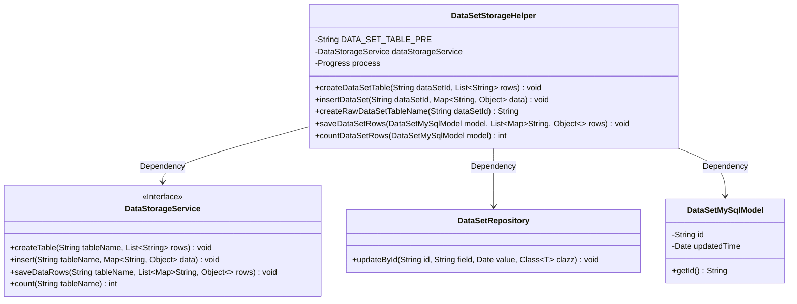
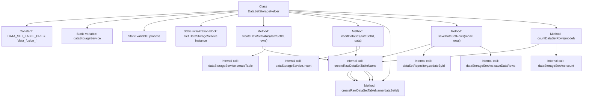

# Basic Information

|      |      |
|------|------|
| Name | DataSetStorageHelper |
| Language | .java |
| Code Path | WeFe/fusion/fusion-service/src/main/java/com/welab/wefe/data/fusion/service/service/dataset/DataSetStorageHelper.java |
| Package Name | com.welab.wefe.data.fusion.service.service.dataset |
| Dependencies | ['com.welab.wefe.common.web.Launcher', 'com.welab.wefe.data.fusion.service.database.entity.DataSetMySqlModel', 'com.welab.wefe.data.fusion.service.database.repository.DataSetRepository', 'com.welab.wefe.data.fusion.service.enums.Progress', 'com.welab.wefe.data.fusion.service.service.DataStorageService', 'java.util.Date', 'java.util.List', 'java.util.Map'] |
| Brief Description | The `DataSetStorageHelper` class provides operations for dataset tables, including creating tables, inserting data, batch saving, and counting rows. The table name format is `data_fusion_` followed by an ID. It relies on `DataStorageService` and `DataSetRepository` to implement its functionality. |

# Description

DataSetStorageHelper is a utility class for dataset storage management, with core functionalities including creating dataset tables, inserting data, batch-saving data rows, and counting rows. The class defines a table name prefix DATA_SET_TABLE_PRE and obtains a DataStorageService instance through static initialization. Key methods include createDataSetTable for table creation, insertDataSet for single-data insertion, saveDataSetRows for batch-saving data while updating model timestamps, and countDataSetRows for row counting. All table names are dynamically generated via the createRawDataSetTableName method in the format of prefix plus dataset ID.

# Class Summary

| Name   | Type  | Description |
|-------|------|-------------|
| DataSetStorageHelper | class | The `DataSetStorageHelper` class provides functionality for dataset table operations, including table creation, data insertion, batch saving of data rows, and row counting. It implements specific storage logic through the `DataStorageService`, with table names formatted as `data_fusion_` followed by the dataset ID. |

## Class DataSetStorageHelper

|      |      |
|------|------|
| Access Modifier | public |
| Type | class |
| Name | DataSetStorageHelper |
| Description | The `DataSetStorageHelper` class provides functionality for dataset table operations, including table creation, data insertion, batch saving of data rows, and row counting. It implements specific storage logic through the `DataStorageService`, with table names formatted as `data_fusion_` followed by the dataset ID. |

### UML Class Diagram

Class diagram description: DataSetStorageHelper is a utility class primarily responsible for dataset table creation, data insertion, batch saving, and row counting. It depends on the DataStorageService interface for underlying storage operations, uses DataSetRepository to update metadata, and manipulates DataSetMySqlModel objects. The class contains static constants and methods, generating complete table names by concatenating table name prefixes.

### Internal Method Call Graph

This flowchart represents the DataSetStorageHelper class, which primarily manages dataset table creation, data insertion, batch saving, and row counting. The static initialization block retrieves a DataStorageService instance, while core methods rely on createRawDataSetTableName to generate table names and invoke various dataStorageService methods for database operations. The diagram illustrates class members, method invocation relationships, and internal dependencies, with saveDataSetRows additionally involving update operations via DataSetRepository.

### Field List

| Name  | Type  | Description |
|-------|-------|------|
| dataStorageService | DataStorageService | Declare a private static DataStorageService class instance variable named dataStorageService. |
| process | Progress | Defined a private static Progress type variable named process. |
| DATA_SET_TABLE_PRE = "data_fusion_" | String | Define a static constant DATA_SET_TABLE_PRE with the value "data_fusion_" to be used as a table name prefix. |

### Method List

| Name  | Type  | Description |
|-------|-------|------|
| createDataSetTable | void | Static method to create a dataset table, with parameters being the dataset ID and row list, invokes the storage service to create the table. |
| insertDataSet | void | The static method `insertDataSet` receives a dataset ID and a data mapping, generates a table name, and then calls the data storage service to insert the data. |
| saveDataSetRows | void | This method saves the dataset row data, updates the dataset timestamp, and stores the row data into the specified table via the storage service. |
| countDataSetRows | int | The static method `countDataSetRows` counts the number of rows in the data table corresponding to the specified model ID through the `dataStorageService`, and may throw exceptions. |
| createRawDataSetTableName | String | This method is used to generate the original dataset table name by concatenating the prefix and the dataset ID. |

