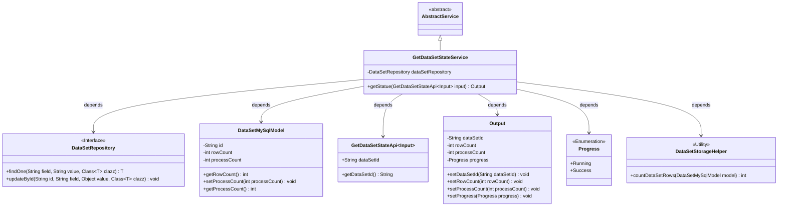
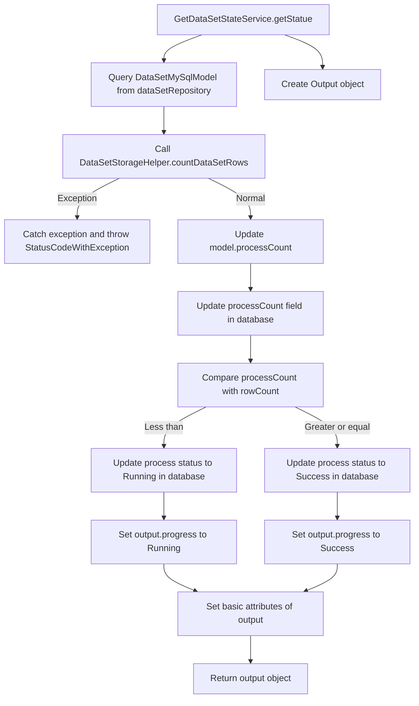

# Basic Information

|      |      |
|------|------|
| Name | GetDataSetStateService |
| Language | .java |
| Code Path | WeFe/fusion/fusion-service/src/main/java/com/welab/wefe/data/fusion/service/service/dataset/GetDataSetStateService.java |
| Package Name | com.welab.wefe.data.fusion.service.service.dataset |
| Dependencies | ['com.welab.wefe.common.StatusCode', 'com.welab.wefe.common.exception.StatusCodeWithException', 'com.welab.wefe.common.web.Launcher', 'com.welab.wefe.data.fusion.service.api.dataset.GetDataSetStateApi', 'com.welab.wefe.data.fusion.service.api.dataset.GetDataSetStateApi.Output', 'com.welab.wefe.data.fusion.service.database.entity.DataSetMySqlModel', 'com.welab.wefe.data.fusion.service.database.repository.DataSetRepository', 'com.welab.wefe.data.fusion.service.enums.Progress', 'com.welab.wefe.data.fusion.service.service.AbstractService', 'org.springframework.beans.factory.annotation.Autowired', 'org.springframework.stereotype.Service', 'java.io.IOException'] |
| Brief Description | Dataset Status Retrieval Service: Query a dataset by ID, calculate the number of processed rows, and update the progress status. Returns the dataset ID, total row count, and processed row count. Marks as successful upon completion; otherwise, marks as in progress. |

# Description

This service class is designed to retrieve dataset status and update processing progress. It queries the corresponding model by dataset ID, calculates the number of processed data rows, and updates the database. If the number of processed rows is less than the total, the status is set to "Running"; otherwise, it is set to "Success." The returned result includes the dataset ID, total row count, processed row count, and current progress status. During the process, a "Data Not Found" exception may be thrown.

# Class Summary

| Name   | Type  | Description |
|-------|------|-------------|
| GetDataSetStateService | class | Dataset Status Retrieval Service: Query the dataset based on the input ID, count the processed rows, and update the progress status. Returns the dataset ID, total row count, processed row count, and progress status. |

## Class GetDataSetStateService

|      |      |
|------|------|
| Access Modifier | @Service;public |
| Type | class |
| Name | GetDataSetStateService |
| Description | Dataset Status Retrieval Service: Query the dataset based on the input ID, count the processed rows, and update the progress status. Returns the dataset ID, total row count, processed row count, and progress status. |

### UML Class Diagram

This code describes a service class `GetDataSetStateService`, which inherits from `AbstractService` and is used to retrieve dataset states and update processing progress. The service interacts with the database through `DataSetRepository`, stores dataset information using `DataSetMySqlModel`, and calculates row counts via `DataSetStorageHelper`. Based on the comparison between processing progress and total row count, it updates the dataset state to either `Running` or `Success`, encapsulating the result in an `Output` object for return. The entire process involves collaboration among multiple components, including data access, business logic processing, and state management.

### Internal Method Call Graph

This code flowchart illustrates the core business logic flow of GetDataSetStateService. The service first queries the dataset model by ID, then counts data processing volume and updates the database status. Based on the comparison between processing progress and total row count, it sets different processing states (Running/Success), and finally assembles an output object containing dataset ID, total rows, processed count, etc. The entire process includes exception handling and data consistency maintenance, demonstrating a typical state tracking service design pattern.

### Field List

| Name  | Type  | Description |
|-------|-------|------|
| dataSetRepository | DataSetRepository | Automated Dataset Repository Injection Instance. |

### Method List

| Name  | Type  | Description |
|-------|-------|------|
| getStatue | Output | The method queries the dataset based on the input ID, counts the processed rows, and updates the status. If the number of processed rows is less than the total number of rows, the status is set to "Running"; otherwise, it is set to "Success". It returns the dataset ID, total number of rows, number of processed rows, and current status. |

