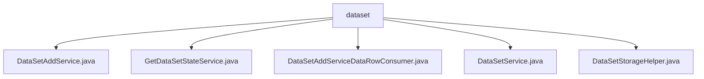

# Basic Information

|      |      |
|------|------|
| Name | dataset |
| Language | .java |
| Code Path | WeFe/fusion/fusion-service/src/main/java/com/welab/wefe/data/fusion/service/service/dataset |
| Package Name | docs.fusion.fusion-service.src.main.java.com.welab.wefe.data.fusion.service.service.dataset |
| Brief Description | The DataSetAddService handles dataset addition, validates parameters, and stores data. The GetDataSetStateService updates dataset status and progress. The DataSetAddServiceDataRowConsumer processes data rows in batches. The DataSetService manages dataset operations. The DataSetStorageHelper handles dataset storage and statistics. |

# Description

## Overview  
The core responsibility of this module is to provide full lifecycle management of datasets, including creation, status tracking, batch processing, and storage optimization. The interface specifications cover CRUD operations, status queries, and batch consumption, similar to an event bus pattern. Key data structures include the dataset model, batch row lists, and dynamic table names (e.g., DATA_SET_TABLE_PRE+ID). External dependencies involve MySQL (via JdbcManager), DataStorageService, and the Spring framework. For example, DataSetAddService supports dual data sources (SQL/file), while DataSetStorageHelper implements batch insertion optimization.  

## Key Business Scenarios  
A typical workflow involves: creating a dataset (validation → storage → status initialization) → batch-consuming data (file parsing or SQL execution) → synchronous status updates. The interaction model adopts a producer-consumer pattern, such as DataSetAddServiceDataRowConsumer processing data in batches of 10,000 rows. Full functionality covers dataset previews, paginated queries, and connection testing, with DataSetService providing SQL syntax validation, for instance. API types include management (CRUD) and monitoring (status/progress), with integration cases such as CSV imports and direct database connections.

### Package Internal Structure View

This flowchart illustrates the file structure relationships within the dataset service module. The root node "dataset" contains five Java service class files, each handling different functionalities of the dataset: add service, state retrieval service, data row consumer service, base dataset service, and storage utility. All service classes are directly under the dataset directory without deeper subdirectory structures.

# File List

| Name   | Type  | Description |
|-------|------|-------------|
| [DataSetAddService.java](DataSetAddService.md) | file | Dataset addition service class, which includes functions for reading data from files or databases and storing it, supports deduplication and field quantity validation. |
| [GetDataSetStateService.java](GetDataSetStateService.md) | file | Get Dataset Status Service: Query the dataset by ID, calculate the processed rows and update the progress status, then return the dataset ID, total rows, and processed rows. Mark as completed when processing is finished; otherwise, mark as in progress. |
| [DataSetAddServiceDataRowConsumer.java](DataSetAddServiceDataRowConsumer.md) | file | The dataset row consumer class supports batch processing and deduplication, can read data from files or databases, accelerates writes through batch processing, and provides completion waiting and shutdown functionalities. |
| [DataSetService.java](DataSetService.md) | file | The DataSetService provides dataset management functionalities, including CRUD operations, SQL testing, file retrieval, paginated queries, and data previews. |
| [DataSetStorageHelper.java](DataSetStorageHelper.md) | file | The `DataSetStorageHelper` class provides operations for dataset tables, including table creation, data insertion, batch saving, and row counting. The table name follows the format `data_fusion_` plus an ID. It relies on `DataStorageService` and `DataSetRepository` to implement its functionality. |

