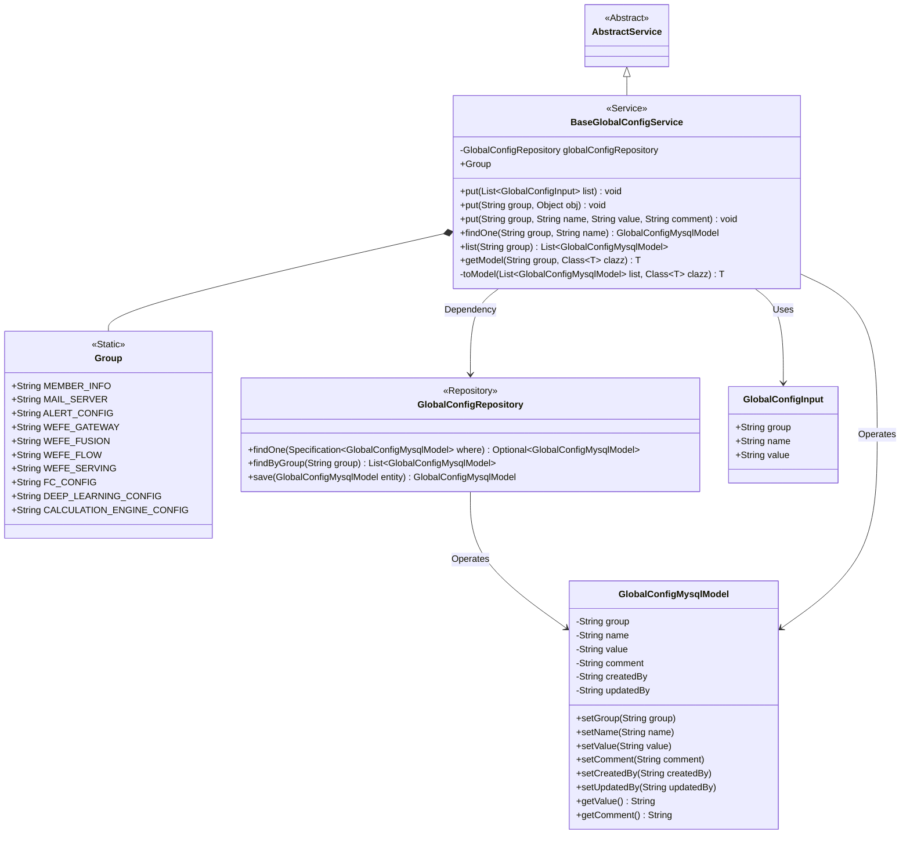
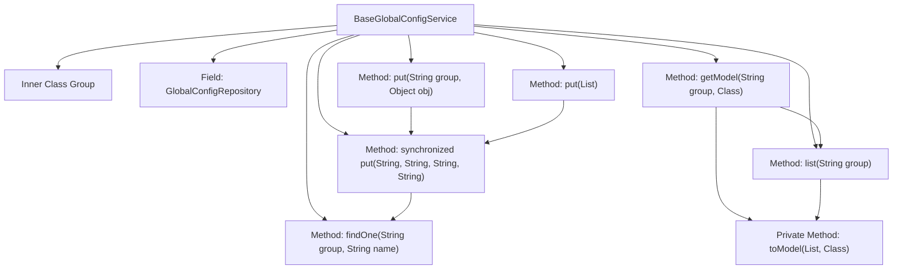

# Basic Information

|      |      |
|------|------|
| Name | BaseGlobalConfigService |
| Language | .java |
| Code Path | WeFe/fusion/fusion-service/src/main/java/com/welab/wefe/data/fusion/service/service/globalconfig/BaseGlobalConfigService.java |
| Package Name | com.welab.wefe.data.fusion.service.service.globalconfig |
| Dependencies | ['com.alibaba.fastjson.JSON', 'com.alibaba.fastjson.JSONObject', 'com.alibaba.fastjson.PropertyNamingStrategy', 'com.alibaba.fastjson.serializer.SerializeConfig', 'com.alibaba.fastjson.serializer.SerializerFeature', 'com.welab.wefe.common.StatusCode', 'com.welab.wefe.common.data.mysql.Where', 'com.welab.wefe.common.exception.StatusCodeWithException', 'com.welab.wefe.common.web.util.CurrentAccountUtil', 'com.welab.wefe.data.fusion.service.database.entity.GlobalConfigMysqlModel', 'com.welab.wefe.data.fusion.service.database.repository.GlobalConfigRepository', 'com.welab.wefe.data.fusion.service.dto.entity.globalconfig.GlobalConfigInput', 'com.welab.wefe.data.fusion.service.service.AbstractService', 'org.springframework.beans.factory.annotation.Autowired', 'org.springframework.data.jpa.domain.Specification', 'java.util.List', 'java.util.Objects'] |
| Brief Description | The BaseGlobalConfigService class provides global configuration management, supporting CRUD operations and including multiple predefined configuration groups such as member_info, mail_server, etc. Methods include batch updates, object serialization storage, and querying configuration items by group. |

# Description

BaseGlobalConfigService is a global configuration service class that inherits from AbstractService, primarily used for managing configuration items across different groups. Its inner class Group defines multiple static string constants representing various configuration groups, such as member information, mail server, alert settings, etc. The class interacts with the database through GlobalConfigRepository and provides a series of methods: the put method is used to add or update single or multiple configuration records, supporting batch operations and object serialization; the findOne and list methods are used to query a single configuration or all configurations under a group based on conditions, respectively; the getModel and toModel methods convert configuration lists into entity objects of the specified type. The class also handles field naming strategies (converted to underscore format) and null value serialization issues to ensure data consistency.

# Class Summary

| Name   | Type  | Description |
|-------|------|-------------|
| BaseGlobalConfigService | class | The BaseGlobalConfigService class provides global configuration management functionality, supporting CRUD operations. It includes multiple predefined configuration groups and can convert configuration items into entity objects. |

## Class BaseGlobalConfigService

|      |      |
|------|------|
| Access Modifier | public |
| Type | class |
| Name | BaseGlobalConfigService |
| Description | The BaseGlobalConfigService class provides global configuration management functionality, supporting CRUD operations. It includes multiple predefined configuration groups and can convert configuration items into entity objects. |

### UML Class Diagram

This code implements a global configuration service with core functionalities including CRUD operations and object mapping for configuration items. BaseGlobalConfigService inherits from AbstractService, defines configuration group constants via the Group static class, and performs database operations using GlobalConfigRepository. Key methods like put support single/batch configuration updates, while getModel maps configuration items to specified object types. The class diagram illustrates the relationship between the service layer and persistence layer, along with the data structure of configuration models, demonstrating the complete business workflow of configuration management.

### Internal Method Call Graph

Flowchart description: This flowchart illustrates the structure of the BaseGlobalConfigService class, including its inner class Group and the invocation relationships between key methods. The core put method has three overloaded versions, all ultimately calling the synchronized 4-parameter version for database operations. The query methods findOne/list/getModel form a call chain, where getModel relies on list and the private method toModel for data conversion. All database operations are implemented via globalConfigRepository.

### Field List

| Name  | Type  | Description |
|-------|-------|------|
| globalConfigRepository | GlobalConfigRepository | Automatically inject global configuration repository instances. |

### Method List

| Name  | Type  | Description |
|-------|-------|------|
| put | void | This method converts the object into a JSON string using the underscore naming strategy while retaining null-value fields, then stores each key-value pair sequentially into the specified group. |
| findOne | GlobalConfigMysqlModel | This method retrieves the specified global configuration items by group and name from the database through conditional query, returning null if no results are found. |
| put | void | Java Method: Iterate through the configuration list, call the put method one by one to store configuration items, with group name, name, and value as mandatory parameters. Throws StatusCodeWithException in case of exceptions. |
| put | void | The synchronous method `put` is used to update or create configuration items, checks for null value conflicts, skips saving if there are no changes, and finally updates the value, comments, and saves. |
| list | List<GlobalConfigMysqlModel> | Query the global configuration list for a specified group. |
| getModel | T | Retrieve configuration from the specified group and convert it into the specified type model. |
| toModel | T | Convert a MySQL configuration list into an object of the specified type. Returns null if the list is empty; otherwise, stores the key-value pairs in a JSON object and converts it into an instance of the target class. |

