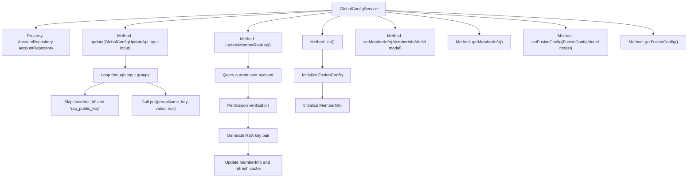

# Basic Information

|      |      |
|------|------|
| Name | GlobalConfigService |
| Language | .java |
| Code Path | WeFe/fusion/fusion-service/src/main/java/com/welab/wefe/data/fusion/service/service/globalconfig/GlobalConfigService.java |
| Package Name | com.welab.wefe.data.fusion.service.service.globalconfig |
| Dependencies | ['com.welab.wefe.common.StatusCode', 'com.welab.wefe.common.constant.SecretKeyType', 'com.welab.wefe.common.exception.StatusCodeWithException', 'com.welab.wefe.common.util.SignUtil', 'com.welab.wefe.common.web.util.CurrentAccountUtil', 'com.welab.wefe.common.web.util.DatabaseEncryptUtil', 'com.welab.wefe.data.fusion.service.api.system.GlobalConfigUpdateApi', 'com.welab.wefe.data.fusion.service.database.entity.AccountMysqlModel', 'com.welab.wefe.data.fusion.service.database.repository.AccountRepository', 'com.welab.wefe.data.fusion.service.dto.entity.globalconfig.FusionConfigModel', 'com.welab.wefe.data.fusion.service.dto.entity.globalconfig.MemberInfoModel', 'com.welab.wefe.data.fusion.service.service.CacheObjects', 'org.springframework.beans.factory.annotation.Autowired', 'org.springframework.stereotype.Service', 'org.springframework.transaction.annotation.Transactional', 'java.security.NoSuchAlgorithmException', 'java.util.Map'] |
| Brief Description | The GlobalConfigService provides global configuration management, including updating configuration items, initializing configurations, setting and retrieving member information, and merging configurations. It supports transactional updates of member RSA keys, which require super administrator privileges. |

# Description

GlobalConfigService is a service class that inherits from BaseGlobalConfigService, providing global configuration management functionality. Key methods include: the update method for updating configuration items while skipping the member_id and rsa_public_key fields; the updateMemberRsaKey method for updating member RSA keys (super admin only); the init method for initializing global configuration items; setMemberInfo and getMemberInfo methods for setting and retrieving member information; setFusionConfig and getFusionConfig methods for managing fusion configurations. The comments also mention unimplemented AlertConfig-related methods.

# Class Summary

| Name   | Type  | Description |
|-------|------|-------------|
| GlobalConfigService | class | The GlobalConfigService provides global configuration management capabilities, including updating configuration items, initializing configurations, setting/retrieving member information, and merging configurations. Among these, the update method handles configuration updates while skipping specific fields; the updateMemberRsaKey method generates and updates RSA key pairs, accessible only to super administrators; the init method initializes global configurations. |


## Class GlobalConfigService

|      |      |
|------|------|
| Access Modifier | @Service;public |
| Type | class |
| Name | GlobalConfigService |
| Description | The GlobalConfigService provides global configuration management capabilities, including updating configuration items, initializing configurations, setting/retrieving member information, and merging configurations. Among these, the update method handles configuration updates while skipping specific fields; the updateMemberRsaKey method generates and updates RSA key pairs, accessible only to super administrators; the init method initializes global configurations. |


### UML Class Diagram

```mermaid
classDiagram
    class BaseGlobalConfigService {
        <<abstract>>
    }
    
    class GlobalConfigService {
        -AccountRepository accountRepository
        +update(GlobalConfigUpdateApi$Input input) void
        +updateMemberRsaKey() void
        +init() void
        +setMemberInfo(MemberInfoModel model) void
        +getMemberInfo() MemberInfoModel
        +setFusionConfig(FusionConfigModel model) void
        +getFusionConfig() FusionConfigModel
    }
    
    class AccountRepository {
        <<Interface>>
        +findByPhoneNumber(String phoneNumber) AccountMysqlModel
    }
    
    class GlobalConfigUpdateApi$Input {
        -Map~String, Map~String, String~~ groups
    }
    
    class MemberInfoModel {
        -String rsaPrivateKey
        -String rsaPublicKey
        +setRsaPrivateKey(String key) void
        +setRsaPublicKey(String key) void
    }
    
    class FusionConfigModel {
    }
    
    class SignUtil {
        <<utility>>
        +generateKeyPair(SecretKeyType type) KeyPair
    }
    
    class StatusCodeWithException {
        <<Exception>>
    }
    
    BaseGlobalConfigService <|-- GlobalConfigService
    GlobalConfigService --> AccountRepository : Dependency
    GlobalConfigService --> GlobalConfigUpdateApi$Input : Uses
    GlobalConfigService --> MemberInfoModel : Manages
    GlobalConfigService --> FusionConfigModel : Manages
    GlobalConfigService ..> SignUtil : Invokes
    GlobalConfigService ..> StatusCodeWithException : Throws
```

This class diagram illustrates that GlobalConfigService inherits from BaseGlobalConfigService and depends on the AccountRepository interface for data access. Its core functionalities include updating global configurations, managing member RSA keys, and initializing configuration items. It manages different types of configuration data through MemberInfoModel and FusionConfigModel, utilizes SignUtil to generate key pairs, and may throw StatusCodeWithException exceptions. The class omits commented-out AlertConfig-related methods, highlighting the essential features of configuration management.


### Internal Method Call Graph



This code implements the GlobalConfigService class, primarily providing global configuration management functionality. It includes core methods: update() for batch updating configuration items, updateMemberRsaKey() for administrators to update RSA key pairs, and init() for configuration initialization. The class inherits from BaseGlobalConfigService, accesses data via AccountRepository, and ensures transactional operations with @Transactional. The flowchart illustrates the class structure and main method invocation relationships, where update() contains nested loop processing, updateMemberRsaKey() includes permission verification and key generation processes, and init() implements initialization checks for configuration items.

### Field List

| Name  | Type  | Description |
|-------|-------|------|
| accountRepository | AccountRepository | Use @Autowired to automatically inject an instance of AccountRepository. |

### Method List

| Name  | Type  | Description |
|-------|-------|------|
| update | void | Update the global configuration, iterate through the input groups and entries, skip member_id and rsa_public_key, and call the put method to save the remaining key-value pairs. |
| init | void | Initialize global configuration: Check and set FusionConfig and MemberInfo, create new instances if they are null, and log success messages. |
| updateMemberRsaKey | void | The method updateMemberRsaKey is used to update a member's RSA key. Only the super administrator can perform this operation, which generates a new key pair and updates the model, rolling back the transaction upon failure. Upon completion, the cache is refreshed. |
| setMemberInfo | void | Set member information method, accepts MemberInfoModel parameter, may throw StatusCodeWithException. |
| getMemberInfo | MemberInfoModel | Retrieve member information, returns a MemberInfoModel type object. |
| setFusionConfig | void | Set the fusion configuration method, which accepts the FusionConfigModel parameter and may throw a StatusCodeWithException. |
| getFusionConfig | FusionConfigModel | Method to obtain fusion configuration: Returns an instance of the FusionConfigModel class under Group.WEFE_FUSION. |


