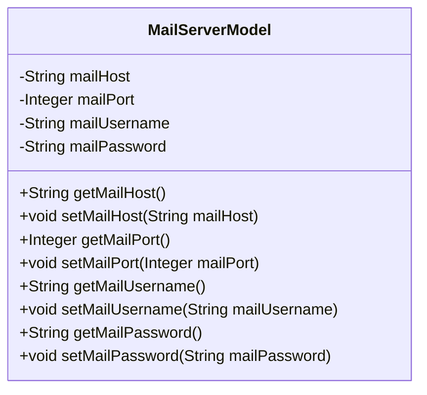

# Basic Information

|      |      |
|------|------|
| Name | MailServerModel |
| Language | .java |
| Code Path | WeFe/fusion/fusion-service/src/main/java/com/welab/wefe/data/fusion/service/service/globalconfig/MailServerModel.java |
| Package Name | com.welab.wefe.data.fusion.service.service.globalconfig |
| Dependencies | ['com.welab.wefe.common.fieldvalidate.annotation.Check'] |
| Brief Description | Email server model class, including fields for host, port, username, and password, along with corresponding getter/setter methods. |

# Description

This is a mail server configuration model class containing four key fields: mail server address, port, username, and password. Each field is annotated with inspection annotations to label its name. The class provides standard getter and setter methods for each field to retrieve and set the corresponding property values. The overall class structure is clear, encapsulating the basic configuration information required for mail server connections.

# Class Summary

| Name   | Type  | Description |
|-------|------|-------------|
| MailServerModel | class | Email server model class, containing fields for address, port, username, and password along with corresponding getter/setter methods. |

## Class MailServerModel

|      |      |
|------|------|
| Access Modifier | public |
| Type | class |
| Name | MailServerModel |
| Description | Email server model class, containing fields for address, port, username, and password along with corresponding getter/setter methods. |

### UML Class Diagram

This code defines a `MailServerModel` class representing email server configuration. The class contains four private attributes: `mailHost` (mail server address), `mailPort` (mail server port), `mailUsername` (mail username), and `mailPassword` (mail password), each annotated with `@Check` for validation. Corresponding getter and setter methods are provided for each attribute to retrieve and modify values. This class primarily encapsulates email server configuration data for easy transfer and usage within the system.

### Internal Method Call Graph

```mermaid
graph TD
    A["Class MailServerModel"]
    B["Attribute: @Check String mailHost"]
    C["Attribute: @Check Integer mailPort"]
    D["Attribute: @Check String mailUsername"]
    E["Attribute: @Check String mailPassword"]
    F["Method: getMailHost()"]
    G["Method: setMailHost(String)"]
    H["Method: getMailPort()"]
    I["Method: setMailPort(Integer)"]
    J["Method: getMailUsername()"]
    K["Method: setMailUsername(String)"]
    L["Method: getMailPassword()"]
    M["Method: setMailPassword(String)"]

    A --> B
    A --> C
    A --> D
    A --> E
    A --> F
    A --> G
    A --> H
    A --> I
    A --> J
    A --> K
    A --> L
    A --> M
```

This flowchart illustrates the structure of the MailServerModel class, containing 4 private attributes annotated with @Check and their corresponding getter/setter methods. Each attribute is annotated with Chinese descriptions such as "mail server address", "mail server port", etc. The class implements encapsulated access to attributes through 8 methods, forming a standard JavaBean structure. Arrows indicate the ownership relationship between the class and its members, clearly presenting the components of the data model.

### Field List

| Name  | Type  | Description |
|-------|-------|------|
| mailUsername | String | Email username validation field. |
| mailPassword | String | Email password verification field. |
| mailHost | String | Define a private string variable mailHost with code, and use annotations to check the mail server address. |
| mailPort | Integer | Email Server Port Configuration Items |

### Method List

| Name  | Type  | Description |
|-------|-------|------|
| setMailUsername | void | This is a Java method used to set the mail username property. The method is named setMailUsername, which accepts a String parameter mailUsername and assigns it to the class member variable of the same name. |
| getMailPassword | String | Methods to obtain the email password, returning a string-type variable mailPassword. |
| setMailPassword | void | Method for setting the email password: Assign the input parameter to the class member variable mailPassword. |
| getMailUsername | String | Methods to obtain the email username, returns the value of the mailUsername variable. |
| setMailHost | void | The method for setting the mail host address assigns the parameter `mailHost` to the class variable `this.mailHost`. |
| getMailHost | String | Methods to Obtain Email Host Addresses. |
| setMailPort | void | The method for setting the mail port, with the parameter as an integer mailPort, assigns the value to the class variable mailPort. |
| getMailPort | Integer | Methods to obtain the mail port, returning an integer value mailPort. |

