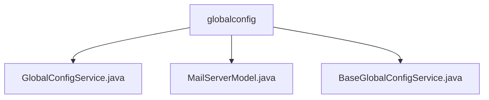

# Basic Information

|      |      |
|------|------|
| Name | globalconfig |
| Language | .java |
| Code Path | WeFe/fusion/fusion-service/src/main/java/com/welab/wefe/data/fusion/service/service/globalconfig |
| Package Name | docs.fusion.fusion-service.src.main.java.com.welab.wefe.data.fusion.service.service.globalconfig |
| Brief Description | The GlobalConfigService inherits from BaseGlobalConfigService, providing configuration management functionalities such as updating configurations, RSA keys, member information, etc. The MailServerModel encapsulates email server configuration details. The BaseGlobalConfigService manages group configurations, supporting CRUD operations and serialization. |

# Description

## Overview  
The core responsibility of this module is to provide global configuration management capabilities, including CRUD operations for grouped configurations such as member information and mail server settings. The interface specification follows a layered design, where GlobalConfigService implements business logic and BaseGlobalConfigService provides basic data access capabilities, resembling a configuration center pattern.  

Key data structures include MailServerModel (encapsulating SMTP connection parameters) and the Group inner class (defining configuration group constants). External dependencies involve JPA (GlobalConfigRepository) and RSA encryption mechanisms. For example, the updateMemberRsaKey method requires super administrator privileges, while MailServerModel implements field validation through annotations.  

## Primary Business Scenarios  
The typical application pattern is multi-tenant system configuration management, supporting group operations (e.g., mail server configuration updates) and fine-grained control (e.g., RSA key update permission isolation). The interaction mode adopts a service-layer aggregation approach, such as the init method automatically loading group data during configuration initialization.  

API types include configuration item operations (put/findOne), model conversion (toModel), and business extensions (AlertConfig placeholder). Integration examples include: member information stored via setMemberInfo, mail configuration serialized through MailServerModel, resembling a configuration bus design.

### Package Internal Structure View

This flowchart illustrates the hierarchical relationships among three files under the globalconfig directory. GlobalConfigService.java, MailServerModel.java, and BaseGlobalConfigService.java are all directly subordinate to the globalconfig directory without deeper nesting structures. All node names adopt the last-level elements of the paths, complying with Mermaid format specifications, clearly presenting the organization of core files related to global configuration in the service module.

# File List

| Name   | Type  | Description |
|-------|------|-------------|
| [GlobalConfigService.java](GlobalConfigService.md) | file | The GlobalConfigService provides global configuration management, including updating configuration items, initializing configurations, setting and retrieving member information, and merging configurations. It supports transactional updates of member RSA keys, which require super administrator privileges. |
| [MailServerModel.java](MailServerModel.md) | file | Email server model class, containing fields for host, port, username, and password along with corresponding getter/setter methods. |
| [BaseGlobalConfigService.java](BaseGlobalConfigService.md) | file | The BaseGlobalConfigService class provides global configuration management, supporting CRUD operations, and includes multiple predefined configuration groups such as member_info, mail_server, etc. Methods include batch updates, object serialization storage, and querying configuration items by group. |

