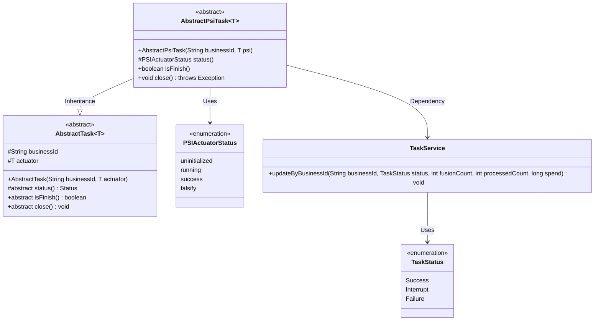
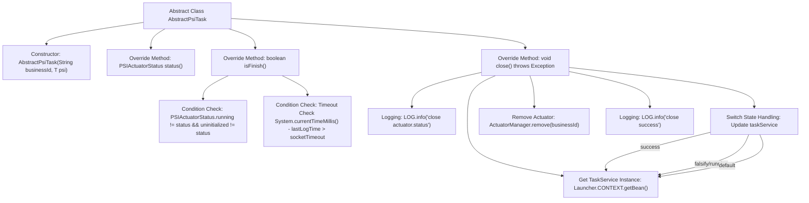

# Basic Information

|      |      |
|------|------|
| Name | AbstractPsiTask |
| Language | .java |
| Code Path | WeFe/fusion/fusion-service/src/main/java/com/welab/wefe/data/fusion/service/task/AbstractPsiTask.java |
| Package Name | com.welab.wefe.data.fusion.service.task |
| Dependencies | ['com.welab.wefe.common.web.Launcher', 'com.welab.wefe.data.fusion.service.actuator.rsapsi.AbstractPsiActuator', 'com.welab.wefe.data.fusion.service.enums.PSIActuatorStatus', 'com.welab.wefe.data.fusion.service.enums.TaskStatus', 'com.welab.wefe.data.fusion.service.manager.ActuatorManager', 'com.welab.wefe.data.fusion.service.service.TaskService'] |
| Brief Description | The abstract class AbstractPsiTask extends AbstractTask, determining task completion through status checks, and upon closure, updates the task result based on the status while cleaning up resources. |

# Description

This is an abstract class `AbstractPsiTask`, which inherits from `AbstractTask` and is used to handle tasks related to the PSI executor. The class includes a constructor that accepts a business ID and a PSI executor instance. It provides a `status` method to return the executor's status and an `isFinish` method to determine whether the task is completed (based on status or timeout). The `close` method is responsible for the task closure logic, updating the task status (success, interrupted, or failed) based on the executor's state, and removing the executor instance. The entire process is logged.

# Class Summary

| Name   | Type  | Description |
|-------|------|-------------|
| AbstractPsiTask | class | The abstract class AbstractPsiTask extends AbstractTask, implementing task status checking, completion determination, and closure logic. It updates task results based on status and cleans up resources. |

## Class AbstractPsiTask

|      |      |
|------|------|
| Access Modifier | public abstract |
| Type | class |
| Name | AbstractPsiTask |
| Description | The abstract class AbstractPsiTask extends AbstractTask, implementing task status checking, completion determination, and closure logic. It updates task results based on status and cleans up resources. |

### UML Class Diagram

This code demonstrates an abstract class `AbstractPsiTask` inheriting from the generic class `AbstractTask`, primarily designed for managing task states related to PSI actuators. The class includes state-checking methods like `isFinish()` and resource cleanup method `close()`, updates task status via `TaskService`, and involves two enumeration types: `PSIActuatorStatus` and `TaskStatus`. The design implements task state monitoring, timeout handling, and resource cleanup logic under different states, reflecting the application of the Template Method Pattern in object-oriented design.

### Internal Method Call Graph

This code flowchart illustrates the core structure of the AbstractPsiTask abstract class, focusing on the logic of task status determination (isFinish) and the shutdown process (close). The isFinish method determines task completion by checking actuator status and timeout conditions, while the close method updates task status based on actuator state by obtaining a TaskService instance, ultimately removing the actuator and logging the process. The entire flow demonstrates state management and resource cleanup mechanisms in the task lifecycle.

### Field List

| Name  | Type  | Description |
|-------|-------|------|

### Method List

| Name  | Type  | Description |
|-------|-------|------|
| isFinish | boolean | Check the executor status or timeout and return completion. |
| status | PSIActuatorStatus | The method for obtaining the executor status directly returns the current status value of the executor. |
| close | void | The method updates the task status based on the executor state upon closure: marks it as successful if completed successfully, as interrupted if forged or still running, and as failed in all other cases, then logs the result and removes the executor. |

