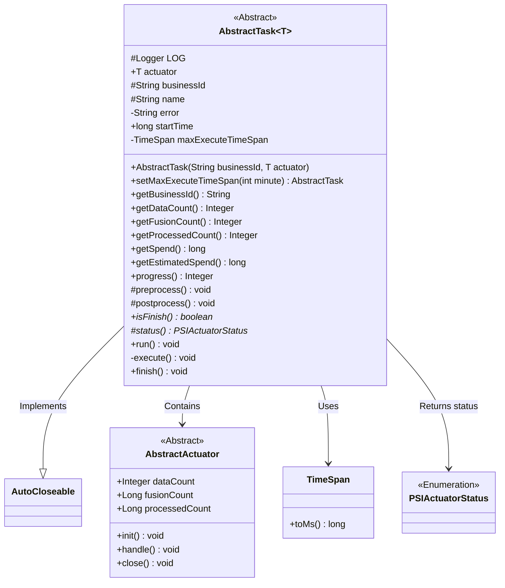
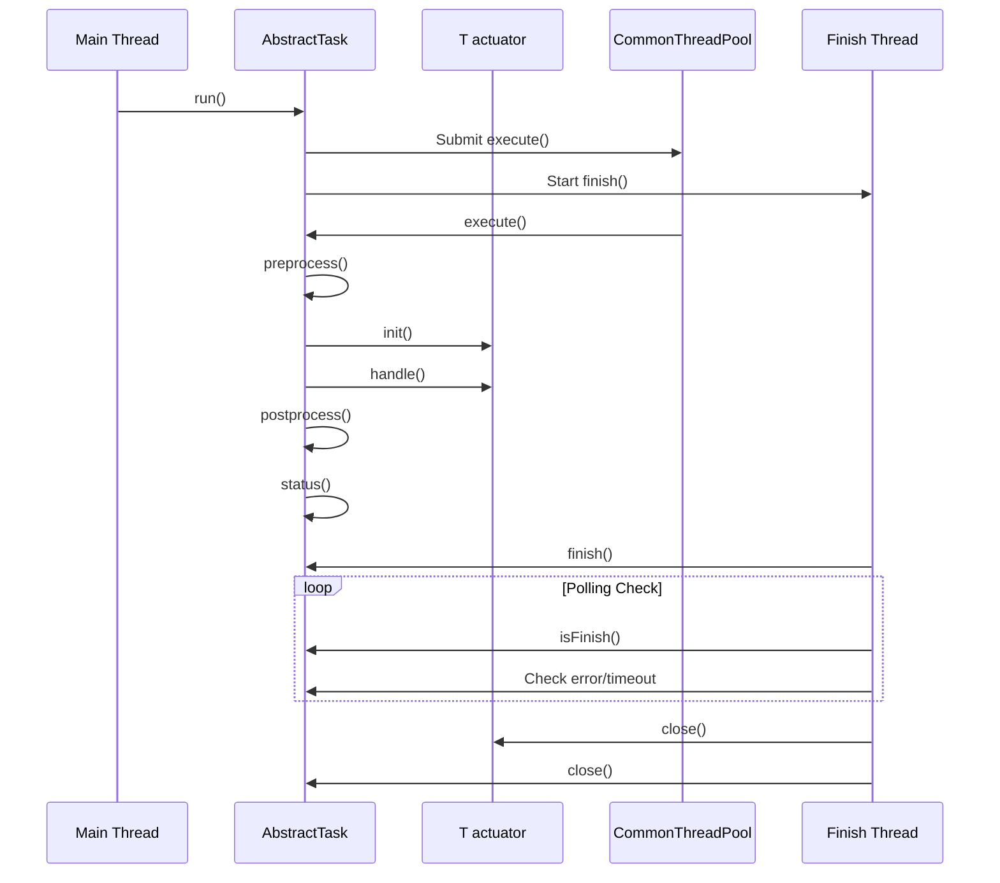

# Basic Information

|      |      |
|------|------|
| Name | AbstractTask |
| Language | .java |
| Code Path | WeFe/fusion/fusion-service/src/main/java/com/welab/wefe/data/fusion/service/task/AbstractTask.java |
| Package Name | com.welab.wefe.data.fusion.service.task |
| Dependencies | ['com.welab.wefe.common.util.ThreadUtil.sleep', 'org.slf4j.Logger', 'org.slf4j.LoggerFactory', 'com.welab.wefe.common.CommonThreadPool', 'com.welab.wefe.common.TimeSpan', 'com.welab.wefe.common.util.StringUtil', 'com.welab.wefe.data.fusion.service.actuator.AbstractActuator', 'com.welab.wefe.data.fusion.service.actuator.rsapsi.AbstractPsiActuator', 'com.welab.wefe.data.fusion.service.enums.PSIActuatorStatus'] |
| Brief Description | The abstract task class `AbstractTask` includes attributes such as executor, business ID, and task name. It provides functionalities like task execution, progress calculation, and time estimation, supports preprocessing, post-processing, and status checks, and implements the auto-close interface. |

# Description

AbstractTask is an abstract class that implements the AutoCloseable interface, designed to manage task execution workflows. It includes attributes such as business ID, executor, task name, and error messages, while recording the task start time and maximum execution duration. It provides methods for setting the maximum execution time, retrieving business data volume, processing progress, and time consumption estimation. Task execution is divided into preprocessing, initialization, processing, and post-processing phases. The task status is monitored via multithreading, and the executor and task are closed upon completion or timeout. Logs record the status of each phase, with error messages captured in case of exceptions.

# Class Summary

| Name   | Type  | Description |
|-------|------|-------------|
| AbstractTask | class | The abstract task class `AbstractTask` includes attributes such as executor, business ID, and error messages, providing functionalities like task execution, progress calculation, and timeout control. It supports pre-processing and post-processing, and achieves asynchronous execution and completion checks through multithreading. |

## Class AbstractTask

|      |      |
|------|------|
| Access Modifier | public abstract |
| Type | class |
| Name | AbstractTask |
| Description | The abstract task class `AbstractTask` includes attributes such as executor, business ID, and error messages, providing functionalities like task execution, progress calculation, and timeout control. It supports pre-processing and post-processing, and achieves asynchronous execution and completion checks through multithreading. |

### UML Class Diagram

Class diagram description: This diagram illustrates the relationship between an abstract task class `AbstractTask` and its related components. `AbstractTask` is a generic class requiring a type parameter that inherits from `AbstractActuator`, and it implements the `AutoCloseable` interface. Key functionalities include task execution time management, progress calculation, and status monitoring. It holds an actuator (`actuator`) through composition and uses `TimeSpan` for timeout control. Core methods `execute()` and `finish()` implement asynchronous task execution and status checking logic, employing the template method pattern to require subclasses to implement `isFinish()` and `status()` methods.

### Internal Method Call Graph

```mermaid
graph TD
    A["Abstract Class AbstractTask<T>"]
    B["Property: Logger LOG"]
    C["Property: T actuator"]
    D["Property: String businessId"]
    E["Property: String name"]
    F["Property: String error"]
    G["Property: long startTime"]
    H["Property: TimeSpan maxExecuteTimeSpan"]
    I["Constructor: AbstractTask(String, T)"]
    J["Method: setMaxExecuteTimeSpan(int)"]
    K["Method: getBusinessId()"]
    L["Method: getDataCount()"]
    M["Method: getFusionCount()"]
    N["Method: getProcessedCount()"]
    O["Method: getSpend()"]
    P["Method: getEstimatedSpend()"]
    Q["Method: progress()"]
    R["Abstract Method: isFinish()"]
    S["Abstract Method: status()"]
    T["Method: run()"]
    U["Method: execute()"]
    V["Method: finish()"]
    W["Protected Method: preprocess()"]
    X["Protected Method: postprocess()"]

    A --> B
    A --> C
    A --> D
    A --> E
    A --> F
    A --> G
    A --> H
    A --> I
    A --> J
    A --> K
    A --> L
    A --> M
    A --> N
    A --> O
    A --> P
    A --> Q
    A --> R
    A --> S
    A --> T
    T --> U
    T --> V
    U --> W
    U --> X
```

This flowchart illustrates the structure of the AbstractTask abstract class, including core properties, constructors, and key behavioral methods. The sequence diagram depicts the complete lifecycle of task execution: after the main thread initiates the task, the thread pool asynchronously executes processing logic while an independent thread monitors task completion status. Key processes include preprocessing, actuator initialization, business handling, postprocessing, as well as timeout/error detection and resource release. The class design adopts the Template Method pattern, enabling extension of specific business logic through abstract methods isFinish() and status().

### Field List

| Name  | Type  | Description |
|-------|-------|------|
| error | String | Declare a private volatile string variable error for sharing error information in a multi-threaded environment. |
| actuator | T | The public member variable `actuator` in the class, of generic type T. |
| businessId | String | Declare a protected string-type variable businessId. |
| name | String | Declare a protected string-type variable name. |
| maxExecuteTimeSpan = new TimeSpan(100 * 60 * 1000) | TimeSpan | Define the maximum execution time span as 100 minutes. |
| startTime = System.currentTimeMillis() | long | Define a long integer variable startTime with an initial value of the current system time in milliseconds. |
| LOG = LoggerFactory.getLogger(getClass()) | Logger | Declare a protected final logger object, initialized with the current class name. |

### Method List

| Name  | Type  | Description |
|-------|-------|------|
| run | void | The method `run` starts two threads: one executes the `execute` method via the `CommonThreadPool`, while the other newly created thread executes the `finish` method. |
| getEstimatedSpend | long | Calculate estimated cost: If the number of processed items is 0, return the total data volume multiplied by the single cost; otherwise, return the remaining data volume multiplied by the average single cost. |
| getBusinessId | String | This method returns the businessId property value of the current object. |
| progress | Integer | This method calculates and returns the processing progress percentage by dividing the number of processed items by the total quantity, multiplying by 100, and rounding the result. |
| getDataCount | Integer | Methods for obtaining data count, returns the data count value in the executor. |
| status | PSIActuatorStatus | Abstract method that returns the protected state object PSIActuatorStatus. |
| postprocess | void | Empty method, no functionality implemented. |
| getProcessedCount | Integer | This method returns the count integer value processed by the executor. |
| getFusionCount | Integer | Get the integer value of the executor fusion count. |
| setMaxExecuteTimeSpan | AbstractTask | Set the maximum execution time for the task, with the parameter in minutes, convert it to milliseconds for storage, and return the current object. |
| getSpend | long | This method returns the difference between the current time and startTime, representing the elapsed milliseconds since startTime. |
| isFinish | boolean | The abstract method `isFinish` returns a boolean value indicating whether it is completed. |
| execute | void | The method `execute` carries out the task flow: preprocessing, initialization, processing, and post-processing, logs each stage, captures exceptions, and records error messages. |
| finish | void | The method `finish()` continuously checks the task status, closes the executor and task upon timeout or completion, and logs exceptions and events. |
| preprocess | void | Empty method preprocess, no implementation, may throw exceptions. |

