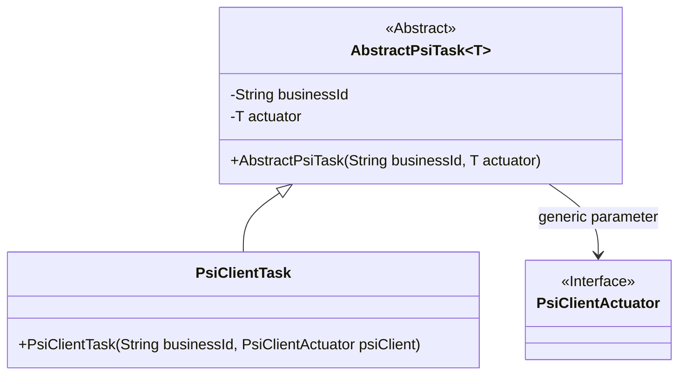
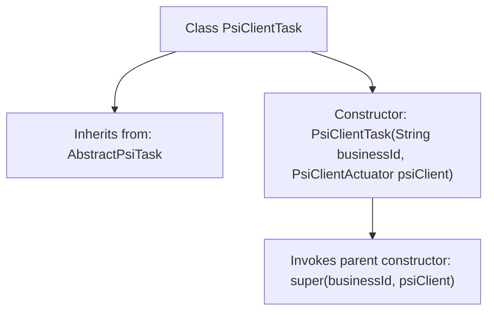

# Basic Information

|      |      |
|------|------|
| Name | PsiClientTask |
| Language | .java |
| Code Path | WeFe/fusion/fusion-service/src/main/java/com/welab/wefe/data/fusion/service/task/PsiClientTask.java |
| Package Name | com.welab.wefe.data.fusion.service.task |
| Dependencies | ['com.welab.wefe.data.fusion.service.actuator.rsapsi.PsiClientActuator'] |
| Brief Description | The PsiClientTask class inherits from AbstractPsiTask and receives the business ID and PsiClientActuator parameters through its constructor method. |

# Description

This is a Java class named PsiClientTask, which extends the AbstractPsiTask generic class with the generic type PsiClientActuator. The class includes a constructor that takes two parameters: a businessId string and a psiClient object, and passes them to the parent class constructor. This class is primarily used for handling tasks related to the PSI client.

# Class Summary

| Name   | Type  | Description |
|-------|------|-------------|
| PsiClientTask | class | The PsiClientTask class inherits from AbstractPsiTask, with the business ID and a PsiClientActuator instance passed through the constructor. |

## Class PsiClientTask

|      |      |
|------|------|
| Access Modifier | public |
| Type | class |
| Name | PsiClientTask |
| Description | The PsiClientTask class inherits from AbstractPsiTask, with the business ID and a PsiClientActuator instance passed through the constructor. |

### UML Class Diagram

This class diagram illustrates the inheritance and dependency relationships of PSI client tasks. `PsiClientTask` inherits from the generic abstract class `AbstractPsiTask<PsiClientActuator>`, where the generic parameter is specified as the interface type `PsiClientActuator`. The abstract base class encapsulates a business ID and an actuator object, while the subclass passes concrete parameters through its constructor. The overall structure demonstrates the application of the Template Method pattern, ensuring type safety through generic constraints.

### Internal Method Call Graph

This flowchart depicts the structure of the PsiClientTask class, which inherits from the generic class AbstractPsiTask<PsiClientActuator>. The core lies in the constructor invocation chain: when creating a new PsiClientTask instance, the constructor receives a business ID and client actuator parameters, then directly invokes the parent class's constructor for initialization. This design exemplifies the Template Method pattern, delegating concrete implementation to the parent class while maintaining type safety (via generics specifying PsiClientActuator type).

### Field List

| Name  | Type  | Description |
|-------|-------|------|

### Method List

| Name  | Type  | Description |
|-------|-------|------|

