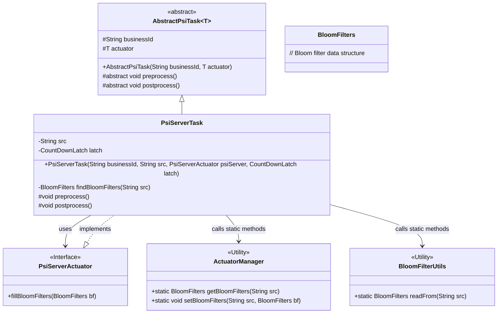
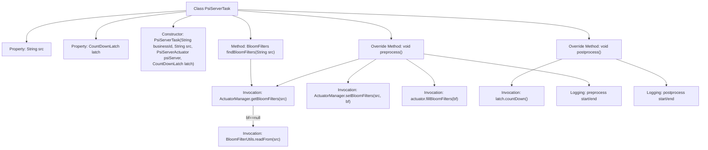

# Basic Information

|      |      |
|------|------|
| Name | PsiServerTask |
| Language | .java |
| Code Path | WeFe/fusion/fusion-service/src/main/java/com/welab/wefe/data/fusion/service/task/PsiServerTask.java |
| Package Name | com.welab.wefe.data.fusion.service.task |
| Dependencies | ['java.util.concurrent.CountDownLatch', 'com.welab.wefe.data.fusion.service.actuator.rsapsi.PsiServerActuator', 'com.welab.wefe.data.fusion.service.manager.ActuatorManager', 'com.welab.wefe.data.fusion.service.utils.bf.BloomFilterUtils', 'com.welab.wefe.data.fusion.service.utils.bf.BloomFilters'] |
| Brief Description | The PsiServerTask class inherits from AbstractPsiTask, containing src and latch attributes. It provides the findBloomFilters method to read Bloom filters, the preprocess method for data preprocessing, and the postprocess method to release the latch. |

# Description

PsiServerTask is a class that inherits from AbstractPsiTask and is used to handle PSI server tasks. It contains two private member variables, src and latch, which are initialized via the constructor. The class defines the findBloomFilters method for retrieving Bloom filter data from a specified source. The preprocess method handles preprocessing, including reading Bloom filter data and populating it into the executor; the postprocess method performs postprocessing, primarily decrementing the count latch value. The entire process logs execution time.

# Class Summary

| Name   | Type  | Description |
|-------|------|-------------|
| PsiServerTask | class | The PsiServerTask class inherits from AbstractPsiTask and contains src and latch attributes. The constructor initializes the business ID, src, and executor. The preprocess method reads and sets the Bloom filter, while the postprocess method decrements the count latch. |

## Class PsiServerTask

|      |      |
|------|------|
| Access Modifier | public |
| Type | class |
| Name | PsiServerTask |
| Description | The PsiServerTask class inherits from AbstractPsiTask and contains src and latch attributes. The constructor initializes the business ID, src, and executor. The preprocess method reads and sets the Bloom filter, while the postprocess method decrements the count latch. |

### UML Class Diagram

Class diagram description: This diagram illustrates the class structure of a PSI (Private Set Intersection) server task. PsiServerTask inherits from the generic abstract class AbstractPsiTask, implementing preprocessing and postprocessing logic. It relies on the PsiServerActuator interface for core operations and manages Bloom filters through ActuatorManager and BloomFilterUtils utility classes. The overall structure demonstrates the Template Method pattern, where the abstract base class defines the algorithm skeleton while concrete subclasses implement specific steps.

### Internal Method Call Graph

This code describes a PSI (Private Set Intersection) server task class primarily handling the lookup, storage, and population of Bloom filters. The flowchart illustrates the class structure, properties, constructor, and key method invocation chains, including the preprocessing phase for reading Bloom filters from source paths, storing them in the manager, and populating the actuator, as well as the postprocessing phase for notifying completion via a countdown latch. All operations feature detailed logging, with time statistics fully covering the task lifecycle.

### Field List

| Name  | Type  | Description |
|-------|-------|------|
| src | String | Private string variable src |
| latch | CountDownLatch | Private countdown latch variable `latch`. |

### Method List

| Name  | Type  | Description |
|-------|-------|------|
| preprocess | void | Preprocessing method: Read source data to construct a Bloom filter, configure and populate it into the executor, then record the time consumption. |
| findBloomFilters | BloomFilters | The method retrieves BloomFilters for the specified source via ActuatorManager, and if they do not exist, it reads from the source and returns them. |
| postprocess | void | The method postprocess logs the start when executed, calls latch.countDown(), and finally logs the end. |

