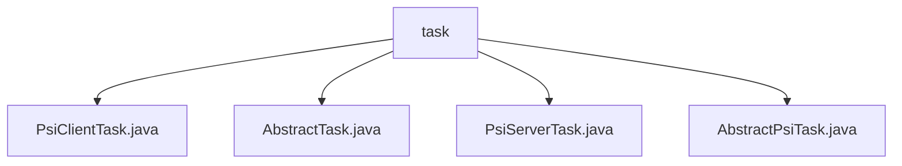

# Basic Information

|      |      |
|------|------|
| Name | task |
| Language | .java |
| Code Path | WeFe/fusion/fusion-service/src/main/java/com/welab/wefe/data/fusion/service/task |
| Package Name | docs.fusion.fusion-service.src.main.java.com.welab.wefe.data.fusion.service.task |
| Brief Description | PsiClientTask extends AbstractPsiTask and handles PSI client tasks. AbstractTask is an abstract class that manages task workflows. PsiServerTask extends AbstractPsiTask and handles PSI server tasks. AbstractPsiTask is the abstract base class for handling PSI executor tasks. |

# Description

## Overview  
The core responsibility of this module is to manage the lifecycle of PSI (Private Set Intersection) tasks, including controlling the execution flow of both client-side and server-side tasks. The interface specification follows a four-phase model of task preprocessing, initialization, processing, and postprocessing, with the AbstractTask base class providing capabilities such as timeout monitoring, state management, and resource release. Key data structures include business IDs, executor instances, task status flags, and Bloom filter data. External dependencies are limited to Java's standard library, specifically AutoCloseable and multithreading utility classes. For example, PsiClientTask handles client-side logic, while PsiServerTask operates on Bloom filter data.  

## Primary Business Scenarios  
The typical workflow resembles a factory assembly line pattern: client tasks perform intersection calculations via PsiClientActuator, while server tasks use PsiServerTask to load Bloom filters and synchronize processing states. All tasks share the base class's thread monitoring mechanism, which automatically triggers resource cleanup in cases of timeouts or exceptions. For instance, the findBloomFilters method implements data retrieval, and preprocess/postprocess form a closed processing loop. API types include status queries (status/isFinish) and flow control (close). Integration cases demonstrate client-server collaboration to achieve private set intersection.

### Package Internal Structure View

This flowchart illustrates the class structure relationships within the task module of the WeFe data fusion service. The root node "task" encompasses four concrete implementation classes, including two PSI task implementations (PsiClientTask and PsiServerTask) and two abstract base classes (AbstractTask and AbstractPsiTask), demonstrating the inheritance hierarchy design of the task processing module.

# File List

| Name   | Type  | Description |
|-------|------|-------------|
| [PsiClientTask.java](PsiClientTask.md) | file | The PsiClientTask class inherits from AbstractPsiTask and receives the business ID and PsiClientActuator parameters through its constructor method. |
| [AbstractTask.java](AbstractTask.md) | file | The abstract task class `AbstractTask` includes attributes such as executor, business ID, and task name. It provides functionalities like task execution, progress calculation, and time estimation, supports preprocessing, postprocessing, and status checks, and implements the auto-close interface. |
| [PsiServerTask.java](PsiServerTask.md) | file | The PsiServerTask class inherits from AbstractPsiTask, containing src and latch attributes. It provides the findBloomFilters method to read Bloom filters, the preprocess method for data preprocessing, and the postprocess method to release the latch. |
| [AbstractPsiTask.java](AbstractPsiTask.md) | file | The abstract class `AbstractPsiTask` extends `AbstractTask`, determining task completion through state checks, updating task results based on state upon closure, and cleaning up resources. |

