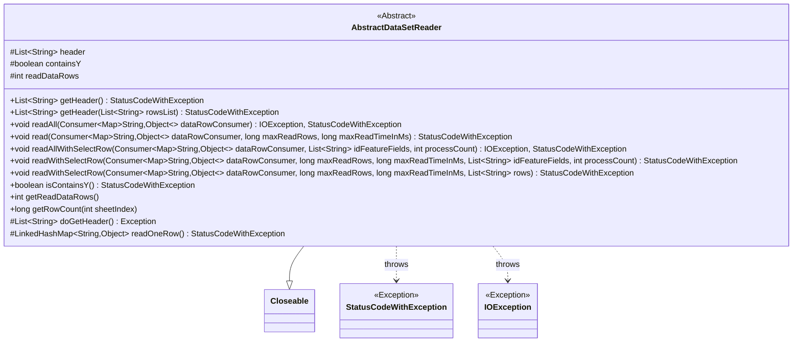

# Basic Information

|      |      |
|------|------|
| Name | AbstractDataSetReader |
| Language | .java |
| Code Path | WeFe/fusion/fusion-service/src/main/java/com/welab/wefe/data/fusion/service/utils/AbstractDataSetReader.java |
| Package Name | com.welab.wefe.data.fusion.service.utils |
| Dependencies | ['com.welab.wefe.common.CommonThreadPool', 'com.welab.wefe.common.StatusCode', 'com.welab.wefe.common.exception.StatusCodeWithException', 'java.io.Closeable', 'java.io.IOException', 'java.util.ArrayList', 'java.util.LinkedHashMap', 'java.util.List', 'java.util.Map', 'java.util.function.Consumer', 'java.util.stream.Collectors'] |
| Brief Description | AbstractDataSetReader is an abstract class that implements the Closeable interface, providing functionality for reading datasets. It includes methods such as retrieving table headers, reading data rows, and counting rows, while supporting field filtering based on conditions and limiting reading time or row count. |

# Description

AbstractDataSetReader is an abstract class that implements the Closeable interface for reading datasets. It includes the method `getHeader` to retrieve header information, checks whether the header contains the "y" field, and ensures no duplicate fields exist. It provides multiple methods for reading data rows, supporting reading by row count or time limit, with options to select specific fields or skip a specified number of rows. The class maintains the count of read rows (`readDataRows`) and contains abstract methods `doGetHeader` and `readOneRow` that require subclass implementation. It also offers functionality to retrieve the total row count and check for the presence of a Y field.

# Class Summary

| Name   | Type  | Description |
|-------|------|-------------|
| AbstractDataSetReader | class | AbstractDataSetReader is an abstract class designed for reading datasets. It provides functionalities such as retrieving headers, reading data rows, checking for the presence of Y fields, and supports row count limits and read time constraints. |

## Class AbstractDataSetReader

|      |      |
|------|------|
| Access Modifier | public abstract |
| Type | class |
| Name | AbstractDataSetReader |
| Description | AbstractDataSetReader is an abstract class designed for reading datasets. It provides functionalities such as retrieving headers, reading data rows, checking for the presence of Y fields, and supports row count limits and read time constraints. |

### UML Class Diagram

This code demonstrates an abstract class `AbstractDataSetReader`, which implements the `Closeable` interface and is primarily used for reading datasets. The class contains multiple methods for retrieving headers, reading data rows, and processing data rows, with support for limiting the number of rows read and processing time. It includes two abstract methods, `doGetHeader` and `readOneRow`, which must be implemented by subclasses. Exception handling is managed through `StatusCodeWithException` and `IOException`.

### Internal Method Call Graph

```mermaid
graph TD
    A["Abstract Class AbstractDataSetReader"]
    B["Attribute: List<String> header"]
    C["Attribute: boolean containsY"]
    D["Attribute: int readDataRows"]
    E["Method: getHeader()"]
    F["Method: getHeader(List<String> rowsList)"]
    G["Method: readAll(Consumer<Map<String, Object>>)"]
    H["Method: read(Consumer<Map<String, Object>>, long, long)"]
    I["Method: readAllWithSelectRow(Consumer<Map<String, Object>>, List<String>, int)"]
    J["Method: readWithSelectRow(Consumer<Map<String, Object>>, long, long, List<String>, int)"]
    K["Method: readWithSelectRow(Consumer<Map<String, Object>>, long, long, List<String>)"]
    L["Method: isContainsY()"]
    M["Method: getReadDataRows()"]
    N["Abstract Method: doGetHeader()"]
    O["Abstract Method: readOneRow()"]
    P["Abstract Method: getRowCount(int)"]

    A --> B
    A --> C
    A --> D
    A --> E
    A --> F
    A --> G
    A --> H
    A --> I
    A --> J
    A --> K
    A --> L
    A --> M
    A -.-> N
    A -.-> O
    A -.-> P
```

This flowchart illustrates the complete structure of the AbstractDataSetReader abstract class, containing 3 protected attributes and 12 methods (including 3 abstract methods). The core functionality revolves around dataset reading operations, including header retrieval (getHeader), data row reading (read/readAll) and their variant methods. Particularly noteworthy are two overloaded readWithSelectRow methods that implement conditional filtering during data reading. All concrete data acquisition operations (doGetHeader/readOneRow) are delegated to subclasses for implementation, embodying the Template Method design pattern.

### Field List

| Name  | Type  | Description |
|-------|-------|------|
| containsY | boolean | The boolean variable `containsY` is used for protective checking of whether Y is included. |
| readDataRows = 0 | int | The variable `readDataRows` is used to track the number of data rows that have been read, with an initial value of 0. |
| header | List<String> | A string list variable named header with protection type. |

### Method List

| Name  | Type  | Description |
|-------|-------|------|
| readOneRow | LinkedHashMap<String, Object> | The abstract method readOneRow returns a LinkedHashMap and may throw a StatusCodeWithException. |
| readWithSelectRow | void | The method `readWithSelectRow` reads row data based on conditions, filters specified columns, processes data through callbacks, and supports maximum row count and time limits. |
| readAll | void | This method reads all data rows and processes them through a callback function, which may throw IO exceptions and status code exceptions. The parameter is a data row consumer with no restrictions on the read range. |
| isContainsY | boolean | Check if it contains Y; if the header is empty, retrieve the header and return the containsY status. |
| read | void | The method reads data line by line, passing each line to the consumer for processing. It supports limiting the number of lines read and the duration, terminating the read operation when the limits are exceeded. |
| doGetHeader | List<String> | Abstract method, returns a list of strings, may throw exceptions. |
| readAllWithSelectRow | void | The method reads data via `readWithSelectRow`, processes specified ID fields, and supports batch processing. Parameters include a data processing callback, a list of ID fields, and the concurrency count. It may throw IO exceptions and custom exceptions. |
| readWithSelectRow | void | The method `readWithSelectRow` reads data rows, filters specified fields, and processes the data through a callback. It supports maximum row count and time limits, as well as skipping a specified number of rows. It counts the number of rows read and terminates when the limit is reached. |
| getReadDataRows | int | This is a Java method that returns the value of the integer variable readDataRows. |
| getHeader | List<String> | Retrieve the dataset header information. If the header exists, return it directly; otherwise, read and check for duplicate fields, convert "Y" to "y", update the header cache, and then return. Throw an error prompt if an exception occurs. |
| getHeader | List<String> | Method retrieves the dataset header; returns it directly if cached. Otherwise, reads and checks for duplicate fields. If no duplicates exist, caches and returns the header; otherwise, throws an exception. |
| getRowCount | long | Abstract method to get the total row count of a specified worksheet. |

