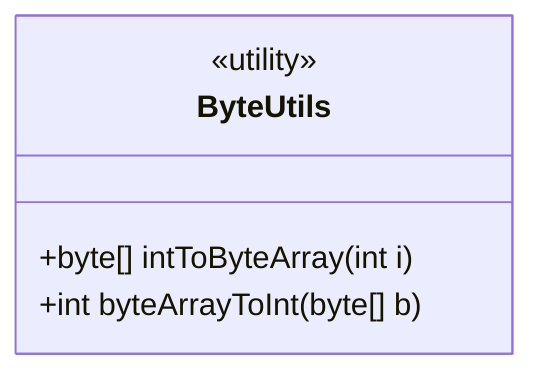
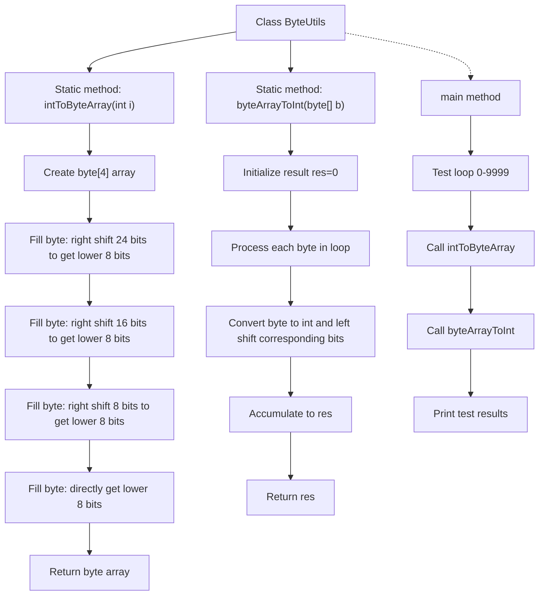

# Basic Information

|      |      |
|------|------|
| Name | ByteUtils |
| Language | .java |
| Code Path | WeFe/fusion/fusion-service/src/main/java/com/welab/wefe/data/fusion/service/utils/ByteUtils.java |
| Package Name | com.welab.wefe.data.fusion.service.utils |
| Dependencies | [] |
| Brief Description | The ByteUtils class provides methods for converting between int and byte arrays. intToByteArray converts an integer to a 4-byte array, while byteArrayToInt converts the byte array back to an integer. The correctness of the conversion is verified through the main method. |

# Description

The ByteUtils class provides two static methods for converting between integers and byte arrays. The intToByteArray method converts a 32-bit integer into a 4-byte array, storing it in big-endian order through bit shifting and masking operations. The byteArrayToInt method restores the byte array back to an integer, also following big-endian reading. The main method tests the correctness of conversions within the range of 0-9999, verifying the accuracy of bidirectional conversion.

# Class Summary

| Name   | Type  | Description |
|-------|------|-------------|
| ByteUtils | class | The ByteUtils class provides functionality for converting between int and byte arrays, including the intToByteArray and byteArrayToInt methods, and tests the conversion correctness via the main method. |

## Class ByteUtils

|      |      |
|------|------|
| Access Modifier | public |
| Type | class |
| Name | ByteUtils |
| Description | The ByteUtils class provides functionality for converting between int and byte arrays, including the intToByteArray and byteArrayToInt methods, and tests the conversion correctness via the main method. |

### UML Class Diagram

This code demonstrates a `ByteUtils` utility class containing two core static methods: `intToByteArray` converts an integer to a 4-byte array (big-endian), while `byteArrayToInt` restores the byte array back to an integer. The class diagram is marked with <<utility>> to indicate its utility class nature, where all methods are public static. The main method verifies the mutual invertibility of both conversions through loop testing, ensuring no precision loss during data transformation. Such byte-level operations are commonly used in scenarios requiring precise binary data control, such as network protocols and file formats.

### Internal Method Call Graph

This code implements bidirectional conversion between integers and byte arrays. The flowchart illustrates the complete structure of the ByteUtils class, featuring two core static methods: intToByteArray decomposes a 32-bit integer into a 4-byte array through right-shift and bitmask operations, while byteArrayToInt reconstructs the integer from byte array using left-shift and accumulation. The main method contains test logic that verifies conversion accuracy through 10,000 loop iterations, ensuring bidirectional conversion correctness. The entire process follows big-endian byte ordering, with each conversion step strictly adhering to bitwise operation rules.

### Field List

| Name  | Type  | Description |
|-------|-------|------|

### Method List

| Name  | Type  | Description |
|-------|-------|------|
| byteArrayToInt | int | Convert a byte array to an integer by concatenating each byte through bitwise operations, with the high-order byte first. |
| intToByteArray | byte[] | Convert an integer to a 4-byte array, stored in big-endian order, with each byte obtained through bit shifting and masking operations. |
| main | void | Java main method tests the conversion functionality between integers 0 to 9999 and byte arrays in a loop, and prints the conversion results. |

