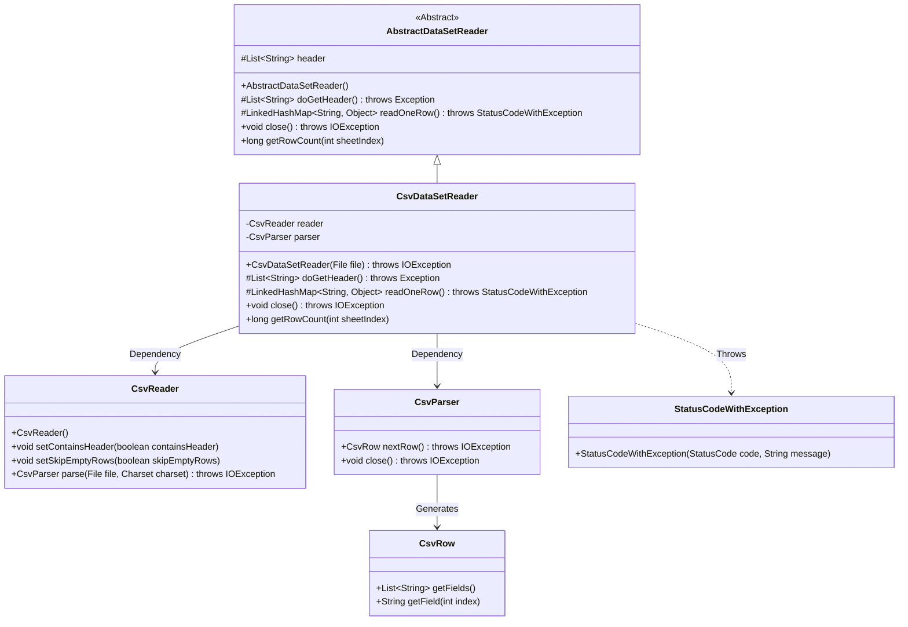
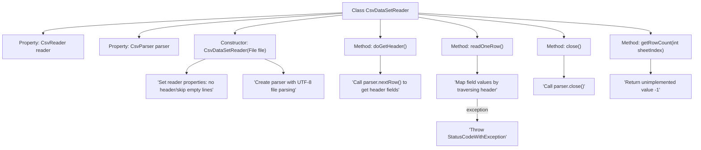

# Basic Information

|      |      |
|------|------|
| Name | CsvDataSetReader |
| Language | .java |
| Code Path | WeFe/fusion/fusion-service/src/main/java/com/welab/wefe/data/fusion/service/utils/CsvDataSetReader.java |
| Package Name | com.welab.wefe.data.fusion.service.utils |
| Dependencies | ['com.welab.wefe.common.StatusCode', 'com.welab.wefe.common.exception.StatusCodeWithException', 'de.siegmar.fastcsv.reader.CsvParser', 'de.siegmar.fastcsv.reader.CsvReader', 'de.siegmar.fastcsv.reader.CsvRow', 'java.io.File', 'java.io.IOException', 'java.nio.charset.StandardCharsets', 'java.util.LinkedHashMap', 'java.util.List'] |
| Brief Description | The CsvDataSetReader class inherits from AbstractDataSetReader and is used to read CSV files. The constructor initializes CsvReader and CsvParser, configuring them to skip headers and empty lines. doGetHeader retrieves the header, readOneRow reads a single row of data and converts it into a LinkedHashMap, while close terminates the parser. getRowCount is deprecated. |

# Description

The CsvDataSetReader class inherits from AbstractDataSetReader and is used to read data from CSV files. The constructor accepts a file object and initializes CsvReader and CsvParser, configuring them to exclude headers and skip empty lines. The doGetHeader method retrieves the first row of the CSV as the header. The readOneRow method reads data line by line, mapping each row's content to key-value pairs corresponding to the header, throwing an exception if reading fails. The close method shuts down the parser. The getRowCount method is marked as deprecated and does not implement specific functionality.

# Class Summary

| Name   | Type  | Description |
|-------|------|-------------|
| CsvDataSetReader | class | The CsvDataSetReader class inherits from AbstractDataSetReader and is used to read CSV files. The constructor initializes the parser, doGetHeader retrieves the header, readOneRow reads data row by row and maps it into key-value pairs, and close terminates the parser. |

## Class CsvDataSetReader

|      |      |
|------|------|
| Access Modifier | public |
| Type | class |
| Name | CsvDataSetReader |
| Description | The CsvDataSetReader class inherits from AbstractDataSetReader and is used to read CSV files. The constructor initializes the parser, doGetHeader retrieves the header, readOneRow reads data row by row and maps it into key-value pairs, and close terminates the parser. |

### UML Class Diagram

This class diagram illustrates the inheritance structure and component relationships of a CSV dataset reader. CsvDataSetReader inherits from the abstract class AbstractDataSetReader and utilizes CsvReader and CsvParser through composition to parse CSV files. Core functionalities include reading headers (doGetHeader), row-by-row data retrieval (readOneRow), and resource cleanup (close). Exception handling is implemented via StatusCodeWithException, while CsvRow objects generated during parsing are used to access field data. The overall design follows the Template Method pattern, delegating concrete implementations to subclasses.

### Internal Method Call Graph

This flowchart illustrates the complete processing workflow of the CsvDataSetReader class, from initialization configuration and file parsing to data reading and resource release. The class collaborates with CsvReader and CsvParser to handle CSV files, implementing core functionalities including header extraction and data row conversion, while managing IO exceptions and marking deprecated methods. The workflow highlights three critical phases: file parsing initialization, header extraction, and data row mapping, along with exception handling and resource release mechanisms.

### Field List

| Name  | Type  | Description |
|-------|-------|------|
| reader = new CsvReader() | CsvReader | Declare a private variable reader, initialized as an instance of the CsvReader class. |
| parser | CsvParser | Private member variable, an instance of the CsvParser type. |

### Method List

| Name  | Type  | Description |
|-------|-------|------|
| readOneRow | LinkedHashMap<String, Object> | This method reads a row of data from a CSV file and converts it into a LinkedHashMap, where the keys are the headers and the values are the corresponding fields. If the read operation fails, it throws an exception; if there is no data, it returns null. |
| doGetHeader | List<String> | Rewrite the doGetHeader method to parse the next line of the CSV and return a list of fields. |
| close | void | This method overrides close(), calls parser.close(), and may throw an IOException. |
| getRowCount | long | Deprecated method getRowCount, returns -1 indicating the functionality is not implemented. |

