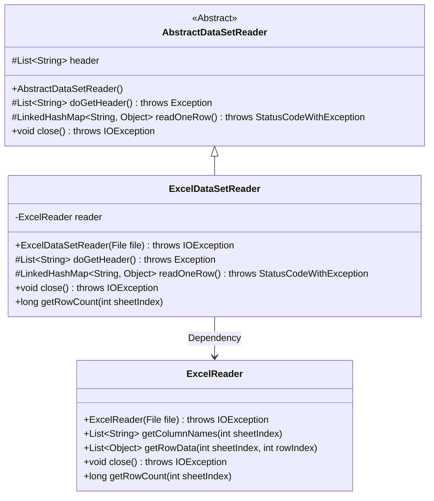
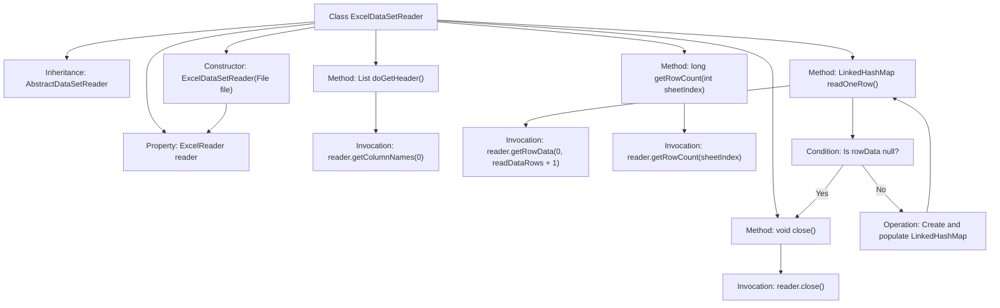

# Basic Information

|      |      |
|------|------|
| Name | ExcelDataSetReader |
| Language | .java |
| Code Path | WeFe/fusion/fusion-service/src/main/java/com/welab/wefe/data/fusion/service/utils/ExcelDataSetReader.java |
| Package Name | com.welab.wefe.data.fusion.service.utils |
| Dependencies | ['com.welab.wefe.common.exception.StatusCodeWithException', 'com.welab.wefe.common.io.excel.ExcelReader', 'java.io.File', 'java.io.IOException', 'java.util.LinkedHashMap', 'java.util.List'] |
| Brief Description | Excel dataset reading class, inherits from an abstract class, reads files via ExcelReader, provides functionalities for retrieving headers, reading data row by row, closing resources, and obtaining row counts. |

# Description

ExcelDataSetReader is a class that inherits from AbstractDataSetReader, designed for reading data from Excel files. It processes file input through an ExcelReader instance, providing functionalities such as retrieving headers, reading data row by row, and closing resources. The doGetHeader method extracts column names from the first row of the Excel sheet as headers, while the readOneRow method reads data from a specified row and returns it as a LinkedHashMap, with keys being header column names and values being corresponding cell data (empty values are treated as NULL). Additionally, it supports obtaining the row count of a specified worksheet and closing file resources.

# Class Summary

| Name   | Type  | Description |
|-------|------|-------------|
| ExcelDataSetReader | class | The ExcelDataSetReader class inherits from AbstractDataSetReader, reads file data through ExcelReader, and provides functionalities for retrieving headers, reading data row by row, and closing resources. |

## Class ExcelDataSetReader

|      |      |
|------|------|
| Access Modifier | public |
| Type | class |
| Name | ExcelDataSetReader |
| Description | The ExcelDataSetReader class inherits from AbstractDataSetReader, reads file data through ExcelReader, and provides functionalities for retrieving headers, reading data row by row, and closing resources. |

### UML Class Diagram

Class Diagram Description:
ExcelDataSetReader inherits from the abstract class AbstractDataSetReader and implements the functionality of reading Excel data. It contains a private member ExcelReader, through which operations such as retrieving column names, row data, and row counts are performed. AbstractDataSetReader defines abstract methods for obtaining headers and reading single-row data, which are implemented by ExcelDataSetReader, along with the added functionality of retrieving row counts. ExcelReader handles the underlying Excel file operations, including data reading and resource closure.

### Internal Method Call Graph

This code demonstrates an Excel dataset reader class that inherits from an abstract dataset reader. Core functionalities include: initializing an Excel reader through the constructor, retrieving header information, reading data row by row and converting it into key-value pair mappings, closing resources, and obtaining row counts. The flowchart clearly presents the class structure, method invocation relationships, and critical logic branches, particularly highlighting the null-check during data reading and the mapping construction process. All methods delegate specific operations to an internal ExcelReader object, reflecting sound separation of responsibilities.

### Field List

| Name  | Type  | Description |
|-------|-------|------|
| reader | ExcelReader | Private Excel reader instance. |

### Method List

| Name  | Type  | Description |
|-------|-------|------|
| close | void | Java method overriding, closing reader resources, may throw an IOException. |
| doGetHeader | List<String> | Java method override, returns the list of column names from the first row obtained by the reader. |
| readOneRow | LinkedHashMap<String, Object> | The method `readOneRow` reads a single row of data. If the row is empty, it returns `null`; otherwise, it maps the data to the table headers as key-value pairs and returns them, padding any missing fields with `null`. |
| getRowCount | long | Get the row count of the specified sheet by calling the getRowCount method of the reader. |

