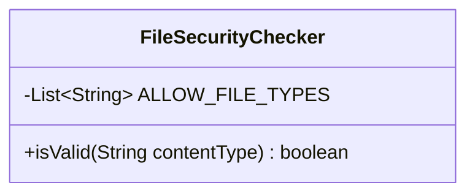
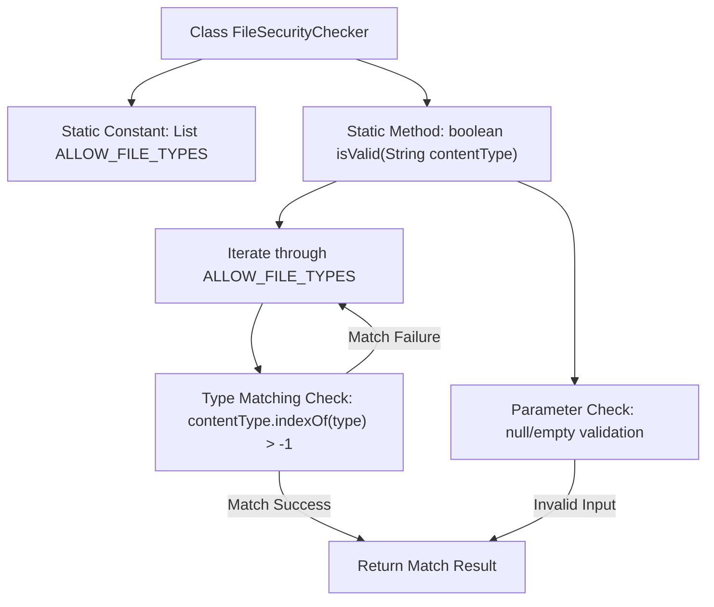

# Basic Information

|      |      |
|------|------|
| Name | FileSecurityChecker |
| Language | .java |
| Code Path | WeFe/fusion/fusion-service/src/main/java/com/welab/wefe/data/fusion/service/utils/FileSecurityChecker.java |
| Package Name | com.welab.wefe.data.fusion.service.utils |
| Dependencies | ['java.util.Arrays', 'java.util.List'] |
| Brief Description | The FileSecurityChecker class checks whether the file type is in the allowed list (xls, xlsx, csv) and validates the contentType parameter through the isValid method. |

# Description

The `FileSecurityChecker` class is used to verify the security of file types. It defines an allowed file type list `ALLOW_FILE_TYPES`, which includes three formats: `xls`, `xlsx`, and `csv`. This class provides a static method `isValid` that accepts a `contentType` parameter to check whether it is an allowed file type. The method first validates that the parameter is not null, then iterates through the allowed type list. If the `contentType` contains any of the allowed types, it returns `true`; otherwise, it returns `false`.

# Class Summary

| Name   | Type  | Description |
|-------|------|-------------|
| FileSecurityChecker | class | The FileSecurityChecker class checks whether the file type is in the allowed list (xls, xlsx, csv) and validates its effectiveness via contentType. |

## Class FileSecurityChecker

|      |      |
|------|------|
| Access Modifier | public |
| Type | class |
| Name | FileSecurityChecker |
| Description | The FileSecurityChecker class checks whether the file type is in the allowed list (xls, xlsx, csv) and validates its effectiveness via contentType. |

### UML Class Diagram

This code defines a file security check class `FileSecurityChecker`, which includes a private static constant `ALLOW_FILE_TYPES` for storing the list of allowed file types, and a public static method `isValid` for verifying whether the input contentType exists in the allowed list. The class ensures only Excel and CSV format files are processed by checking file type extensions, returning false for empty or invalid types.

### Internal Method Call Graph

Flowchart Description: This flowchart illustrates the structure and workflow of the FileSecurityChecker class. It first checks if the input parameter contentType is null or empty, returning false immediately if invalid. For valid inputs, it iterates through the predefined ALLOW_FILE_TYPES list, using indexOf to check type matching. A match returns true immediately, while exhausting all types without a match returns false. The entire process implements a secure file type validation mechanism.

### Field List

| Name  | Type  | Description |
|-------|-------|------|
| ALLOW_FILE_TYPES = Arrays.asList(            "xls", "xlsx", "csv"    ) | List<String> | The allowed file types are xls, xlsx, and csv. |

### Method List

| Name  | Type  | Description |
|-------|-------|------|
| isValid | boolean | Check if contentType is valid: returns true if it is not empty and exists in ALLOW_FILE_TYPES, otherwise false. |

