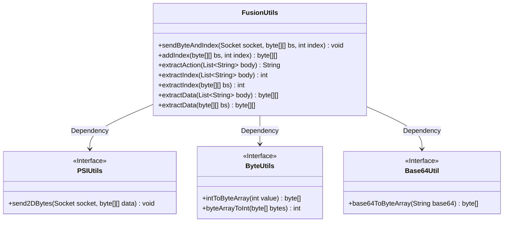
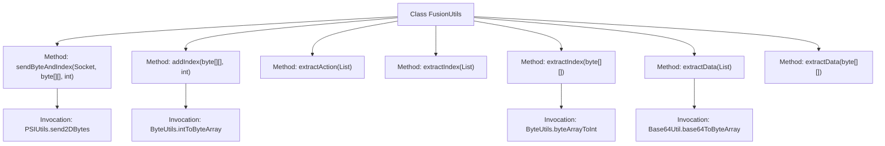

# Basic Information

|      |      |
|------|------|
| Name | FusionUtils |
| Language | .java |
| Code Path | WeFe/fusion/fusion-service/src/main/java/com/welab/wefe/data/fusion/service/utils/FusionUtils.java |
| Package Name | com.welab.wefe.data.fusion.service.utils |
| Dependencies | ['com.welab.wefe.common.util.Base64Util', 'com.welab.wefe.fusion.core.utils.PSIUtils', 'java.net.Socket', 'java.util.List'] |
| Brief Description | The FusionUtils class provides data processing utilities: sending indexed byte arrays, adding/extracting indices, extracting actions, and performing data conversion functions. |

# Description

The `FusionUtils` class provides a series of static methods for data processing and index operations. Its main functionalities include: sending byte array data with an index via the `sendByteAndIndex` method; appending an index to the end of a byte array using the `addIndex` method; extracting and removing the first element from a string list as an action with the `extractAction` method; extracting an index from either a string list or a byte array with the `extractIndex` method; and extracting data from a Base64 string list or byte array while handling data decryption with the `extractData` method. All methods revolve around core operations such as adding, extracting, and sending byte arrays and indices.

# Class Summary

| Name   | Type  | Description |
|-------|------|-------------|
| FusionUtils | class | The `FusionUtils` class provides data manipulation functions: sending indexed byte arrays, adding/extracting indices, extracting actions, and data conversion. |

## Class FusionUtils

|      |      |
|------|------|
| Access Modifier | public |
| Type | class |
| Name | FusionUtils |
| Description | The `FusionUtils` class provides data manipulation functions: sending indexed byte arrays, adding/extracting indices, extracting actions, and data conversion. |

### UML Class Diagram

This code demonstrates a utility class named FusionUtils, primarily designed for handling byte array and index operations. It provides functionalities such as adding/extracting indexes, sending indexed data over networks, and extracting data from lists or byte arrays. The class depends on three interfaces: PSIUtils for network transmission, ByteUtils for byte conversion, and Base64Util for Base64 decoding. All methods are static, reflecting the design characteristics of utility classes, mainly serving data processing and conversion scenarios, particularly for index management requirements in network transmission contexts.

### Internal Method Call Graph

This flowchart illustrates the core method invocation relationships of the FusionUtils utility class. The class primarily handles mixed operations involving byte arrays and indices, including sending indexed data (addIndex), extracting actions (extractAction), indices (extractIndex), and raw data (extractData) from different data types. Key dependencies include PSIUtils' byte-sending functionality, ByteUtils' type conversion, and Base64Util's encoding/decoding capabilities. All methods are static utility methods, forming independent functional units.

### Field List

| Name  | Type  | Description |
|-------|-------|------|

### Method List

| Name  | Type  | Description |
|-------|-------|------|
| addIndex | byte[][] | The method `addIndex` appends a byte array converted from the integer `index` to the end of the two-dimensional byte array `bs`, returning the new array. The original array remains unchanged, and its length increases by 1. |
| sendByteAndIndex | void | The method sendByteAndIndex sends a two-dimensional byte array with an index via a socket, implemented by calling PSIUtils.send2DBytes. |
| extractIndex | int | Extract the first element from a string list, convert it to an integer, remove that element, and return the integer value. |
| extractIndex | int | The static method `extractIndex` extracts the last element from the two-dimensional byte array `bs` and returns it converted to an integer. |
| extractAction | String | Extract and remove the first element from the string list as the return value. |
| extractData | byte[][] | The static method `extractData` accepts a list of strings, Base64 decodes each element into a byte array, and returns a two-dimensional byte array. |
| extractData | byte[][] | The method `extractData` takes a two-dimensional byte array `bs` and returns a new array `ret` containing all rows of `bs` except the last one. |

