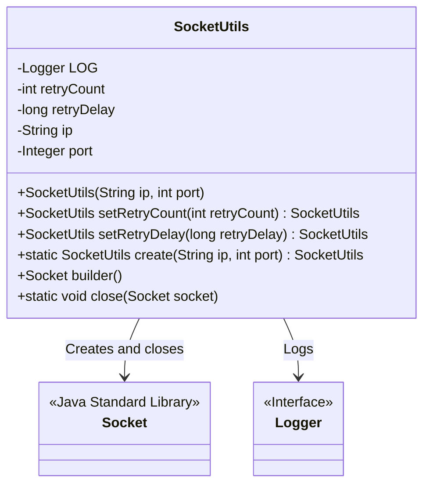
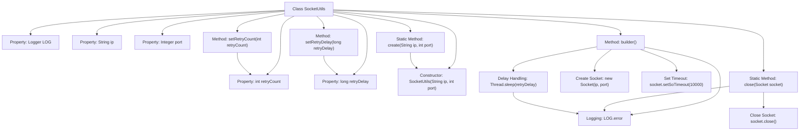

# Basic Information

|      |      |
|------|------|
| Name | SocketUtils |
| Language | .java |
| Code Path | WeFe/fusion/fusion-service/src/main/java/com/welab/wefe/data/fusion/service/utils/SocketUtils.java |
| Package Name | com.welab.wefe.data.fusion.service.utils |
| Dependencies | ['org.slf4j.Logger', 'org.slf4j.LoggerFactory', 'java.io.IOException', 'java.net.InetAddress', 'java.net.Socket'] |
| Brief Description | The SocketUtils class is used for creating and managing socket connections, supporting the configuration of retry attempts and intervals, and providing methods for creating, building, and closing sockets. |

# Description

SocketUtils is a utility class designed for creating and managing Socket connections. It supports setting IP addresses and port numbers, and allows configuration of retry attempts and retry intervals. The default retry count is 1, and the default retry interval is 0 milliseconds. When creating a Socket, a 10-second timeout is set, and retries are performed upon failure according to the configured settings. It also provides static methods for safely closing Socket connections. All operations include error handling and logging.

# Class Summary

| Name   | Type  | Description |
|-------|------|-------------|
| SocketUtils | class | The SocketUtils class is used to create and manage Socket connections, supporting the configuration of retry attempts and intervals. By default, it retries once with no delay, and provides methods for creating, building, and closing Sockets. |

## Class SocketUtils

|      |      |
|------|------|
| Access Modifier | public |
| Type | class |
| Name | SocketUtils |
| Description | The SocketUtils class is used to create and manage Socket connections, supporting the configuration of retry attempts and intervals. By default, it retries once with no delay, and provides methods for creating, building, and closing Sockets. |

### UML Class Diagram

Class diagram description: The SocketUtils class encapsulates the creation, retry, and closing of Socket connections, containing private attributes such as IP address, port number, retry count, and delay. It creates Socket connections through the builder() method with retry mechanism support and uses the static close() method to terminate connections. This class relies on the Java Standard Library's Socket class and Logger interface for network operations and logging.

### Internal Method Call Graph

This flowchart illustrates the complete structure and workflow of the SocketUtils class. The class contains 5 private properties and 6 main methods, with the builder() method being the core functionality that implements a Socket creation process with retry mechanism. The retryCount and retryDelay parameters control the number of retries and intervals. Each attempt creates a new Socket with a 10-second timeout. Regardless of success or failure, the finally block executes delay handling before returning either the established Socket or null. The static close() method provides safe Socket termination. All exceptions are logged via Logger. The design adopts a chained invocation pattern supporting method cascading.

### Field List

| Name  | Type  | Description |
|-------|-------|------|
| retryDelay = 0 | long | The private long integer variable retryDelay has an initial value of 0. |
| LOG = LoggerFactory.getLogger(SocketUtils.class) | Logger | The class SocketUtils defines a private static immutable log object LOG for recording log information. |
| port | Integer | Declare a private integer variable port. |
| ip | String | Declare a private string variable ip to store the IP address. |
| retryCount = 1 | int | Define an integer variable retryCount with an initial value of 1, used to record the number of retries. |

### Method List

| Name  | Type  | Description |
|-------|-------|------|
| create | SocketUtils | Create a SocketUtils instance using static methods, passing in the IP and port parameters. |
| setRetryCount | SocketUtils | The method to set the number of retries, with the parameter as retryCount, returns the current object to support chained calls. |
| setRetryDelay | SocketUtils | Set the retry delay time and return the current object instance. |
| builder | Socket | Create a Socket connection with retry and delay support, set the timeout to 10 seconds, and log error messages upon failure. |
| close | void | The static method `close` is used to safely close a Socket. If it is not null, it performs the close operation and catches IOException, logging an error if one occurs. |

