# Basic Information

|      |      |
|------|------|
| Name | utils |
| Language | .java |
| Code Path | WeFe/fusion/fusion-service/src/main/java/com/welab/wefe/data/fusion/service/utils |
| Package Name | docs.fusion.fusion-service.src.main.java.com.welab.wefe.data.fusion.service.utils |
| Brief Description | Bloom filter enables high-performance data deduplication. The primary key generation module supports multiple hash algorithms. The data parsing tool processes CSV/Excel/DB data sources. The deduplication module offers both Bloom filter and in-memory set strategies. The file type checker restricts formats to xls/xlsx/csv. The Socket tool manages connection retries. The byte utility class implements conversions between integers and byte arrays. |

# Description

## Overview  
The core responsibility of this module is to provide a comprehensive toolkit for data fusion processing, covering functionalities such as high-performance Bloom filters, primary key generation, dataset parsing, and security validation. Interface specifications include serialized read/write operations for Bloom filters (writeTo/readFrom), hash algorithm processing for primary key generation (MD5/SHA1), and abstract methods for dataset reading (doGetHeader/readOneRow). Key data structures include bit arrays (BitArray), field metadata (FieldInfo), and dataset models (DataSetPreviewOutputModel). External dependencies involve Java standard I/O, serialization libraries, and hash algorithm implementations. For example, BloomFilterUtils enables file persistence, PrimaryKeyUtils supports four primary key generation methods, and DataResourceHelper provides automatic parsing for CSV/Excel files.  

## Key Business Scenarios  
The module supports three major applications: 1) Data deduplication scenarios, achieving efficient duplicate detection through Bloom filters (similar to cache penetration protection) or in-memory HashSets; 2) Primary key generation for data fusion, resembling field concatenation and hash conversion in ETL workflows; 3) Heterogeneous data source processing, including CSV/Excel file parsing and database queries. The complete workflow is: initialize tools → load/parse data → apply deduplication or primary key generation → output processed results. For instance, DataSetBloomUniqueFilter handles deduplication for billion-scale datasets, ExcelDataSetReader enables multi-sheet reading, and SocketUtils manages Socket connections with retry mechanisms. Integration cases demonstrate component collaboration in distributed environments, such as byte array index operations and data decryption implemented by FusionUtils.

### Package Internal Structure View

```mermaid
graph TD
    utils --> bf
    utils --> primarykey
    utils --> dataresouce
    utils --> unique
    utils --> ByteUtils.java
    utils --> AbstractDataSetReader.java
    utils --> CsvDataSetReader.java
    utils --> ExcelDataSetReader.java
    utils --> FileSecurityChecker.java
    utils --> SocketUtils.java
    utils --> FusionUtils.java
    bf --> BloomFilterUtils.java
    bf --> BloomFilters.java
    bf --> BitArray.java
    primarykey --> PrimaryKeyUtils.java
    primarykey --> FieldInfo.java
    dataresouce --> DataResouceHelper.java
    unique --> DataSetBloomUniqueFilter.java
    unique --> AbstractDataSetUniqueFilter.java
    unique --> ContainResult.java
    unique --> DataSetMemoryUniqueFilter.java
```

This flowchart illustrates the hierarchical structure of the utils utility classes in the WeFe data fusion service. The top level is the utils directory, which is divided into four subdirectories: bf, primarykey, dataresouce, and unique. Each subdirectory contains corresponding utility class files. Additionally, the utils directory directly includes multiple standalone utility class files, such as ByteUtils.java, FusionUtils.java, etc. The entire structure clearly demonstrates the categorized organization of the utility classes.

# File List

| Name   | Type  | Description |
|-------|------|-------------|
| [ByteUtils.java](ByteUtils.md) | file | The ByteUtils class provides methods for converting between int and byte arrays. intToByteArray converts an integer to a 4-byte array, while byteArrayToInt converts the byte array back to an integer. The correctness of the conversion is verified through the main method. |
| [AbstractDataSetReader.java](AbstractDataSetReader.md) | file | AbstractDataSetReader is an abstract class that implements the Closeable interface, providing functionality for reading datasets. It includes methods such as retrieving headers, reading data rows, and counting rows, supporting field filtering based on conditions and limiting reading time or row count. |
| [CsvDataSetReader.java](CsvDataSetReader.md) | file | The CsvDataSetReader class inherits from AbstractDataSetReader and is used to read CSV files. The constructor initializes CsvReader and CsvParser, configuring them to skip headers and empty lines. doGetHeader retrieves the header, readOneRow reads a single row of data and converts it into a LinkedHashMap, while close terminates the parser. getRowCount is deprecated. |
| [ExcelDataSetReader.java](ExcelDataSetReader.md) | file | Excel dataset reading class, inherits from an abstract class, reads files via ExcelReader, provides functionalities for retrieving headers, reading data row by row, closing resources, and obtaining row counts. |
| [FileSecurityChecker.java](FileSecurityChecker.md) | file | The FileSecurityChecker class checks whether the file type is in the allowed list (xls, xlsx, csv) and validates the contentType parameter through the isValid method. |
| [SocketUtils.java](SocketUtils.md) | file | The SocketUtils class is used to create and manage Socket connections, supporting the configuration of retry attempts and intervals, and providing methods for creating, building, and closing Sockets. |
| [FusionUtils.java](FusionUtils.md) | file | The FusionUtils class provides data processing utilities: sending byte arrays with indices, adding/extracting indices, extracting actions, and data conversion functions. |
| [primarykey](primarykey/_module.md) | package | The `PrimaryKeyUtils` class provides primary key generation functionality, supporting four processing methods. The `FieldInfo` class manages field information, including attributes such as column names, options, and indexes. The two work together to process data and generate primary keys. |
| [unique](unique/_module.md) | package | The DataSetBloomUniqueFilter implements data deduplication based on a Bloom filter, with a default capacity of 100 million, support for UTF-8, and an error rate of 0.01. The AbstractDataSetUniqueFilter is an abstract base class that defines the contains method. The ContainResult enumeration includes three states: In, NotIn, and MaybeIn. The DataSetMemoryUniqueFilter implements in-memory deduplication based on HashSet. |
| [dataresouce](dataresouce/_module.md) | package | The DataResouceHelper class provides methods for reading file and database data, supports CSV/Excel formats, infers data types, and generates preview output models. |
| [bf](bf/_module.md) | package | The BloomFilterUtils class provides read and write methods for Bloom filter files, supporting serialization and deserialization. The BloomFilters class implements the core functionality of Bloom filters, including bit arrays and hash calculations. The BitArray class encapsulates bit array operations, supporting initialization, copying, and merging. |

