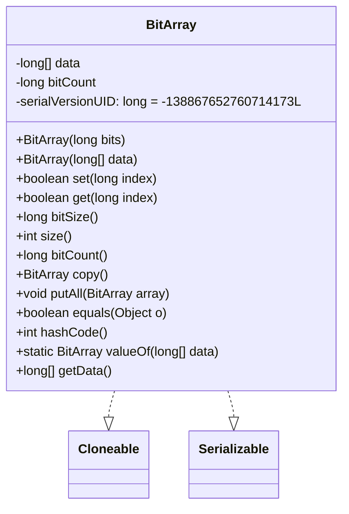

# Basic Information

|      |      |
|------|------|
| Name | BitArray |
| Language | .java |
| Code Path | WeFe/fusion/fusion-service/src/main/java/com/welab/wefe/data/fusion/service/utils/bf/BitArray.java |
| Package Name | com.welab.wefe.data.fusion.service.utils.bf |
| Dependencies | ['java.math.RoundingMode', 'java.util.Arrays', 'javax.annotation.Nullable', 'com.google.common.base.Preconditions', 'com.google.common.math.LongMath', 'com.google.common.primitives.Ints'] |
| Brief Description | The BitArray class implements bit array functionality, supporting operations such as setting, getting, copying, and merging. It uses a long array to store data and includes methods for bit counting and size querying. |

# Description

The `BitArray` class is a bit array data structure that implements the `Cloneable` and `Serializable` interfaces, using a `long` array to store bit data. Its constructors support initialization by specifying the number of bits or directly passing a `long` array, automatically calculating the number of set bits. It provides methods to set and retrieve bit states, supports bit array copying and merging operations, and includes methods to calculate bit size, array length, and the count of set bits. The `equals` and `hashCode` methods are overridden for comparing bit array contents. It also contains a static factory method `valueOf` for creating instances from `long` arrays, automatically trimming trailing zero values.

# Class Summary

| Name   | Type  | Description |
|-------|------|-------------|
| BitArray | class | The BitArray class implements bit array functionality, supporting operations such as setting, getting, copying, and merging. It uses a long array to store data, includes bit counting and size calculation, and overrides the equals and hashCode methods. |

## Class BitArray

|      |      |
|------|------|
| Access Modifier | public |
| Type | class |
| Name | BitArray |
| Description | The BitArray class implements bit array functionality, supporting operations such as setting, getting, copying, and merging. It uses a long array to store data, includes bit counting and size calculation, and overrides the equals and hashCode methods. |

### UML Class Diagram

Class diagram description: The BitArray class implements Cloneable and Serializable interfaces for efficient bit manipulation. Its core data structure is a long array 'data', where each element stores 64 bits. It provides operations like bit setting (set), retrieval (get), counting (bitCount), and supports functionalities such as copying (copy) and merging (putAll). The valueOf method creates optimized instances by trimming trailing zero values. equals and hashCode are implemented based on the data array. The toByteArray method mentioned in comments is preserved but unimplemented.

### Internal Method Call Graph

```mermaid
graph TD
    A["Class BitArray"]
    B["Field: long[] data"]
    C["Field: long bitCount"]
    D["Constructor: BitArray(long bits)"]
    E["Constructor: BitArray(long[] data)"]
    F["Method: boolean set(long index)"]
    G["Method: boolean get(long index)"]
    H["Method: long bitSize()"]
    I["Method: int size()"]
    J["Method: long bitCount()"]
    K["Method: BitArray copy()"]
    L["Method: void putAll(BitArray array)"]
    M["Method: boolean equals(Object o)"]
    N["Method: int hashCode()"]
    O["Static method: BitArray valueOf(long[] data)"]
    P["Method: long[] getData()"]

    A --> B
    A --> C
    A --> D
    A --> E
    A --> F
    A --> G
    A --> H
    A --> I
    A --> J
    A --> K
    A --> L
    A --> M
    A --> N
    A --> O
    A --> P
```

The flowchart depicts the complete structure of the BitArray class, including two constructors and 12 member methods. Core functionalities include bit manipulation (set/get), capacity calculation (bitSize/size), bit counting (bitCount), data copying (copy), array merging (putAll), and object comparison (equals/hashCode). The class implements bit storage via a long array where each long can store 64 bits. Constructors automatically calculate initial bit count, and the valueOf method optimizes by trimming trailing zero values.

### Field List

| Name  | Type  | Description |
|-------|-------|------|
| serialVersionUID = -138867652760714173L | long | Defined a private static final serial version UID with a value of -138867652760714173L to ensure class version compatibility. |
| data | long[] | Declare an immutable long integer array named data. |
| bitCount | long | The variable bitCount is used to store the count of long integer bits. |

### Method List

| Name  | Type  | Description |
|-------|-------|------|
| valueOf | BitArray | Static method converts a long integer array into a BitArray, skipping trailing zero-value elements, and only copies the non-zero portion to generate a new object. |
| size | int | This method returns the length of the current object's data array. |
| getData | long[] | The method returns a long integer array named data. |
| equals | boolean | This method checks whether the object is of type BitArray; if so, it compares whether the data arrays are identical, otherwise it returns false. |
| hashCode | int | This method returns the hash code of the object data, calculated based on the array contents. |
| bitCount | long | The method returns the value of bitCount. |
| set | boolean | Set the specified index bit to 1. If the original value is 0, update the data and return true; otherwise, return false. |
| putAll | void | Merge two BitArrays of equal length and update the bitCount to the total number of bits. |
| bitSize | long | The method returns a long integer value equal to the data length multiplied by 64, representing the total number of bits. |
| get | boolean | Check whether the corresponding bit of the long integer index is 1, and determine by retrieving the value from the data array through bitwise operations. |
| copy | BitArray | Create a new BitArray object whose data is a cloned copy of the current object's data. |

