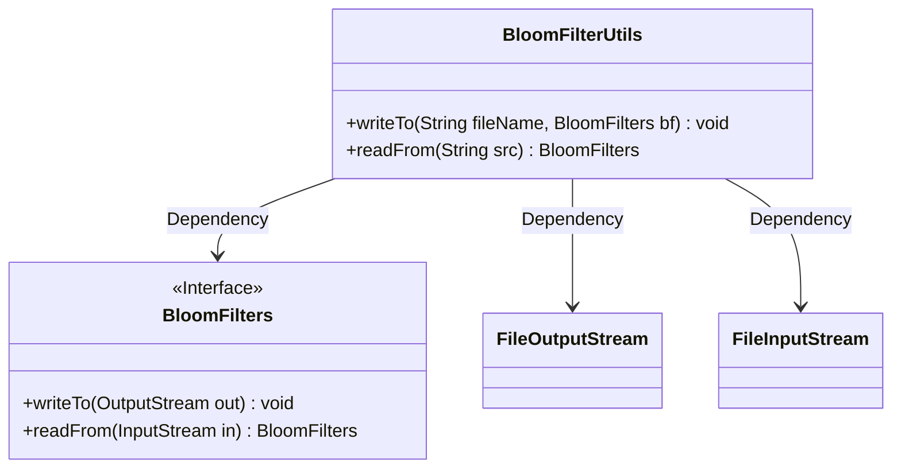
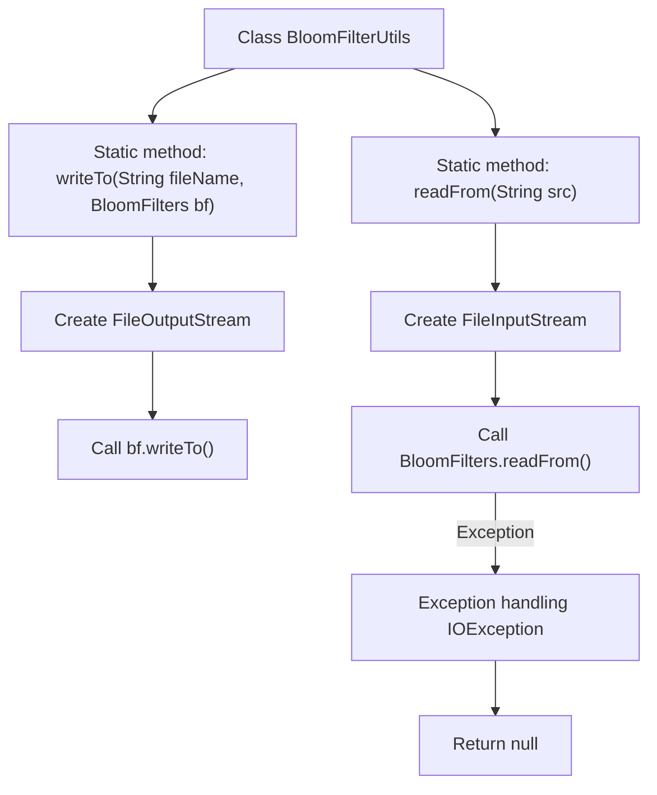

# Basic Information

|      |      |
|------|------|
| Name | BloomFilterUtils |
| Language | .java |
| Code Path | WeFe/fusion/fusion-service/src/main/java/com/welab/wefe/data/fusion/service/utils/bf/BloomFilterUtils.java |
| Package Name | com.welab.wefe.data.fusion.service.utils.bf |
| Dependencies | ['java.io.FileInputStream', 'java.io.FileOutputStream', 'java.io.IOException'] |
| Brief Description | The BloomFilterUtils class provides methods for writing to and reading from a Bloom filter, implemented through writeTo and readFrom for file operations respectively. |

# Description

The BloomFilterUtils class provides two static methods for file read/write operations of Bloom filters. The writeTo method serializes a Bloom filter object and writes it to a specified file using FileOutputStream, with the file opened in overwrite mode. The readFrom method reads data from a specified file and deserializes it into a Bloom filter object using FileInputStream. If an IO exception occurs, it prints the stack trace and returns null. Both methods handle basic IO operations, but the exception handling in readFrom is relatively simplistic.

# Class Summary

| Name   | Type  | Description |
|-------|------|-------------|
| BloomFilterUtils | class | The BloomFilterUtils class provides methods for reading and writing Bloom filters: writeTo writes the Bloom filter to a file, and readFrom reads the Bloom filter from a file. |

## Class BloomFilterUtils

|      |      |
|------|------|
| Access Modifier | public |
| Type | class |
| Name | BloomFilterUtils |
| Description | The BloomFilterUtils class provides methods for reading and writing Bloom filters: writeTo writes the Bloom filter to a file, and readFrom reads the Bloom filter from a file. |

### UML Class Diagram

This code demonstrates a utility class `BloomFilterUtils` that provides static methods for serializing Bloom filters (`BloomFilters`) to files and deserializing them from files. In the class diagram, `BloomFilters` is marked as an interface containing read/write methods. The utility class depends on the `BloomFilters` interface and Java IO classes (`FileOutputStream`/`FileInputStream`) to implement file operations, where write operations forcibly overwrite files and read operations return null on exceptions.

### Internal Method Call Graph

This flowchart illustrates the two core methods of the BloomFilterUtils utility class. The writeTo method accepts a filename and a Bloom filter object, writing the filter data to a file via a file output stream. The readFrom method reads data from a specified file and reconstructs the Bloom filter object, incorporating complete exception handling. Both methods involve file I/O operations, utilizing output and input streams for data persistence and recovery respectively. The readFrom method prints stack traces and returns null upon IO exceptions. The entire process clearly demonstrates the method call chains and exception handling paths of the class.

### Field List

| Name  | Type  | Description |
|-------|-------|------|

### Method List

| Name  | Type  | Description |
|-------|-------|------|
| writeTo | void | The static method `writeTo` writes the BloomFilters object to the specified file, overwriting existing content, and may throw an IOException. |
| readFrom | BloomFilters | Static method reads Bloom filter from file path, returns null on exception. |

