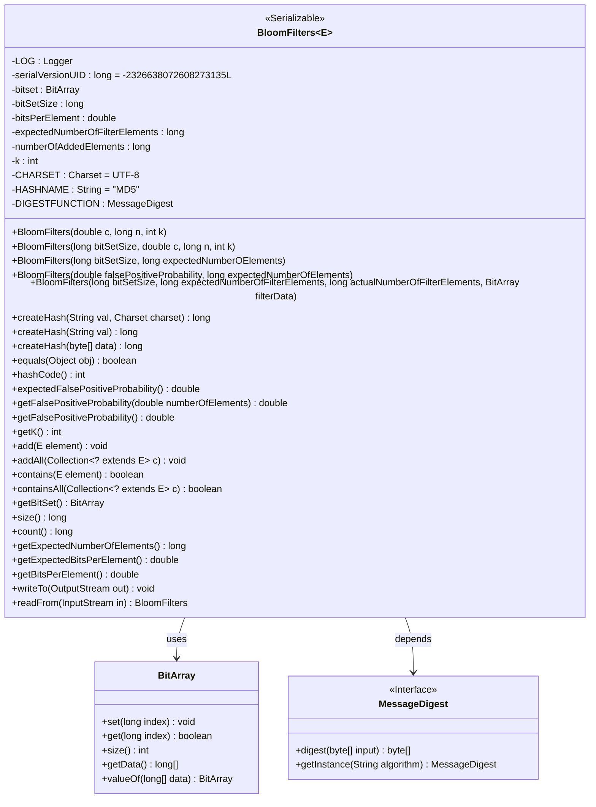

# Basic Information

|      |      |
|------|------|
| Name | BloomFilters |
| Language | .java |
| Code Path | WeFe/fusion/fusion-service/src/main/java/com/welab/wefe/data/fusion/service/utils/bf/BloomFilters.java |
| Package Name | com.welab.wefe.data.fusion.service.utils.bf |
| Dependencies | ['java.io.DataInputStream', 'java.io.DataOutputStream', 'java.io.IOException', 'java.io.InputStream', 'java.io.OutputStream', 'java.io.Serializable', 'java.nio.charset.Charset', 'java.security.MessageDigest', 'java.security.NoSuchAlgorithmException', 'java.util.Collection', 'org.slf4j.Logger', 'org.slf4j.LoggerFactory', 'com.google.common.base.Preconditions'] |
| Brief Description | The BloomFilters class implements a serializable Bloom filter, which includes a bit array, hash functions, element addition and query functionalities, and supports false positive rate calculation and serialization operations. |

# Description

This is a Java class implementing a Bloom Filter, designed for efficiently determining the existence of elements. The class includes core attributes such as a bit array, element count, and number of hash functions, supporting filter construction with different parameters. It provides functionalities like adding elements, checking existence, calculating false positive rates, and implements the serialization interface for storage and retrieval. The MD5 hash algorithm is used to generate digests, supporting batch operations and custom parameter configurations, making it suitable for large-scale data deduplication scenarios.

# Class Summary

| Name   | Type  | Description |
|-------|------|-------------|
| BloomFilters | class | The BloomFilters class implements a serializable Bloom filter, incorporating a bit array, hash functions, element addition and query functionalities, with support for calculating false positive rates and serialization operations. |

## Class BloomFilters

|      |      |
|------|------|
| Access Modifier | public |
| Type | class |
| Name | BloomFilters |
| Description | The BloomFilters class implements a serializable Bloom filter, incorporating a bit array, hash functions, element addition and query functionalities, with support for calculating false positive rates and serialization operations. |

### UML Class Diagram

Class Diagram Description: This diagram illustrates the structure of a generic BloomFilters class implementing the Serializable interface. It encapsulates core bit array operations, hash computations, and false-positive probability calculations. The class utilizes BitArray for bit manipulation and depends on MessageDigest for hash computation. Multiple constructors are provided to accommodate different scenarios, supporting element addition, querying, and serialization operations. Key attributes include bit set size, number of hash functions, and element count, with static methods enabling hash generation and deserialization functionality.

### Internal Method Call Graph

```mermaid
graph TD
    A["Class BloomFilters<E>"]
    B["Static Property: Logger LOG"]
    C["Static Property: long serialVersionUID"]
    D["Static Property: Charset CHARSET"]
    E["Static Property: String HASHNAME"]
    F["Static Property: MessageDigest DIGESTFUNCTION"]
    G["Static Initializer Block: Initialize DIGESTFUNCTION"]
    H["Instance Property: BitArray bitset"]
    I["Instance Property: long bitSetSize"]
    J["Instance Property: double bitsPerElement"]
    K["Instance Property: long expectedNumberOfFilterElements"]
    L["Instance Property: long numberOfAddedElements"]
    M["Instance Property: int k"]
    N["Constructor: BloomFilters(double c, long n, int k)"]
    O["Constructor: BloomFilters(long bitSetSize, double c, long n, int k)"]
    P["Constructor: BloomFilters(long bitSetSize, long expectedNumberOElements)"]
    Q["Constructor: BloomFilters(double falsePositiveProbability, long expectedNumberOfElements)"]
    R["Constructor: BloomFilters(long bitSetSize, long expectedNumberOfFilterElements, long actualNumberOfFilterElements, BitArray filterData)"]
    S["Static Method: long createHash(String val, Charset charset)"]
    T["Static Method: long createHash(String val)"]
    U["Static Method: long createHash(byte[] data)"]
    V["Instance Method: boolean equals(Object obj)"]
    W["Instance Method: int hashCode()"]
    X["Instance Method: double expectedFalsePositiveProbability()"]
    Y["Instance Method: double getFalsePositiveProbability(double numberOfElements)"]
    Z["Instance Method: double getFalsePositiveProbability()"]
    AA["Instance Method: int getK()"]
    AB["Instance Method: void add(E element)"]
    AC["Instance Method: void addAll(Collection<? extends E> c)"]
    AD["Instance Method: boolean contains(E element)"]
    AE["Instance Method: boolean containsAll(Collection<? extends E> c)"]
    AF["Instance Method: BitArray getBitSet()"]
    AG["Instance Method: long size()"]
    AH["Instance Method: long count()"]
    AI["Instance Method: long getExpectedNumberOfElements()"]
    AJ["Instance Method: double getExpectedBitsPerElement()"]
    AK["Instance Method: double getBitsPerElement()"]
    AL["Instance Method: void writeTo(OutputStream out)"]
    AM["Static Method: BloomFilters readFrom(InputStream in)"]

    A --> B
    A --> C
    A --> D
    A --> E
    A --> F
    A --> G
    A --> H
    A --> I
    A --> J
    A --> K
    A --> L
    A --> M
    A --> N
    A --> O
    A --> P
    A --> Q
    A --> R
    A --> S
    A --> T
    A --> U
    A --> V
    A --> W
    A --> X
    A --> Y
    A --> Z
    A --> AA
    A --> AB
    A --> AC
    A --> AD
    A --> AE
    A --> AF
    A --> AG
    A --> AH
    A --> AI
    A --> AJ
    A --> AK
    A --> AL
    A --> AM
```

This code implements a generic Bloom Filter data structure, primarily used for efficiently determining whether an element exists in a set. The class contains multiple constructors supporting filter initialization through different parameters (such as false positive probability and expected element count). It provides element addition (add/addAll) and query (contains/containsAll) functionalities, and implements serialization interfaces to support read/write operations. The core logic utilizes a bit array (BitArray) and multiple hash functions to achieve space-efficient probabilistic data storage, while including auxiliary methods such as false positive probability calculation and hash generation. The static initializer block ensures secure initialization of the hash algorithm instance.

### Field List

| Name  | Type  | Description |
|-------|-------|------|
| DIGESTFUNCTION | MessageDigest | Declare a static immutable MessageDigest object DIGESTFUNCTION. |
| expectedNumberOfFilterElements | long | Private long integer variable used to record the expected number of filter elements. |
| bitsPerElement | double | Private double-precision floating-point variable, representing the number of bits per element. |
| bitset | BitArray | The private bit array variable bitset. |
| k | int | Declare a private integer variable k. |
| HASHNAME = "MD5" | String | Define a static constant string HASHNAME with the value MD5. |
| CHARSET = Charset.forName("UTF-8") | Charset | Define the UTF-8 character set constant CHARSET. |
| serialVersionUID = -2326638072608273135L | long | private static final long serialVersionUID = -2326638072608273135L; |
| LOG = LoggerFactory.getLogger(BloomFilters.class) | Logger | The BloomFilters class defines a protected static constant LOG for logging purposes. |
| numberOfAddedElements | long | Private long integer variable, recording the number of newly added elements. |
| bitSetSize | long | The private long integer variable bitSetSize is used to store the size of the bit set. |

### Method List

| Name  | Type  | Description |
|-------|-------|------|
| size | long | This method returns the value of bitSetSize, indicating the size of the bit set. |
| createHash | long | The static method `createHash` takes a string parameter `val`, invokes the overloaded method `createHash`, and returns a long integer hash value, using the `CHARSET` character set by default. |
| getFalsePositiveProbability | double | The method returns the false positive probability based on the number of elements that have been added. |
| expectedFalsePositiveProbability | double | The method returns the expected false positive probability, calculated based on the preset number of filter elements. |
| equals | boolean | The equals method checks whether the object is null, whether the classes are the same, the expected number of elements, the number of hash functions, the size of the bit set, and whether the contents of the bit set are consistent. It returns true only if all these conditions match. |
| getBitSet | BitArray | The method returns a BitArray-type bitset object. |
| getK | int | The method returns the value of the integer variable k. |
| contains | boolean | Check if an element exists in the Bloom filter by verifying whether all corresponding bits in the bit set are set to 1 through k hash calculations. If all bits are 1, the element exists; otherwise, it does not. |
| containsAll | boolean | This method checks whether the current collection contains all elements of the specified collection. It iterates through the specified collection and returns false if any element is not found; otherwise, it returns true. |
| addAll | void | This method iterates through each element in the collection c and calls the add method one by one to add them to the current collection. |
| getFalsePositiveProbability | double | Calculate the false positive probability of a Bloom filter, given by the formula (1 - e^(-k * n / m))^k, where n is the number of elements, m is the size of the bit array, and k is the number of hash functions. |
| add | void | The method converts elements into strings, generates k hash values and maps them into a bit set, then increments the element count. |
| createHash | long | The static method `createHash` processes a byte array by synchronously invoking the digest function, generating and returning a 64-bit long integer hash value composed of the first 4 bytes. |
| count | long | This method returns the number of elements that have been added. |
| getExpectedNumberOfElements | long | Method returns the expected number of filter elements. |
| getExpectedBitsPerElement | double | The method returns the expected number of bits per element, with the value being bitsPerElement. |
| getBitsPerElement | double | This method calculates the average number of bits per element, resulting in a floating-point value of bitSetSize divided by numberOfAddedElements. |
| writeTo | void | This method writes data to the output stream, including the bitset size, expected number of elements, underlying array size, and array data, while logging operations before and after execution. |
| readFrom | BloomFilters | Reads Bloom filter data from the input stream, including the number of bits, the count of elements, and the underlying array, then constructs and returns the object. Throws an IO exception in case of errors. |
| hashCode | int | This method overrides hashCode, calculating the hash value based on the bitset, expected number of elements, bitset size, and k value, using 61 as the multiplier to ensure uniform distribution. |
| createHash | long | This method converts a string into a byte array by specifying a character set and calls an internal method to generate a hash value. |

