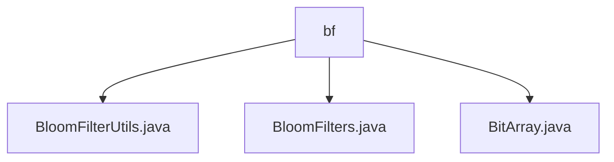

# Basic Information

|      |      |
|------|------|
| Name | bf |
| Language | .java |
| Code Path | WeFe/fusion/fusion-service/src/main/java/com/welab/wefe/data/fusion/service/utils/bf |
| Package Name | docs.fusion.fusion-service.src.main.java.com.welab.wefe.data.fusion.service.utils.bf |
| Brief Description | The BloomFilterUtils class provides read and write methods for Bloom filter files, supporting serialization and deserialization. The BloomFilters class implements the core functionality of Bloom filters, including bit arrays and hash calculations. The BitArray class encapsulates bit array operations, supporting initialization, copying, and merging. |

# Description

## Overview  
The core responsibility of this module is to implement a high-performance Bloom filter and its supporting tools, enabling element existence checks and large-scale data deduplication. The interface specifications include serialized read/write operations (writeTo/readFrom), element operations (add/contains), and bit array management (set/get/merge). Key data structures consist of a bit array (BitArray), hash configuration, and false-positive rate calculation parameters. External dependencies are limited to Java standard IO and serialization libraries. For example, BloomFilterUtils provides file persistence functionality, while BitArray implements optimized low-level bit operations.  

## Primary Business Scenarios  
Typical applications include data preprocessing deduplication and rapid existence verification, similar to message filtering in an event bus pattern. The complete workflow is as follows: initialize the Bloom filter → batch-add elements → serialize and store → deserialize and load → query for judgment. For instance, the BloomFilters class supports MD5 hash batch processing, and BitArray optimizes storage efficiency through long arrays. Integration examples demonstrate the efficient combination of file IO and in-memory bit operations, suitable for maintaining data consistency in distributed environments.

### Package Internal Structure View

This flowchart illustrates the file structure relationship of BloomFilter utility classes in the WeFe project. The node "bf" serves as the parent directory, containing three Java utility files: BloomFilterUtils.java, BloomFilters.java, and BitArray.java. These files belong to the Bloom Filter toolkit within the data fusion service, designed to implement efficient bit array operations and Bloom Filter algorithms.

# File List

| Name   | Type  | Description |
|-------|------|-------------|
| [BloomFilterUtils.java](BloomFilterUtils.md) | file | The BloomFilterUtils class provides methods for writing to and reading from a Bloom filter, implemented via writeTo and readFrom for file operations respectively. |
| [BloomFilters.java](BloomFilters.md) | file | The BloomFilters class implements a serializable Bloom filter, incorporating a bit array, hash functions, element addition and query functionalities, with support for calculating false positive rates and serialization operations. |
| [BitArray.java](BitArray.md) | file | The BitArray class implements bit array functionality, supporting operations such as setting, getting, copying, and merging. It uses a long array to store data and includes methods for bit counting and size querying. |

