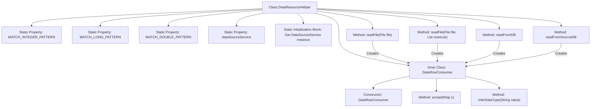

# Basic Information

|      |      |
|------|------|
| Name | DataResouceHelper |
| Language | .java |
| Code Path | WeFe/fusion/fusion-service/src/main/java/com/welab/wefe/data/fusion/service/utils/dataresouce/DataResouceHelper.java |
| Package Name | com.welab.wefe.data.fusion.service.utils.dataresouce |
| Dependencies | ['com.welab.wefe.common.StatusCode', 'com.welab.wefe.common.exception.StatusCodeWithException', 'com.welab.wefe.common.util.StringUtil', 'com.welab.wefe.common.web.Launcher', 'com.welab.wefe.common.wefe.enums.ColumnDataType', 'com.welab.wefe.data.fusion.service.database.entity.DataSetColumnOutputModel', 'com.welab.wefe.data.fusion.service.database.entity.DataSourceMySqlModel', 'com.welab.wefe.data.fusion.service.dto.entity.dataset.DataSetPreviewOutputModel', 'com.welab.wefe.data.fusion.service.manager.JdbcManager', 'com.welab.wefe.data.fusion.service.service.DataSourceService', 'com.welab.wefe.data.fusion.service.utils.AbstractDataSetReader', 'com.welab.wefe.data.fusion.service.utils.CsvDataSetReader', 'com.welab.wefe.data.fusion.service.utils.ExcelDataSetReader', 'java.io.File', 'java.io.IOException', 'java.sql.Connection', 'java.util.ArrayList', 'java.util.LinkedHashMap', 'java.util.List', 'java.util.Map', 'java.util.function.Consumer', 'java.util.regex.Pattern', 'java.util.stream.Collectors'] |
| Brief Description | The DataResouceHelper class provides methods for reading file and database data, supports CSV/Excel formats, infers data types, and generates preview output models. |

# Description

The DataResouceHelper class provides dataset file parsing and database query functionalities. It includes two main methods: readFile for parsing CSV or Excel files with automatic column data type inference, and readFromDB and readFromSourceDB for reading data from databases. The inner class DataRowConsumer processes data rows and infers integer, long, float, and string types through regular expressions. The class uses the singleton pattern to obtain a DataSourceService instance, supports file reading with row filtering and database queries, and outputs a DataSetPreviewOutputModel object containing metadata and raw data.

# Class Summary

| Name   | Type  | Description |
|-------|------|-------------|
| DataResouceHelper | class | The DataResouceHelper class provides dataset file parsing functionality, supporting CSV/Excel formats, inferring data types, and reading data from databases. It includes two readFile methods and two readFromDB methods for handling data preview and metadata generation. |

## Class DataResouceHelper

|      |      |
|------|------|
| Access Modifier | public |
| Type | class |
| Name | DataResouceHelper |
| Description | The DataResouceHelper class provides dataset file parsing functionality, supporting CSV/Excel formats, inferring data types, and reading data from databases. It includes two readFile methods and two readFromDB methods for handling data preview and metadata generation. |

### UML Class Diagram

```mermaid
classDiagram
    class DataResouceHelper {
        -Pattern MATCH_INTEGER_PATTERN
        -Pattern MATCH_LONG_PATTERN
        -Pattern MATCH_DOUBLE_PATTERN
        -static DataSourceService dataSourceService
        +static DataSetPreviewOutputModel readFile(File file) throws IOException, StatusCodeWithException
        +static DataSetPreviewOutputModel readFile(File file, List~String~ rowsList) throws IOException, StatusCodeWithException
        +static DataSetPreviewOutputModel readFromDB(String dataSourceId, String sql, List~String~ rowList) throws Exception
        +static DataSetPreviewOutputModel readFromSourceDB(String dataSourceId, String sql) throws Exception
    }

    class DataSetPreviewOutputModel {
        +List~String~ header
        +List~Map~String,Object~~ rawDataList
        +List~DataSetColumnOutputModel~ metadataList
        +setHeader(List~String~ header)
        +setMetadataList(List~DataSetColumnOutputModel~ metadataList)
    }

    class DataSetColumnOutputModel {
        +String name
        +ColumnDataType dataType
        +setName(String name)
        +setDataType(ColumnDataType dataType)
        +getDataType() ColumnDataType
    }

    class DataRowConsumer {
        -Map~String, DataSetColumnOutputModel~ metadata
        -DataSetPreviewOutputModel output
        -boolean allColumnKnowDataType
        +DataRowConsumer(Map~String, DataSetColumnOutputModel~ metadata, DataSetPreviewOutputModel output)
        +accept(Map~String, Object~ x)
        -inferDataType(String value) ColumnDataType
    }

    class AbstractDataSetReader {
        <<Interface>>
        +getHeader() List~String~
        +read(Consumer~Map~String,Object~~ consumer, int batchSize, int maxCount)
        +readWithSelectRow(Consumer~Map~String,Object~~ consumer, int batchSize, int maxCount, List~String~ rowsList)
        +close()
    }

    class CsvDataSetReader {
        +CsvDataSetReader(File file)
    }

    class ExcelDataSetReader {
        +ExcelDataSetReader(File file)
    }

    class DataSourceService {
        <<Interface>>
        +getDataSourceById(String dataSourceId) DataSourceMySqlModel
    }

    class DataSourceMySqlModel {
        +String databaseType
        +String host
        +int port
        +String userName
        +String password
        +String databaseName
    }

    class JdbcManager {
        +getConnection(String databaseType, String host, int port, String userName, String password, String databaseName) Connection
        +getRowHeaders(Connection conn, String sql) List~String~
        +readWithFieldRow(Connection conn, String sql, Consumer~Map~String,Object~~ consumer, int limit, List~String~ fields)
    }

    DataResouceHelper --> DataSetPreviewOutputModel : uses
    DataResouceHelper --> DataRowConsumer : creates
    DataResouceHelper --> AbstractDataSetReader : depends
    DataResouceHelper --> DataSourceService : depends
    DataResouceHelper --> JdbcManager : uses
    DataRowConsumer --> DataSetColumnOutputModel : operates
    DataRowConsumer --> DataSetPreviewOutputModel : updates
    AbstractDataSetReader <|-- CsvDataSetReader : implements
    AbstractDataSetReader <|-- ExcelDataSetReader : implements
    JdbcManager --> DataSourceMySqlModel : uses
    DataSourceService --> DataSourceMySqlModel : returns
```

Class diagram description: This diagram illustrates the core structure of the DataResourceHelper utility class, which retrieves data through file reading (CSV/Excel) and database queries. It utilizes the internal DataRowConsumer class to process data rows. Key components include the dataset preview model (DataSetPreviewOutputModel), column model (DataSetColumnOutputModel), data reader interface (AbstractDataSetReader) with its implementations, and the JdbcManager component for database interactions. The system employs regular expressions for data type inference and supports structured data acquisition from diverse data sources.

### Internal Method Call Graph

Flowchart Description: This flowchart illustrates the structure of the DataResourceHelper class, including static properties, initialization blocks, main file reading methods, and database reading methods, along with the implementation of the inner class DataRowConsumer. DataRowConsumer is responsible for processing data rows and inferring data types, determining numeric types through regular expression pattern matching. All reading methods create DataRowConsumer instances to process data, ultimately returning a DataSetPreviewOutputModel object containing metadata and preview data.

### Field List

| Name  | Type  | Description |
|-------|-------|------|
| MATCH_INTEGER_PATTERN = Pattern.compile("^-?\\d{1,9}$") | Pattern | Define a static constant regular expression to match optional negative integers with 1 to 9 digits. |
| MATCH_LONG_PATTERN = Pattern.compile("^-?\\d{10,}$") | Pattern | Define a static constant MATCH_LONG_PATTERN, using regex to match 10 or more digits (may include a negative sign). |
| MATCH_DOUBLE_PATTERN = Pattern.compile("^-?\\d+\\.\\d+$") | Pattern | Define a static constant MATCH_DOUBLE_PATTERN, using a regular expression to match floating-point numbers with optional negative signs. |
| dataSourceService | DataSourceService | Private static data source service instance. |

### Method List

| Name  | Type  | Description |
|-------|-------|------|
| readFile | DataSetPreviewOutputModel | Read file data and generate a preview output model, processing CSV or Excel formats, including column headers and data rows, and finally return the output result with metadata. |
| readFile | DataSetPreviewOutputModel | This method reads file data and generates a preview output model. Based on the file type, it selects either a CSV or Excel reader, processes the headers and data rows, and ultimately returns a preview model containing headers, metadata, and partial data. |
| readFromDB | DataSetPreviewOutputModel | Read data from the database, check if the data source exists, validate field uniqueness, and return a dataset preview model. |
| readFromSourceDB | DataSetPreviewOutputModel | The static method `readFromSourceDB` executes an SQL query from the specified data source, verifies data existence, SQL non-null status, and field uniqueness, then processes and returns a `DataSetPreviewOutputModel` object containing table headers and metadata. |

