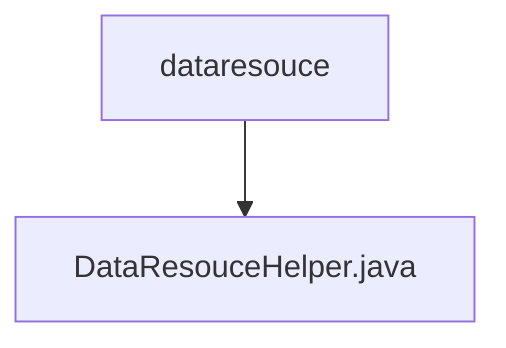

# Basic Information

|      |      |
|------|------|
| Name | dataresouce |
| Language | .java |
| Code Path | WeFe/fusion/fusion-service/src/main/java/com/welab/wefe/data/fusion/service/utils/dataresouce |
| Package Name | docs.fusion.fusion-service.src.main.java.com.welab.wefe.data.fusion.service.utils.dataresouce |
| Brief Description | The DataResouceHelper class provides methods for reading file and database data, supports CSV/Excel formats, infers data types, and generates preview output models. |

# Description

The DataResouceHelper class provides dataset file parsing and database query functionalities. It includes two main methods: readFile for parsing CSV or Excel files with automatic column data type inference, and readFromDB and readFromSourceDB for reading data from databases. The inner class DataRowConsumer processes data rows and infers integer, long, floating-point, and string types through regular expressions. The class employs the singleton pattern to obtain a DataSourceService instance, supporting file reading with row filtering and database queries, and outputs a DataSetPreviewOutputModel object containing metadata and raw data.

### Package Internal Structure View

This flowchart illustrates the hierarchical relationship between the dataresouce directory and its contained file DataResouceHelper.java. As the parent directory, dataresouce has DataResouceHelper.java as its sole child node file, demonstrating a simple single-layer directory structure. This type of structure is commonly used for organizing utility or helper class code.

# File List

| Name   | Type  | Description |
|-------|------|-------------|
| [DataResouceHelper.java](DataResouceHelper.md) | file | The DataResouceHelper class provides methods for reading file and database data, supports CSV/Excel formats, infers data types, and generates preview output models. |

