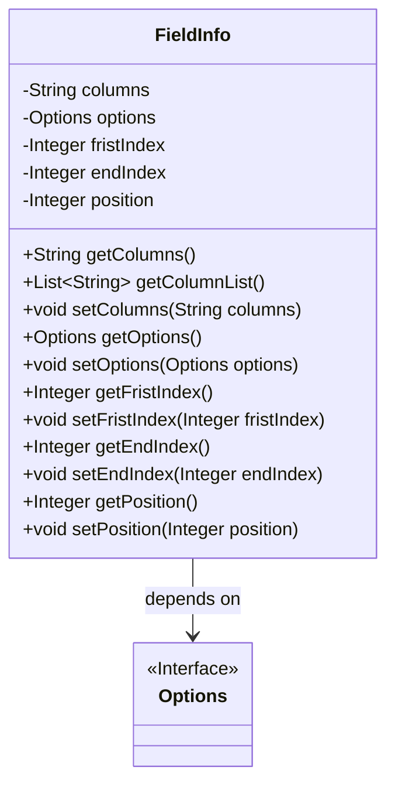

# Basic Information

|      |      |
|------|------|
| Name | FieldInfo |
| Language | .java |
| Code Path | WeFe/fusion/fusion-service/src/main/java/com/welab/wefe/data/fusion/service/utils/primarykey/FieldInfo.java |
| Package Name | com.welab.wefe.data.fusion.service.utils.primarykey |
| Dependencies | ['com.welab.wefe.data.fusion.service.enums.Options', 'java.util.Arrays', 'java.util.List'] |
| Brief Description | The FieldInfo class includes fields such as columns, options, firstIndex, endIndex, and position, providing getter and setter methods, and supports converting columns into a list. |

# Description

The FieldInfo class contains five private properties: columns string, options object, firstIndex integer, endIndex integer, and position integer. It provides getter and setter methods for each property, with the getColumnList method splitting the columns into a string list by commas. This class is used to manage field information, supporting the setting and retrieval of field columns, options, index positions, and other data.

# Class Summary

| Name   | Type  | Description |
|-------|------|-------------|
| FieldInfo | class | The FieldInfo class includes attributes such as columns, options, firstIndex, endIndex, and position, providing corresponding getter and setter methods, where columns can be converted to a list. |

## Class FieldInfo

|      |      |
|------|------|
| Access Modifier | public |
| Type | class |
| Name | FieldInfo |
| Description | The FieldInfo class includes attributes such as columns, options, firstIndex, endIndex, and position, providing corresponding getter and setter methods, where columns can be converted to a list. |

### UML Class Diagram

This code defines a FieldInfo class for storing field information, including column names, option configurations, index positions, and other attributes. The class provides standard getter/setter methods for private fields, with the getColumnList() method converting comma-separated column name strings into a list. FieldInfo depends on the Options interface, though the specific implementation of Options is not provided in the code. Note that "fristIndex" may contain a spelling error (likely intended as firstIndex). The overall design complies with JavaBean specifications and is suitable for use as a data carrier.

### Internal Method Call Graph

```mermaid
graph TD
    A["Class FieldInfo"]
    B["Property: String columns"]
    C["Property: Options options"]
    D["Property: Integer fristIndex"]
    E["Property: Integer endIndex"]
    F["Property: Integer position"]
    G["Method: String getColumns()"]
    H["Method: List<String> getColumnList()"]
    I["Method: void setColumns(String columns)"]
    J["Method: Options getOptions()"]
    K["Method: void setOptions(Options options)"]
    L["Method: Integer getFristIndex()"]
    M["Method: void setFristIndex(Integer fristIndex)"]
    N["Method: Integer getEndIndex()"]
    O["Method: void setEndIndex(Integer endIndex)"]
    P["Method: Integer getPosition()"]
    Q["Method: void setPosition(Integer position)"]

    A --> B
    A --> C
    A --> D
    A --> E
    A --> F
    A --> G
    A --> H
    A --> I
    A --> J
    A --> K
    A --> L
    A --> M
    A --> N
    A --> O
    A --> P
    A --> Q
```

This code defines a class named FieldInfo containing 5 private properties and their corresponding getter/setter methods. Key functionalities include: storing comma-separated column name strings (columns) with a method to split them into lists (getColumnList), managing configuration items of type Options (options), and recording index ranges (fristIndex/endIndex) along with positional information (position). All properties are encapsulated following standard JavaBean specifications to ensure data access security.

### Field List

| Name  | Type  | Description |
|-------|-------|------|
| fristIndex | Integer | Private integer variable used to store the first index. |
| options | Options | The private member variable `options`, of type `Options`. |
| position | Integer | private int variable position |
| endIndex | Integer | Private integer variable indicating the end index. |
| columns | String | Private string variable columns. |

### Method List

| Name  | Type  | Description |
|-------|-------|------|
| getFristIndex | Integer | The method `getFristIndex` returns the value of the integer variable `fristIndex`. |
| getColumnList | List<String> | This method splits the string by commas and returns it as a list. |
| setColumns | void | Methods for setting column fields, assigning the parameter `columns` to the `columns` property of the current object. |
| getOptions | Options | The method returns an options object. |
| getColumns | String | The method returns the value of the string variable columns. |
| getEndIndex | Integer | Get the integer value of the end index. |
| setEndIndex | void | The method to set the end index assigns the parameter endIndex to the class's member variable endIndex. |
| setFristIndex | void | Set the value of the integer type variable fristIndex. |
| setOptions | void | Setting option method, assigns the passed `options` parameter to the `options` property of the current object. |
| getPosition | Integer | The method returns the value of the integer variable position. |
| setPosition | void | Methods for setting the position attribute of an object, with the parameter being an integer position. |

