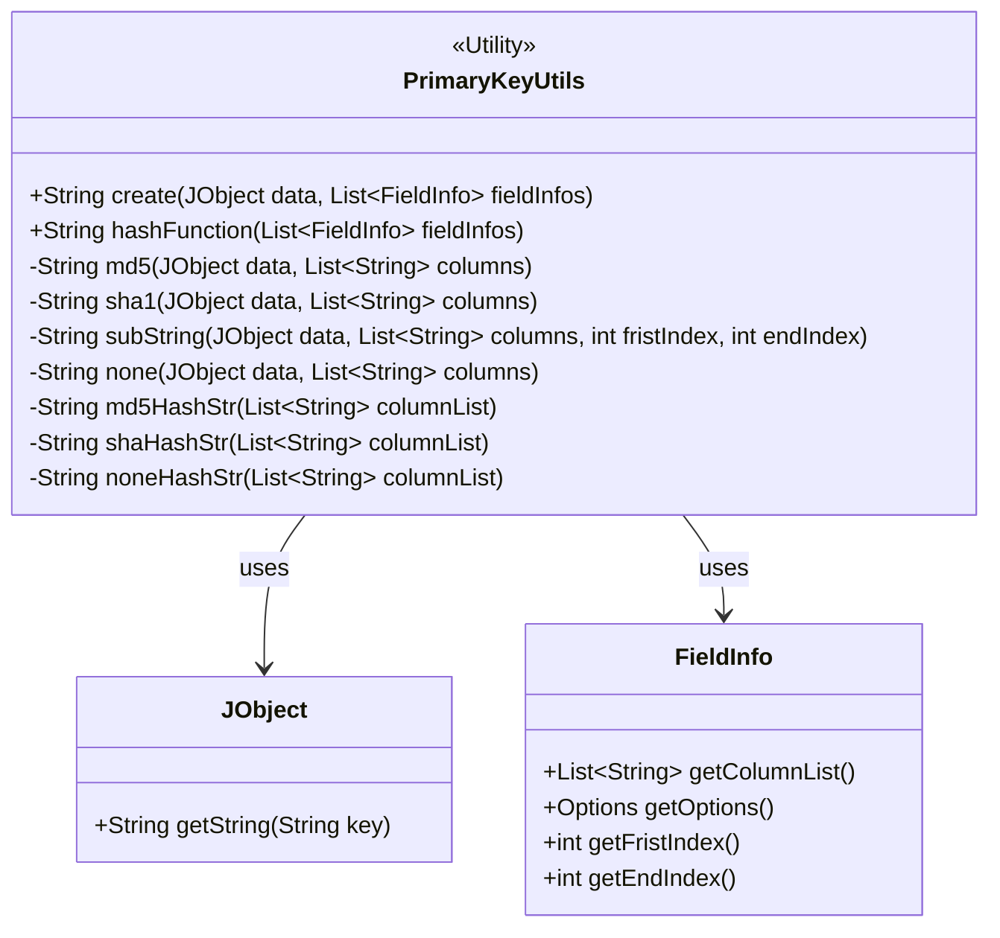
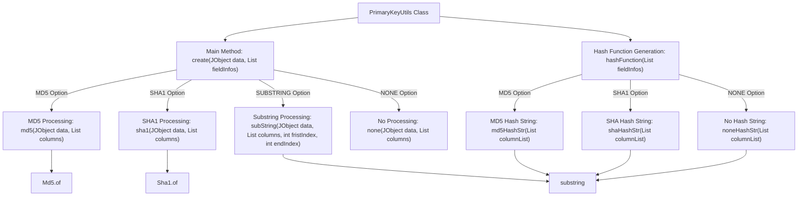

# Basic Information

|      |      |
|------|------|
| Name | PrimaryKeyUtils |
| Language | .java |
| Code Path | WeFe/fusion/fusion-service/src/main/java/com/welab/wefe/data/fusion/service/utils/primarykey/PrimaryKeyUtils.java |
| Package Name | com.welab.wefe.data.fusion.service.utils.primarykey |
| Dependencies | ['com.welab.wefe.common.util.JObject', 'com.welab.wefe.common.util.Md5', 'com.welab.wefe.common.util.Sha1', 'java.util.List'] |
| Brief Description | The PrimaryKeyUtils class provides primary key generation functionality, supporting four methods: MD5, SHA1, substring extraction, and raw concatenation, processing data according to field configurations to generate primary keys. |

# Description

The `PrimaryKeyUtils` class provides primary key generation functionality, supporting four processing methods: MD5, SHA1, SUBSTRING, and NONE. The `create` method processes and concatenates specified columns in `JObject` data according to `FieldInfo` configurations. The `hashFunction` method generates a string describing the processing rules, including column names and algorithm types. Internal methods `md5`, `sha1`, `subString`, and `none` implement different algorithm logics, all of which process concatenated values from specified columns. Helper methods `md5HashStr`, `shaHashStr`, and `noneHashStr` are used to construct rule description strings.

# Class Summary

| Name   | Type  | Description |
|-------|------|-------------|
| PrimaryKeyUtils | class | The PrimaryKeyUtils class provides primary key generation functionality, supporting four methods: MD5, SHA1, substring extraction, and raw concatenation, along with corresponding hash function description methods. |

## Class PrimaryKeyUtils

|      |      |
|------|------|
| Access Modifier | public |
| Type | class |
| Name | PrimaryKeyUtils |
| Description | The PrimaryKeyUtils class provides primary key generation functionality, supporting four methods: MD5, SHA1, substring extraction, and raw concatenation, along with corresponding hash function description methods. |

### UML Class Diagram

This code demonstrates a primary key generation utility class `PrimaryKeyUtils`, which provides multiple primary key generation methods (MD5, SHA1, substring extraction, etc.). The class receives `JObject` data and a `FieldInfo` list, then selects different processing methods based on field configurations. The class diagram clearly shows the dependency relationships between the utility class and the data object `JObject` and field information class `FieldInfo`, as well as various private processing methods within the utility class. This is a typical utility class design that encapsulates multiple primary key generation algorithms, offering good extensibility and flexibility.

### Internal Method Call Graph

This code represents the PrimaryKeyUtils class, primarily used to generate primary keys based on different rules. The main method `create` invokes corresponding processing methods (MD5, SHA1, SUBSTRING, NONE) according to the FieldInfo options, concatenates the results, and returns them. The `hashFunction` method generates a string describing the hashing rules. The flowchart illustrates the invocation relationships between methods in the class, the logical branches from the main method to various processing methods, and the final result generation path.

### Field List

| Name  | Type  | Description |
|-------|-------|------|

### Method List

| Name  | Type  | Description |
|-------|-------|------|
| hashFunction | String | The static method `hashFunction` performs MD5, SHA1, or no hashing on the column list based on the field options, concatenates the results, and returns the string with the trailing plus sign removed. |
| shaHashStr | String | This method concatenates the list of strings and processes it with SHA hashing, returning the format as "SHA(concatenated string)". |
| md5 | String | The static method md5 takes a JObject and a list of column names, concatenates the values of the specified columns, and returns the MD5 hash value. |
| none | String | The static method `none` takes a JObject and a list of strings, iterates through the list, concatenates the string values of the corresponding fields in the JObject, and returns the concatenated result. |
| create | String | Static methods process data based on field options, supporting MD5, SHA1, truncation, or no operation, and return the concatenated result. |
| subString | String | The static method `subString` extracts specified column data from a `JObject`, concatenates it into a string, and then truncates the substring between `fristIndex` and `endIndex`. |
| sha1 | String | The method generates a string by concatenating data from specified columns and returns its SHA1 hash value. The input consists of a JSON object and a list of column names, and the output is a hash string. |
| noneHashStr | String | The static method `noneHashStr` takes a list of strings, joins all elements with "+", and returns the resulting string. |
| md5HashStr | String | This method concatenates a list of strings into a single string separated by plus signs and prefixes it with "MD5". For example, given the input list ["a", "b"], the output would be "MD5(a+b)". |

